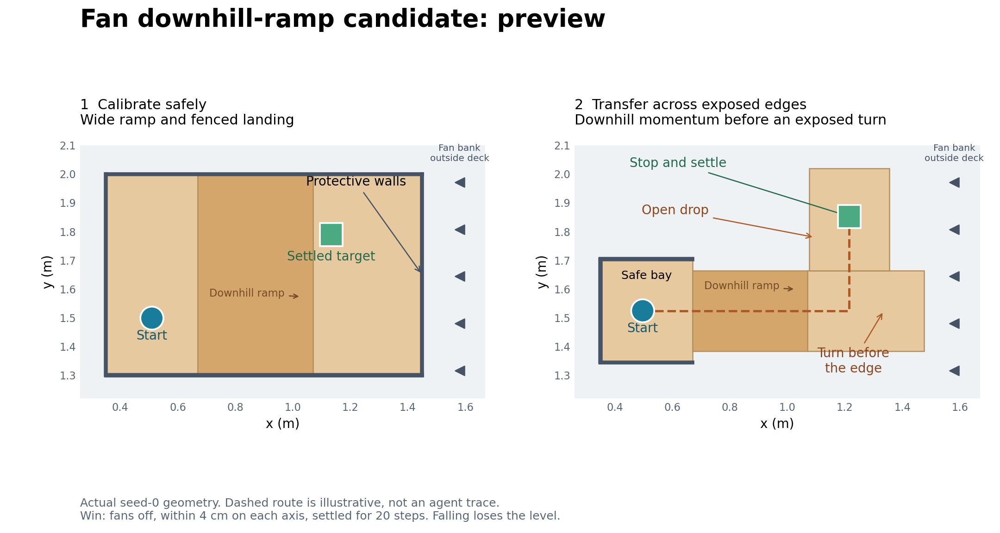
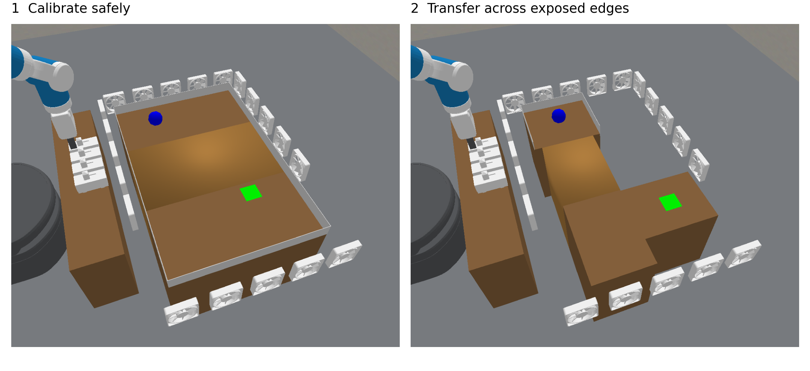
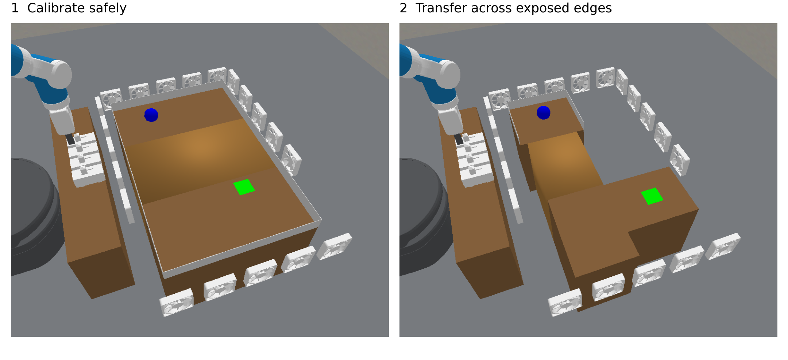
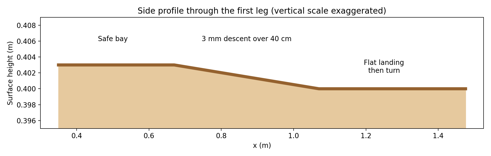

# Fan domain development record

Goal: find a physically valid Fan setting where predictive simulation improves robust completion relative to direct control.
All entries here are development experiments, not held-out paper results.
Keep every configuration and failed attempt rather than selecting seeds after seeing outcomes.
Agents must share layouts, observation access, real-step budgets, reset rules, and task certification.
Simulator access and its associated harness remain the intended method difference.
Expensive checks and agent runs use compute nodes.
Before launching agents on any new setting, show the user visualizations of its actual training and test tasks and wait for review.
Physical diagnostics may establish feasibility before that review, but are not agent experiments.

## Current scope

The user explicitly requested domain-only variation: keep EMPIRIC, the direct agent, and their harness settings unchanged.
Do not implement the proposed reconstruction, adaptive-wait, or preflight changes as part of this domain search.
Finish the five EMPIRIC longer-landing runs before deciding the next variant or matched baseline launch.
The less-damped, weaker-wind Fan inertial variant remains an acceptable fallback if ramp variants are unsuccessful.
Its fresh-seed results did not confirm a solve-rate gap, so choosing it as a fallback must not be described as achieving that research objective.

## Decision rule

Screen each physically validated configuration on matched seeds 0 and 1 for both agents.
Inspect both successes and failures for interface errors, privilege leaks, simulator mismatch, and actual strategy before changing the domain.
A promising candidate has EMPIRIC solving both screening seeds while the direct agent fails at least one for task-related reasons, not account limits or infrastructure failures.
Freeze that candidate and evaluate both agents on fresh seeds 2 through 4 before making any robustness claim, following the user's revised request for five total seeds per agent including the pilot.
Those three fresh seeds are confirmation data only if their results are not used to revise the candidate; report them separately from the two screening seeds when assessing confirmation.
If confirmation fails, retain the negative result and label subsequent experiments as further development.
This is a screening rule, not a statistical significance claim or a guaranteed outcome.
For the inertial candidate, `scripts/configs/predicatorv3/continual_fan_inertial_confirmation_r1.yaml` now prepares separate confirmation run keys for seeds 2 through 4.
Configuration resolution produced exactly ten runs with environment, arguments, and flags identical to the frozen inertial pilot; equality was rechecked immediately before submission.
After both EMPIRIC pilot seeds passed, confirmation arrays `23252966` (EMPIRIC) and `23252967` (direct), seeds 2 through 6, were submitted on 2026-09-20 to `mit_preemptable` from frozen runtime `8d12ae07d89a994889b03f5cfe2488dacbdf8140`.
At the user's subsequent request for only three additional seeds per agent, tasks `23252966_5`, `23252966_6`, `23252967_5`, and `23252967_6` were cancelled without inspecting their outcomes for selection.
Their partial logs are preserved, are not task failures, and must not be automatically resumed; seeds 2 through 4 continue unchanged.
Each task has 8 CPUs, 16 GB, and 12 hours, with automatic requeue and account selection among a through d; dat remains backup.
No domain or agent settings changed for confirmation.
The first finished confirmation run is direct seed 3: `all_levels_won`, 1,262 total steps, with both training and test accepted by the evaluator.
Its scorecard is `logs/agent_continual_model_free/fan_inertial-mf_opus_inertial_confirmation_r1/seed3/run_20260920_111039/scorecard.json`.
EMPIRIC confirmation seed 2 also has accepted evaluator wins on both levels, at 1,328 total steps.
Its scorecard is `logs/agent_continual/fan_inertial-mb_opus_inertial_confirmation_r1/seed2/run_20260920_111039/scorecard.json`.
EMPIRIC confirmation seed 4 has accepted wins on both levels at 1,305 total steps, and direct confirmation seed 2 has accepted wins on both levels at 2,614 total steps.
Their scorecards are `logs/agent_continual/fan_inertial-mb_opus_inertial_confirmation_r1/seed4/run_20260920_111039/scorecard.json` and `logs/agent_continual_model_free/fan_inertial-mf_opus_inertial_confirmation_r1/seed2/run_20260920_111039/scorecard.json`.
Direct confirmation seed 4 finished with accepted wins on both levels at 2,067 total steps (1,507 training and 560 test), with no resets.
Its scorecard is `logs/agent_continual_model_free/fan_inertial-mf_opus_inertial_confirmation_r1/seed4/run_20260920_111039/scorecard.json`.
Direct control therefore solved all three fresh confirmation seeds, so the pilot solve-rate gap did not replicate on this confirmation batch.
EMPIRIC confirmation seed 3 also has evaluator-accepted wins on both levels: 311 training steps and 1,660 test steps, 1,971 total with zero resets.
Its scorecard is `logs/agent_continual/fan_inertial-mb_opus_inertial_confirmation_r1/seed3/run_20260920_111039/scorecard.json`; postmortem processing was still active when the accepted episodes were checked.
Fresh inertial confirmation therefore finished 3/3 for each arm: the pilot solve-rate gap did not replicate.
Across pilot and confirmation, EMPIRIC is 5/5 and direct control is 4/5, but the pooled difference must not be presented as an independently confirmed advantage.
The successful direct seed 4 journal records four rest-to-rest test pulses: two along x and two along y, without an opposing braking pulse, completing the test in 560 steps.
It calibrated a scalar pulse-duration-to-displacement relationship and remeasured stopped positions between pulses.
Direct seed 3 instead records a small fitted dynamics model, test-time refitting, and an opposing-pulse correction after overshooting its desired x position, completing the test in 797 steps.
These are agent-reported strategies in the corresponding `agent/sandbox/journal.md` files, consistent with their accepted scorecards; the fitted parameter interpretations have not been independently replayed.
The direct baseline can write its own prediction code, so absence of the EMPIRIC harness does not imply absence of modeling or informal uncertainty reasoning.
The inertial task still permits stopping, observing, recalibrating, and axis-by-axis progress; its confirmation results do not establish a need for the full harness.
The already-launched ramp pilot tests an additional physical effect, but must earn its own evidence rather than inherit the inertial screening result.

## Candidates

### Exposed transfer r1

Protected calibration tray followed by an exposed L-shaped route, unchanged original pilot.
The direct agent learned and refined a simple pulse-duration model and solved seed 1 in 724 steps without resets.
EMPIRIC seed 1 also solved, in 1,095 steps.
At the user's request, unfinished seed-0 jobs `23232486_0` and `23232487_0` were cancelled on 2026-09-20; their partial logs and both completed seed-1 results are preserved.
The cancelled seeds are not task failures and must not be automatically resumed.
This does not establish the desired completion advantage.
See [the original pilot](fan-exposed-transfer.md).

### Inertial transfer r1

Same geometry, lower drag, and weaker wind, with persistent momentum and optional active braking.
All 27 environment checks passed; privileged plans replayed successfully through actual switches on both screening seeds.
Arrays `23239940` (EMPIRIC) and `23239941` (direct) run matched seeds 0 and 1 from frozen commit `8d12ae07d89a994889b03f5cfe2488dacbdf8140`.
Direct seed 0 finished with `all_levels_won`: 924 training steps plus 653 test steps, 1,577 total, zero resets.
Its scorecard is `logs/agent_continual_model_free/fan_inertial-mf_opus_inertial_pilot_r1/seed0/run_20260920_092144/scorecard.json`.
EMPIRIC seed 0 also finished with `all_levels_won`: 406 training steps plus 999 test steps, 1,405 total, zero resets.
Its scorecard is `logs/agent_continual/fan_inertial-mb_opus_inertial_pilot_r1/seed0/run_20260920_092143/scorecard.json`.
Direct seed 1 ended with `agent_ended` after explicitly calling `give_up`: training won in 1,453 steps, test unsolved after 1,914 steps, 3,367 total, zero resets.
Its scorecard is `logs/agent_continual_model_free/fan_inertial-mf_opus_inertial_pilot_r1/seed1/run_20260920_092143/scorecard.json`.
The test episode itself did not trigger a terminal fall or evaluator rejection; the agent forfeited after an overshoot and unsuccessful recovery attempts.
Its trace places the ball beyond the platform edge, about 3 cm lower, and attributes the resulting wedged position to contact with the adjacent fan bank.
The postmortem attributes the overshoot to extrapolating a three-parameter position-dependent force model from two pulses, choosing a 76-step pulse despite a simpler model predicting 53 steps.
That causal interpretation and the claim that recovery was impossible have not been independently replayed.
The same postmortem calls switch states in `trajectories.pkl` hidden, but a frozen-runtime source audit does not support that characterization of the on/off flag.
`pybullet_fan_base.py:913-923` derives observable `fan.is_on` and `switch.is_on` from the same controlling switch, and both agents' initial test observations show all four fan flags.
The shared exporter in `agent_sdk/sandbox_setup.py:688` copies only `State.data`, dropping privileged state and simulator bookkeeping; both agents are explicitly given recorded observable trajectories.
Switch objects omitted from the compact observation text are present in those recordings, but the reported on/off access is redundant with an already observable feature, not evidence of hidden dynamics leakage.
This source-level check addresses that specific concern, not every possible sandbox information channel.
EMPIRIC seed 1 finished with `all_levels_won`: 1,003 training steps plus 1,269 test steps, 2,272 total, zero resets; both episodes have accepted evaluator wins.
Its scorecard is `logs/agent_continual/fan_inertial-mb_opus_inertial_pilot_r1/seed1/run_20260920_092153/scorecard.json`.
The completed pilot is EMPIRIC 2/2 and direct control 1/2, meeting the screening rule but not establishing a robust advantage without fresh-seed confirmation.
On the completed matched seed, EMPIRIC used 172 fewer total steps, but 346 more test steps; both methods solved, so this is not a completion-rate gap.
The direct agent's journal fits a pulse-response rule, while EMPIRIC uses fitted simulation; a training-efficiency difference alone does not meet the completion-rate screening rule.
During seed-0 test planning, EMPIRIC's trace reports a simulated 3.5 mm step between the nominally level platforms, caused by noisy geometry reconstruction, and tests a coplanar hypothesis.
Direct seed 0 has already crossed that join in real execution.
This is a relevant method robustness issue under the shared observation noise, not an infrastructure failure or a justification for dropping the seed.
Direct seed 0 used four forward pulses on test, settling and recalibrating between them, without opposing-fan braking.
Its final observed mean errors were approximately +3.5 cm in x and -3.2 cm in y, close to but within the evaluator's 4 cm tolerance; the physical settling certificate accepted the run.
The success is retained and does not support a completion-rate advantage on this seed.
EMPIRIC seed 0's postmortem reports additional mismatch from simulated versus executed switch durations and target-pad contact, with its final observed position only about 3 mm inside the tolerance boundary.
These are the agent's diagnoses, not independently replayed causal findings; the scorecard independently records an accepted test win.
See [physics and validation](fan-inertial-transfer.md).

### Downhill ramp candidate

User-approved pilot launched on 2026-09-20 after visual review.
Adds an observed convex ramp that descends 4 mm over 40 cm into a lower landing before the turn.
The grade is deliberately shallow so gravity changes speed without creating a large uncontrolled drop relative to slow physical switches.
Training has the same grade with a wide, fenced landing; test uses an exposed narrower path.
Ramp dimensions and rise are visible to both agents and reconstructed in the simulator base.
Geometry, gravity, restoration, and real-controller feasibility must pass before agent launch.
Geometry, gravity, and restoration passed with the full 28-check environment suite in job `23240367`.
The initial single-forward-pulse feasibility search failed to find an accurate safe landing on either seed (array `23240475`); feasibility is not yet established.
An expanded search with opposing-fan braking also failed (`23240884`), with the ball stopping near the ramp entrance rather than falling.
This exposed a collision-geometry issue: the default convex-mesh margin creates an unintended entrance lip relative to the neighboring box support.
The ramp now uses an exact static triangle mesh with zero collision margin; its visible dimensions and intended slope are unchanged.
Strict surface-height, downhill-motion, and simulator-restoration checks passed in job `23241516` (28 checks).
Actual-controller replays on the corrected mesh are array `23241689`; the additional seam-crossing regression is job `23241698`.
The seam-crossing regression passed with all 28 checks: a ball driven from the actual training initial state crossed the ramp and reached x=1.126 m instead of sticking at the entrance.
The corrected-mesh controller search (`23241689`) still failed to reach the target column.
A contact probe (`23242039`) identified physical contact with the original right fan bank at x=1.126 m, inside the enlarged ramp landing.
The ramp variant now moves that bank 40 cm outward in both observed task state and simulator reconstruction, without changing original or inertial-pilot fan positions.
The clearance regression now requires crossing beyond x=1.25 m, not merely reaching the ramp end.
Updated validation, controller replay, and visual-preview jobs are `23242172`, `23242175`, and `23242188` respectively.
The clearance regression passed all 28 checks, reaching x=1.409 m on the protected training landing.
With the accidental obstructions removed, the bounded controller search now produces genuine exposed-edge failures (46/68 and 47/68 candidate trajectories), but still no sufficiently accurate safe landing.
The closest safe plan uses the maximum tested braking duration, so array `23242490` extends that duration from 60 to 120 steps without changing the domain.
This is privileged physical feasibility testing, not evidence about either agent's solve rate.
The updated preview explicitly marks the fan bank outside the deck (`23242406`).
The extended braking search succeeded on both seeds (`23242490`), using opposing-fan braking before the turn.
Seed 0 selected x pulse wait 8, reverse-fan wait 120, and y pulse wait 40; seed 1 selected waits 8, 80, and 42 respectively.
These waits are controller-plan parameters, not total fan-on times or charged physical steps.
The mesh face winding was corrected to outward normals so its top is visible in the actual simulator render; the 28-check suite still passed (`23242634`).
Independent fresh-process replays on the final geometry also succeeded through actual switch controllers: seed 0 in 588 steps (`23242828`) and seed 1 in 553 steps (`23242834`).
These replay counts include conservative settling waits and exclude privileged plan-search cost; they must not be compared as agent sample-efficiency results.
The launch configuration is `scripts/configs/predicatorv3/continual_fan_ramp_pilot_r1.yaml`, with distinct run keys and matched seeds 0 and 1.
Job `23242898` passed all 32 checks, including the resolved launcher and physical regressions.
The reviewed candidate is frozen at `logs/fan-ramp-runtime-20260920`, commit `1510ebdc4b0f5dde005bc72665bd6a0dbe7886ce`.
Following the user's explicit request for two ramp seeds per agent, arrays `23254928` (EMPIRIC) and `23254929` (direct) were submitted from that frozen runtime on `mit_preemptable`.
Each task has 8 CPUs, 16 GB, and 12 hours, with automatic requeue and accounts a through d; dat remains backup.
These four pilot runs are separate from the six remaining inertial confirmation runs and do not alter paper results.
Direct ramp seed 0 finished with `level_lost`: training won in 747 steps, then the evaluator rejected the test because the ball fell off the platform after 1,172 test steps (1,919 total, zero resets).
Its authoritative scorecard is `logs/agent_continual_model_free/fan_ramp-mf_opus_ramp_pilot_r1/seed0/run_20260920_112733/scorecard.json`.
The agent's postmortem attributes the failure to delayed brake activation: `SwitchOn(fan_1)` allegedly took 83 steps to toggle versus 30 in calibration, leaving the ball unbraked during descent.
Independent inspection of the saved observation trajectory confirms fan 0 turned off at state index 1,087 and fan 1 turned on at 1,169, an 82-step interval with both off.
The agent's 83-step figure used an off-by-one off index and is not the duration of the `SwitchOn` invocation itself; that invocation was interrupted after 78 steps according to the execution log.
At brake activation the observed ball x was already 1.3746 m, near the landing edge, consistent with braking too late.
This verifies the delayed activation sequence, not the counterfactual claim that a different sequence would certainly succeed; the terminal fall itself is evaluator-confirmed.
Its claim that its physics model was otherwise accurate is not an independent validation of that model.
EMPIRIC ramp seed 1 finished with `all_levels_won`: accepted training and test wins in 707 and 1,369 steps respectively (2,076 total, zero resets).
Its scorecard is `logs/agent_continual/fan_ramp-mb_opus_ramp_pilot_r1/seed1/run_20260920_112733/scorecard.json`.
The agent reports using repeated static observations to resolve surface heights and adapting the overlapping-fan sequence to observed switch latency; these strategy claims await trajectory-level analysis.
It also reports a narrow final goal margin, so the accepted success should not be described as demonstrated robustness on its own.
EMPIRIC ramp seed 0 also finished with `all_levels_won`: accepted training and test wins in 1,004 and 1,622 steps respectively (2,626 total, zero resets).
Its scorecard is `logs/agent_continual/fan_ramp-mb_opus_ramp_pilot_r1/seed0/run_20260920_112730/scorecard.json`.
Both EMPIRIC screening seeds succeeded and direct seed 0 has an evaluator-confirmed task failure, satisfying the numerical pilot screening rule.
Direct seed 1 remains unfinished and must be retained regardless of outcome.
The next stage is to finish the strategy/interface audit and run matched fresh seeds 2 through 4 on the unchanged frozen ramp runtime; no robustness claim is established by this pilot alone.
After inspecting the successful strategy logs, the direct failure trajectory, and the shared observable-only trajectory exporter, confirmation arrays `23266180` (EMPIRIC) and `23266181` (direct) were submitted for seeds 2 through 4.
The configuration is `scripts/configs/predicatorv3/continual_fan_ramp_confirmation_r1.yaml`.
Immediately before submission, all 1,158 source blobs under the frozen runtime's `predicators`, `scripts`, `prompts`, and `main.py` were checked against commit `1510ebdc4b0f5dde005bc72665bd6a0dbe7886ce`, accounting for symlink contents, and matched.
Resolved environment, flags, arguments, and accelerator settings matched the pilot per arm; only seed range and experiment identifiers changed.
These six compute-node jobs use 8 CPUs, 16 GB, 12 hours, requeue, and primary accounts a through d; dat remains backup.
Keep the three fresh seeds separate from screening results when assessing confirmation, and retain the unfinished direct pilot seed regardless of its eventual outcome.
The remaining direct pilot seed 1 subsequently lost the test to an evaluator-confirmed fall: 3,328 training steps plus 116 test steps, 3,444 total and zero resets.
The completed ramp screening batch is therefore EMPIRIC 2/2 and direct 0/2.
Fresh confirmation seed 4 succeeded for EMPIRIC in 2,435 steps (1,117 training plus 1,318 test), with both episodes accepted and no resets.
Direct confirmation seed 3 succeeded in 1,722 steps (791 training plus 931 test), with both episodes accepted and no resets.
Direct confirmation seed 4 lost to an evaluator-confirmed test fall in 1,584 steps (1,246 training plus 338 test), with no resets.
These confirmation scorecards are under `logs/agent_continual/fan_ramp-mb_opus_ramp_confirmation_r1/seed4/run_20260920_130308`, `logs/agent_continual_model_free/fan_ramp-mf_opus_ramp_confirmation_r1/seed3/run_20260920_130303`, and `logs/agent_continual_model_free/fan_ramp-mf_opus_ramp_confirmation_r1/seed4/run_20260920_130259` respectively.
EMPIRIC confirmation seeds 2 and 3 and direct confirmation seed 2 remain unfinished; current fresh-seed results are EMPIRIC 1/1 finished and direct 1/2 finished, not final confirmation rates.
During its unfinished test run, direct ramp seed 0 implemented Monte Carlo checks over correlated drag and ramp-acceleration estimates and compared delayed-braking survival predictions.
The evidence is its `agent/002_play_20260920_114411.md` log under `logs/agent_continual_model_free/fan_ramp-mf_opus_ramp_pilot_r1/seed0/run_20260920_112733`.
These are the agent's own model predictions, not measured success probabilities or completed task outcomes.
This further demonstrates that the direct baseline can implement uncertainty reasoning without the supplied harness; interpret eventual differences as differences in the complete workflows, not exclusive access to modeling or uncertainty.
The intermediate zero-margin convex-hull attempt (`23241380`, `23241392`) did not establish feasibility and failed a ray-contact check, so it is not the accepted geometry implementation.
No agent experiment is authorized for launch before the user's visual review and successful physical validation.

## Reporting

### Additional Fan inertial arms, September 21

The user requested five seeds each for the five remaining paper arms on Fan inertial, without modifying agents or the domain.
The existing saved no-ramp inertial results are EMPIRIC 5/5 and direct control 4/5, not both 5/5; direct pilot seed 1 ended with a give-up.
The new runtime `logs/fan-inertial-baselines-runtime-20260921` is a clean clone of the original inertial commit `8d12ae07d89a994889b03f5cfe2488dacbdf8140`.
The external launch configuration `scripts/configs/predicatorv3/continual_fan_inertial_baselines_r1.yaml` preserves its environment and arm menus, selects seeds 0 through 4, and uses distinct experiment keys.
The submitted arrays are Oracle dynamics `23383838`, Direct + scene `23383839`, Standalone sim `23383840`, No harness fitting `23383841`, and No explicit uncertainty `23383842`.
Each array contains five tasks on `mit_preemptable`, with requeue, 8 CPUs, 16 GB, and a 12-hour allocation per task.
Accounts a through d are eligible; dat remains backup only.
No ramp is enabled, preflight and validation audit remain off, and paper results are unchanged.

### Longer-landing candidate following the five-seed ramp results

The final original-ramp direct-agent run, confirmation seed 2, subsequently succeeded in 4,708 charged steps (1,800 training and 2,908 test), with one training reset and no test reset.
Its scorecard is `logs/agent_continual_model_free/fan_ramp-mf_opus_ramp_confirmation_r1/seed2/run_20260920_130303/scorecard.json`.
Original-ramp results are now complete: EMPIRIC 3/5 and direct 2/5 overall, but fresh confirmation was EMPIRIC 1/3 and direct 2/3.
The screening advantage therefore did not replicate on fresh seeds; the pooled difference is not evidence of a reliable advantage.

EMPIRIC confirmation seeds 2 and 3 subsequently finished with evaluator-confirmed test falls, in 1,312 and 1,533 total steps respectively.
Together with successful seed 4, fresh confirmation is 1/3 for EMPIRIC, and the combined screening plus confirmation result is 3/5.
The original ramp therefore did not establish reliable EMPIRIC success.
Seed 2's execution log and postmortem identify an assumed 21-step switch approach that instead took 42 steps, extending acceleration from approximately 46 to 68 steps before braking.
Seed 3's postmortem identifies an artificial seam in its reconstructed simulator that dissipated momentum in prediction but not in execution.
These diagnoses do not establish that excessive terminal waiting was the primary cause of either failure.

The next candidate adds 0.10 m to the exposed test landing in the downhill direction, without moving the target, widening the turn, adding walls, or changing the training tray, ramp, noise, dynamics, or goal tolerance.
It is opt-in via `fan_ramp_landing_extension=0.10`; the default remains zero and the original frozen runtime is untouched.
This is a robustness-margin hypothesis, not a guarantee of 5/5 or a preserved advantage over direct control.
Both agents must receive identical candidate geometry and interfaces.
The geometry/model-restoration suite passed all 26 checks on a compute node.
A fresh seed-0 privileged controller replay with opposing-fan braking succeeded in 588 steps; the corresponding unbraked sequence fell off the extended landing.
These two reference trajectories establish limited feasibility and retained fall risk, not either agent's performance or the size of the safe timing window.
Diagnostic outputs are `logs/fan-ramp-long-landing-validation.log` and `logs/fan-ramp-long-landing-replays.log`.
Following visual review, the user approved EMPIRIC-only testing on five seeds without additional environment changes.
Array `23285842` launches seeds 0 through 4 under the distinct run key `fan_ramp-mb_opus_ramp_long_landing_r1`.
The frozen runtime is `logs/fan-ramp-long-landing-runtime-20260920`, commit `b6d9243be`, based on the original ramp runtime with only the landing-extension implementation, its regression tests, and the new launch configuration added.
The resolved flags differ from the original EMPIRIC ramp pilot only by `fan_ramp_landing_extension=0.10`; preflight and validation audit remain off.
All 26 physical regression tests passed again in this frozen runtime before submission.
Jobs use `mit_preemptable`, 8 CPUs, 16 GB, a 12-hour allocation with requeue, and accounts a through d; dat remains backup.
No direct-agent jobs were launched for this candidate.
Longer-landing EMPIRIC seed 1 finished with `agent_ended` after an explicit `give_up`, at 2,228 total steps (1,610 accepted training steps and 618 unsuccessful test steps).
Its scorecard is `logs/agent_continual/fan_ramp-mb_opus_ramp_long_landing_r1/seed1/run_20260920_152607/scorecard.json`.
This is an agent forfeiture, not an evaluator-confirmed `level_lost`: the agent reports the ball overshot the open landing and became stranded against its side, then judged recovery impossible.
Its postmortem attributes the overshoot to late brake activation through three switch maneuvers and a faster-than-predicted descent; those causal and irrecoverability claims remain agent interpretations pending trajectory review.
The batch can no longer reach 5/5; retain this result and let the other four runs finish unchanged.
Longer-landing EMPIRIC seed 3 subsequently finished with `all_levels_won`, in 2,640 total steps (1,722 training and 918 test).
Its scorecard is `logs/agent_continual/fan_ramp-mb_opus_ramp_long_landing_r1/seed3/run_20260920_152607/scorecard.json`.
With seeds 0, 2, and 4 still unfinished, this is one success and one forfeiture among two completed runs, not a final five-seed solve rate.
Seed 3's test postmortem reports jointly checking force and seam-height hypotheses and selecting a descent whose underpowered outcome returns to the protected bay.
It reports a measured first-leg peak x of 1.3381 m, which is inside even the original seed-3 landing edge (target x plus 0.16 m, approximately 1.394 m).
Thus this successful first leg does not by itself demonstrate that the extra landing length was necessary; the reported geometry reconstruction and control strategy also changed relative to the failed original run.
These strategy and peak-position claims come from `agent/002_play_20260920_161558.md` and require independent trajectory replay before causal attribution.
Longer-landing EMPIRIC seed 2 subsequently received an evaluator-confirmed test loss: `rejected: The ball fell off the platform.`, after 638 test steps and 1,094 accepted training steps (1,732 total).
Its scorecard is `logs/agent_continual/fan_ramp-mb_opus_ramp_long_landing_r1/seed2/run_20260920_152621/scorecard.json`; the terminal episode is recorded even while run-level postprocessing remains pending.
The batch now has one accepted full success, two unsuccessful test outcomes, and two unresolved runs (seeds 0 and 4), so its maximum possible final success count is 3/5.
Seed 2's test postmortem (`agent/003_play_20260920_162040.md`) reports a simulated 39-step brake-switch invocation that took 107 steps in execution after changing the skill parameters to an untested setting.
It reports sweeping dynamics parameters but not planner trials for this crossing, despite using trials earlier during training.
These are reported causal details, not independently replayed findings; they suggest that another small landing extension alone may not address the dominant timing hazard.
Keep the agent and harness fixed as requested, and finish seeds 0 and 4 before selecting a further domain-only variant.
Longer-landing EMPIRIC seed 0 subsequently finished with `all_levels_won`, in 2,279 total steps (988 training and 1,291 test).
Its scorecard is `logs/agent_continual/fan_ramp-mb_opus_ramp_long_landing_r1/seed0/run_20260920_152605/scorecard.json`.
The batch now has two accepted full successes, two unsuccessful tests, and only seed 4 unresolved; this remains a development result, not a matched comparison with direct control.
Any subsequent screening must retain all outcomes and be followed by fresh matched seeds before claiming a reliable gap.
Longer-landing EMPIRIC seed 4 subsequently finished with `all_levels_won`, in 1,809 total steps (738 training and 1,071 test).
Its scorecard is `logs/agent_continual/fan_ramp-mb_opus_ramp_long_landing_r1/seed4/run_20260920_152637/scorecard.json`.
The completed longer-landing batch is therefore 3/5: seeds 0, 3, and 4 succeeded, seed 1 forfeited, and seed 2 suffered an evaluator-confirmed fall.
This equals the original ramp's aggregate EMPIRIC success count and does not establish an improvement in reliability or a gap against direct control, which has not been run on the longer landing.
The agent and harness remained unchanged throughout this batch; paper results remain untouched.

### Lower-drop ramp candidate

Following the completed longer-landing batch, the proposed next candidate retains the 0.10 m landing extension and reduces the visible ramp drop from 0.004 m to 0.003 m in both training and test.
Ramp length remains 0.40 m; other geometry, dynamics, observation noise, goal tolerance, agents, and harness settings are unchanged.
The optional setting is `fan_ramp_rise=0.003`, with the historical default preserved at 0.004.
This tests whether reduced gravity-driven acceleration affords more braking margin; it does not establish that the observed switch-duration mismatch is resolved or that direct control remains difficult.
All 28 tests in `tests/envs/test_pybullet_fan_transfer.py` passed on a compute node, covering both drops and both landing extensions, including geometry, downhill motion, and model restoration.
The first test pass exposed hard-coded 4 mm expectations in the newly parameterized test; these were replaced by the analytical height formula before the successful rerun.
The renderer's hard-coded profile and label were also corrected, and the regenerated images were inspected.
Following visual review, the user approved testing and then restricted the first launch to EMPIRIC only, two seeds.
Array `23370647` submits seeds 0 and 1 under the new key `fan_ramp-mb_opus_ramp_low_drop_r1` on `mit_preemptable` with requeue, 8 CPUs, and 16 GB per task.
The frozen runtime is `logs/fan-ramp-low-drop-runtime-20260921`, commit `ed7fb86a3`, based on the longer-landing snapshot with only the optional ramp-rise setting, domain implementation, and launch configuration changed.
Configuration resolution confirmed exactly one EMPIRIC batch with two seeds; preflight and validation audit remain off.
Accounts a through d are eligible and dat remains backup; no direct-control jobs were submitted.
Any promising comparison still requires matched direct-control runs and fresh confirmation seeds before claiming a reliable gap.
Both lower-drop EMPIRIC screening seeds completed with `all_levels_won`, with evaluator-accepted training and test episodes and zero resets.
Seed 0 used 1,150 total steps (580 training, 570 test); seed 1 used 1,984 total steps (712 training, 1,272 test).
Their scorecards are under `logs/agent_continual/fan_ramp-mb_opus_ramp_low_drop_r1/seed{0,1}/run_20260921_024850/scorecard.json`, both recording frozen commit `ed7fb86a3ad0`.
This is 2/2 screening success, not evidence of 5/5 reliability or a gap against direct control.
The scheduler still listed both tasks as running when the terminal scorecards were inspected, with temporary video outputs present; experiment outcomes are complete even while postprocessing continues.
No further agent jobs were launched after these results pending the next user decision.
The user subsequently approved three additional EMPIRIC seeds, 2 through 4.
Array `23376645` submits these seeds on `mit_preemptable` from the same unchanged frozen commit `ed7fb86a3ad0`, with requeue, 8 CPUs, 16 GB, and accounts a through d (dat backup only).
The confirmation configuration resolves to exactly the same experiment key, agent, and flags as seeds 0 and 1; only the seed range changes.
These three additional runs complete the planned five-seed EMPIRIC cohort when finished; no direct-control jobs have been submitted.

## Shared-skill repair cohort, September 21

At the user's request, five EMPIRIC seeds (0-4) were launched as array `23385440` on `mit_preemptable`.
All five tasks were verified running on compute nodes after submission.
The separate experiment key is `fan_ramp-mb_opus_ramp_skill_repair_r1`; original lower-drop results remain untouched.
The frozen runtime is `logs/fan-ramp-skill-repair-runtime-20260921` at commit `ff11bc76f4652c6964e73beda7e41a6655d670d9`.
Relative to the original lower-drop runtime, only the three shared skill implementation files change production behavior; regression fixtures and a launch configuration are also included.
The resolved experiment flags exactly match the original EMPIRIC lower-drop cohort: the reviewed 3 mm ramp, 10 cm landing extension, Opus 5, and preflight off.
The exact frozen runtime passed 126 targeted skill and motion-planning tests, with four existing expected failures, before submission.
These are matched development reruns, not fresh held-out confirmation or paper results.

The launcher uses accounts `a,b,d`, all of which passed live tool-free model probes before submission.
The backup account `dat` also passed but is not in the active pool.
Account `c` has an active limit marker until September 23 at 00:00 UTC and is excluded.
Usage percentages were unavailable from the service endpoint; successful probes establish current access, not a guarantee of sufficient remaining quota for full runs.
Each task requests 8 CPUs and 16 GB, with requeue enabled for preemption, time limits, and recognized account-limit exits.
The launch configuration is [continual_fan_ramp_skill_repair_r1.yaml](https://github.com/BasisResearch/predicators/blob/iclr-empiric-submission/scripts/configs/predicatorv3/continual_fan_ramp_skill_repair_r1.yaml).
The shared repair and its measured extra interaction cost are documented in [the switch investigation](fan-switch-seed4-investigation.md).

Seed 0's original job stopped after account `a` reported that its organization had disabled subscription access for Claude Code.
This was an infrastructure interruption after training succeeded and the test reached 207 steps, not a task failure.
With the user's approval, job `23395354` resumes only seed 0 on `dat`, from the same frozen runtime, experiment key, run directory, sandbox, and recorded state.
The resume configuration is [continual_fan_ramp_skill_repair_seed0_resume.yaml](https://github.com/BasisResearch/predicators/blob/iclr-empiric-submission/scripts/configs/predicatorv3/continual_fan_ramp_skill_repair_seed0_resume.yaml).

### Six matched comparison arms

The user approved five seeds each for all six other paper agents on this repaired Fan ramp setup.
All 30 tasks were verified running on compute nodes after submission.
They use the same frozen runtime `ff11bc76f4652c6964e73beda7e41a6655d670d9`, reviewed geometry, observation noise, step budget, and preflight-off setting as the repaired EMPIRIC cohort.
The [six-arm configuration](https://github.com/BasisResearch/predicators/blob/iclr-empiric-submission/scripts/configs/predicatorv3/continual_fan_ramp_skill_repair_baselines_r1.yaml) resolves to exactly six five-seed arrays, with only the intended approach and ablation flag differences.

- Oracle dynamics: array `23398858`, seeds 0-4, accounts b/d.
- Direct agent: array `23398859`, seeds 0-4, account dat.
- Direct + scene: array `23398860`, seeds 0-4, accounts b/d.
- Standalone sim: array `23398861`, seeds 0-4, accounts b/d.
- No harness fitting: array `23398862`, seeds 0-4, accounts b/d.
- No explicit uncertainty: array `23398863`, seeds 0-4, accounts b/d.

Account a failed the prelaunch model probe with the organization-access-disabled error; c remains marked limited and was excluded.
Accounts b, d, and dat passed live model probes; dat hosts five of the 30 new runs as occasional overflow.
The arrays use separate `<arm>_opus_ramp_skill_repair_r1` experiment keys, leaving older ramp cohorts untouched.
At submission, EMPIRIC seeds 1-4 had terminal all-levels-won scorecards; resumed seed 0 remained in progress at test step 1010.
The user's apparent 5/5 success is therefore not yet confirmed by all five terminal scorecards.

Do not replace the original Fan maze or paper results during development.
Do not count diagnostic reference-policy successes as EMPIRIC results.
Do not count unfinished, account-limited, or infrastructure-failed runs as task failures.

### September 21, 16:43 UTC health check

All five repaired EMPIRIC seeds now have terminal `all_levels_won` scorecards.
All 30 comparison jobs were running, with recent execution, planning, or model-analysis activity and no current account-limit errors on b, d, or dat.
Scheduler accounting confirmed that recent restarts were compute-node preemptions; the jobs resumed their existing unfinished runs.
One exception was already-finished EMPIRIC seed 0: requeued job `23395354_0` created redundant directory `run_20260921_124237` after its original `run_20260921_090823` had won both levels.
The redundant job was cancelled, with both directories preserved; do not resume or count the redundant partial run.
The original seed-0 accepted result remains 1,623 training steps plus 1,120 test steps.
The Markdown result monitor remained active; none of the 30 comparison seeds had a terminal scorecard at this check.
