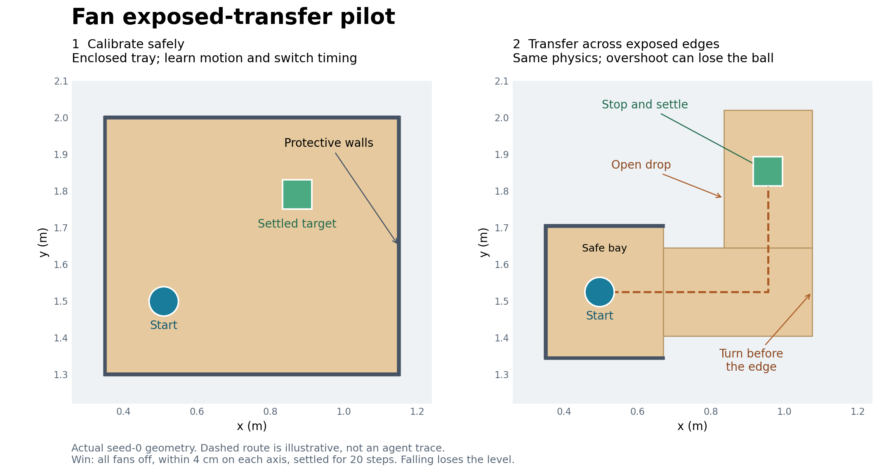
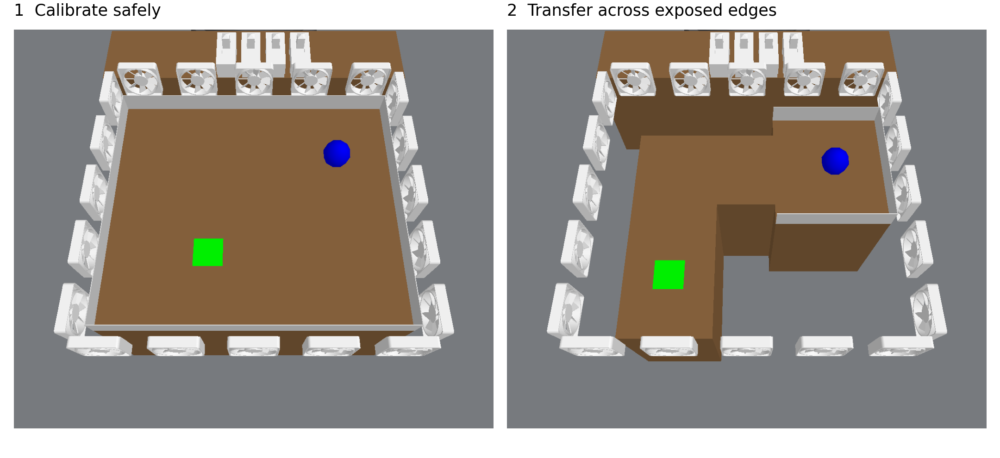

# Fan exposed-transfer pilot

This is a separate pilot, not a replacement for the Fan maze results in the paper.
The subsequent [inertial-transfer candidate](fan-inertial-transfer.md) preserves this layout while testing longer coasting and momentum-sensitive control; it does not alter these original runs.
The illustrations below are generated from the actual seed-0 environment states.

## Task

The first level is a protected calibration tray where agents can learn the wind response and the timing of robot-operated switches.
The second level starts in a three-sided safe bay connected to an exposed L-shaped platform.
There are no stopping walls at the turn or target, and the space outside the platforms is genuinely unsupported.
A ball falling below the deck ends the episode unsuccessfully; the test level permits no reset.

Both levels use the same physical parameters and switch controllers.
Compared with the original maze, the pilot uses lower damping and rolling resistance with a correspondingly weaker wind, allowing measurable coasting without making switch actuation impractically slow relative to travel.
Opposing fans still sum normally; we have not prohibited any baseline strategy.

Success requires all fans off and the ball within 4 cm of the target on each horizontal axis for 20 consecutive steps.
Across that window, the ball must stay within 6 mm of its final position.
Passing through the target does not count.

## Pilot comparison

EMPIRIC and the direct agent each receive seeds 0 and 1, identical layouts, the existing 5 mm position-noise setting, and a pooled budget of 10,000 real environment steps across the two levels.
Mandatory skill preflight and validation audit are off, matching the current comparison configuration.
Calibration permits resets; the transfer level does not.
The task generator is not filtered using either agent's outcomes.

This tests whether predictive modeling improves completion under consequential execution errors.
It does not assume that the direct agent will fail or that EMPIRIC will succeed.
The dashed path in the illustration is a geometric guide, not a recorded agent solution or a validated timing policy.

## Validation and reproduction

Final validation of the frozen runtime passed 33 tests covering the new variant, historical Fan regressions, the repaired benchmark interfaces, and the resolved pilot launch configuration for both agents and seeds.
These include actual episode termination on a fall, settled-goal checks, reconstruction of support geometry in the learned simulator base, wind-rollout agreement, and a moving-state restart during coasting.
A diagnostic reference policy also solved seeds 0 and 1 through the actual robot-operated switch skills.
Those reference runs establish feasibility; they are not EMPIRIC results.

Launch configuration: `scripts/configs/predicatorv3/continual_fan_transfer_pilot_r1.yaml`.
Illustration generator: `scripts/render_fan_transfer.py`.
Short compute-node test entry point: `scripts/validate_fan_transfer.sh`.
Physical and controller diagnostic: `scripts/probe_fan_transfer.py`.

Submitted on 2026-09-20 to `mit_preemptable`, with one task per seed:

- EMPIRIC, seeds 0 and 1: array `23232486`.
- Direct agent, seeds 0 and 1: array `23232487`.

Frozen runtime: `/home/ycliang/predicators/logs/fan-transfer-runtime-20260920`, commit `c15778a26494ca4342d9485a02736bbda6eb5dac`.
This detached snapshot includes the current benchmark-interface repairs and preserves the main checkout's branch and index.
The launch uses accounts a, b, and d; c has an active limit marker, and dat is reserved as backup.
Usage percentages were unavailable from the account endpoint, so the launcher uses its supported account-selection fallback.
At startup, account a reported a weekly limit, and EMPIRIC seed 0 automatically requeued to select another available account.
EMPIRIC seed 1 and both direct-agent seeds reached their agent sessions successfully.

EMPIRIC run directories: `logs/agent_continual/fan_transfer-mb_opus_transfer_pilot_r1/seed{0,1}/`.
Direct-agent run directories: `logs/agent_continual_model_free/fan_transfer-mf_opus_transfer_pilot_r1/seed{0,1}/`.
Scheduler logs live in the frozen runtime's `logs/` directory.
The final validation log is `logs/fan-transfer-frozen-validation-23232378.out`.
These job submissions are not completed experimental results.
On 2026-09-20, the user stopped this initial redesign after both seed-1 agents solved it without the intended advantage.
The remaining seed-0 tasks `23232486_0` and `23232487_0` were cancelled, with their partial logs preserved; do not resume them or count them as task failures.
The separate inertial pilot remains active.

The initial EMPIRIC array `23232030` failed during task construction because the config loader concatenated inherited maze wall counts with the requested zero-wall list.
The initial direct-agent array `23232031` was stopped before agent interaction because it carried the same invalid configuration.
The pilot now uses quoted CLI list literals to replace those inherited lists, and a regression test resolves the actual launch config and constructs both levels for all four runs.
The initial attempts produced no benchmark results and are not additional seeds.
