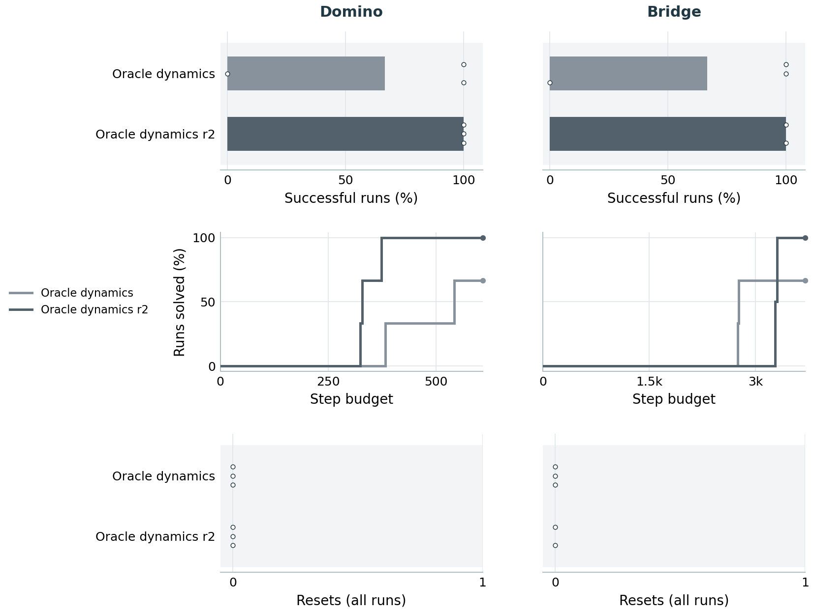

# Oracle dynamics repair pilot

<!-- Generated by monitor_benchmark_arms.py; do not edit. -->

Updated 2026-09-19T18:30:55.785509+00:00; 5/6 repaired-run seeds finished.
Only Domino and Bridge are launched, with seeds 0-2 and preflight off.
The other domains await review of this pilot.
Only finished runs contribute; unfinished seeds are not failures.

The bar and curve denominators are the finished seeds of each cohort, not always three.
Shared harness repairs change validation, and Bridge also has a repaired observation-memory model.
These are diagnostic reruns, not yet a matched final-paper comparison.

## Finished recordings

- Domino, oracle_old, seed 0: [scorecard](/orcd/home/002/ycliang/predicators/logs/agent_continual_oracle_dynamics/domino_high_friction_turn-oracle_dynamics_opus_benchmark_r1/seed0/run_20260918_091745/scorecard.json).
- Domino, oracle_old, seed 1: [scorecard](/orcd/home/002/ycliang/predicators/logs/agent_continual_oracle_dynamics/domino_high_friction_turn-oracle_dynamics_opus_benchmark_r1/seed1/run_20260918_091746/scorecard.json).
- Domino, oracle_old, seed 2: [scorecard](/orcd/home/002/ycliang/predicators/logs/agent_continual_oracle_dynamics/domino_high_friction_turn-oracle_dynamics_opus_benchmark_r1/seed2/run_20260918_091745/scorecard.json).
- Domino, oracle_fixed, seed 0: [scorecard](/orcd/home/002/ycliang/predicators/logs/agent_continual_oracle_dynamics/domino_high_friction_turn-oracle_dynamics_opus_benchmark_r2/seed0/run_20260919_120029/scorecard.json).
- Domino, oracle_fixed, seed 1: [scorecard](/orcd/home/002/ycliang/predicators/logs/agent_continual_oracle_dynamics/domino_high_friction_turn-oracle_dynamics_opus_benchmark_r2/seed1/run_20260919_120258/scorecard.json).
- Domino, oracle_fixed, seed 2: [scorecard](/orcd/home/002/ycliang/predicators/logs/agent_continual_oracle_dynamics/domino_high_friction_turn-oracle_dynamics_opus_benchmark_r2/seed2/run_20260919_120029/scorecard.json).
- Bridge (4-span), oracle_old, seed 0: [scorecard](/orcd/home/002/ycliang/predicators/logs/agent_continual_oracle_dynamics/bridge-oracle_dynamics_opus_benchmark_r1/seed0/run_20260918_091701/scorecard.json).
- Bridge (4-span), oracle_old, seed 1: [scorecard](/orcd/home/002/ycliang/predicators/logs/agent_continual_oracle_dynamics/bridge-oracle_dynamics_opus_benchmark_r1/seed1/run_20260918_091710/scorecard.json).
- Bridge (4-span), oracle_old, seed 2: [scorecard](/orcd/home/002/ycliang/predicators/logs/agent_continual_oracle_dynamics/bridge-oracle_dynamics_opus_benchmark_r1/seed2/run_20260918_091710/scorecard.json).
- Bridge (4-span), oracle_fixed, seed 1: [scorecard](/orcd/home/002/ycliang/predicators/logs/agent_continual_oracle_dynamics/bridge-oracle_dynamics_opus_benchmark_r2/seed1/run_20260919_120029/scorecard.json).
- Bridge (4-span), oracle_fixed, seed 2: [scorecard](/orcd/home/002/ycliang/predicators/logs/agent_continual_oracle_dynamics/bridge-oracle_dynamics_opus_benchmark_r2/seed2/run_20260919_120029/scorecard.json).
