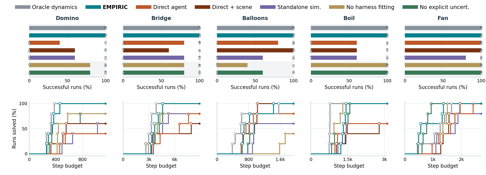

# Paper experiment results



[Vector PDF](figures/paper-results-opus.pdf)

The figure includes Oracle dynamics, EMPIRIC, Direct agent, Direct + scene, Standalone sim., No harness fitting, and No explicit uncert.
Direct + scene denotes the direct agent provided with scene assets.
Paper columns are ordered Domino, Bridge, Balloons, Boil, Fan.
Agent names appear only in the centered, full-width single-row top legend, above the domain titles, with thick color samples matching the bars and curves.
For seeds 0-2, Oracle dynamics uses r2 in Domino and Bridge and the original benchmark cohort in Boil, Balloons, and Fan.
The five-seed selection additionally includes repaired Oracle seeds 3-4 in every domain, and EMPIRIC r2 seeds 3-4 alongside the original EMPIRIC cohort.
The other five approaches likewise include the additional seeds 3-4 as they finish.
These additions use the repaired runtime and retain the original benchmark geometry; see [the launch review](five-seed-launch-review.md).
All remaining cohorts match the full benchmark comparison.
Only finished runs enter the denominator, and a run succeeds only if it wins every level.
The upper row shows successful-run percentages; the lower row shows the percentage solved within each total real-environment step budget, including training and test levels.
White dots show the binary outcome of each finished seed at 0% or 100%; unfinished runs are excluded.
Curves plateau at the corresponding solve rate, so unsuccessful finished runs remain in the denominator.
Method-specific transition markers expose individual curve jumps and make overlapping trajectories easier to distinguish.
Curves are drawn in reverse legend order so EMPIRIC and Oracle dynamics remain visible where methods overlap.
Alternating backgrounds distinguish Oracle, comparison methods, and EMPIRIC ablations without section labels.

The generated `figures/paper-results-opus-summary.json` records the source directory and original arm of each included run.
Historical cohorts remain separate in the full benchmark figure.
This paper figure is a separately generated snapshot, not automatically synchronized to Overleaf.
The snapshot includes the finished seeds available at regeneration time, with larger 12-point agent names in the top legend.

Regenerate on a compute node from the repository root:

```bash
PYTHONPATH=. MPLBACKEND=Agg OPENBLAS_NUM_THREADS=1 /home/ycliang/.conda/envs/pred/bin/python scripts/plotting/plot_benchmark_arms.py docs/comparisons/figures/paper-results-opus --paper
```
