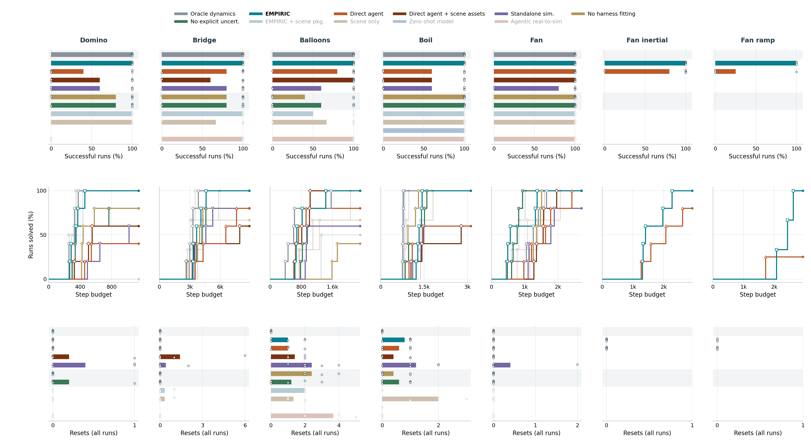

# Opus benchmark sweep: eleven agents and r2 cohorts

Compiled 2026-09-20T18:31:30.660231+00:00 from 235 finished scorecards on the five benchmark settings fixed on September 18 plus separate Fan exposed-transfer, inertial, and ramp development cohorts.
All agents are Claude Opus with the composite skill library.
Preflight settings differ across historical cohorts: some selected EMPIRIC Boil, Domino, Balloons, and Fan runs had preflight enabled; the selected Bridge reruns, EMPIRIC r2 replacements, and newer comparison arms used preflight off.
This is not a matched preflight ablation.
Every linked log directory contains the selected run's scorecard, agent logs, recordings and videos.
This page is a snapshot: runs listed under "Unfinished runs" are not counted anywhere above them.

## Status at this snapshot

- Oracle dynamics: 25/25 seeds finished across five domains.
- EMPIRIC: 25/25 seeds finished (five selected seeds per domain; Boil and Balloons seed 2 and seeds 3-4 use r2).
- Fan transfer pilot: EMPIRIC 1/2 and Direct agent 1/2 seeds finished (separate from the five-domain totals above).
- Fan (inertial transfer): EMPIRIC 5/5 solved, 5/5 finished; Direct agent 4/5 solved, 5/5 finished.
- Fan (ramp transfer): EMPIRIC 3/3 solved, 3/5 finished; Direct agent 1/4 solved, 4/5 finished.
- Direct + scene: 25/25 seeds finished.
  Unfinished: none.
- EMPIRIC + scene package: four unfinished runs remain paused at the user's request (Balloons seed 0, Boil seeds 0 and 2, Domino seed 0).
- No explicit uncertainty Balloons seed 2: finished.
- Other unfinished seeds are listed below; an unfinished scorecard does not establish whether a job is running.
  Zero-shot remains paused; the monitor does not launch, resume or cancel experiments.

The local monitor checks every minute and updates this report and its figure when finished results change.
Its heartbeat and update log are in `logs/benchmark_monitor/`.

## Figure and plotting method



The figure is drawn by [plot_benchmark_arms.py](../../scripts/plotting/plot_benchmark_arms.py) ([PDF](figures/benchmark-arms-opus.pdf), [per-seed records](figures/benchmark-arms-opus-summary.json)).
It follows the policy of [plot_continual_comparisons.py](../../scripts/plotting/plot_continual_comparisons.py), the paper figure script.
The top row is the fraction of finished runs that won every training and test level.
The middle row is the solve-rate curve: the fraction of finished runs that solved the domain within each step budget, so each curve steps up at a solved run's total steps and its plateau is the solve rate.
The bottom row is the mean resets over all finished runs, with dots for individual seeds.
For each seed the script reads the newest finished run in the seed directory, so an unfinished relaunch never displaces a finished run.
Alternating light-grey and white group backgrounds distinguish the oracle reference, methods, EMPIRIC ablations, and additional comparisons without separator lines or group labels; the curve legend preserves the same agent order without section names.
Oracle dynamics is grey, No explicit uncert. is green, and EMPIRIC has a bold label.
EMPIRIC + scene package, Scene only, Zero-shot model, and Agentic real-to-sim are drawn in pale tints.
To regenerate, run the script from the directory that should receive the outputs:

```bash
python ../../../scripts/plotting/plot_benchmark_arms.py benchmark-arms-opus
```

## Settings and cohort selection

The five settings are the menu defaults in [envs/continual.yaml](../../scripts/configs/predicatorv3/envs/continual.yaml): Boil two-jug test, Domino high-friction turn, Fan maze test, Bridge four-span test row and Balloons composition test levels.
EMPIRIC and the direct agent ran before the benchmark rounds under their own round keys; the four-span EMPIRIC runs are the preflight-off ones (r2 seed 0, r3 seeds 1-2).
The other arms ran as `<arm>_opus_benchmark_<round>` from frozen worktrees:

- Oracle dynamics, zero-shot and no harness fitting: [continual_five_ablations_benchmark_r1.yaml](../../scripts/configs/predicatorv3/continual_five_ablations_benchmark_r1.yaml) at `2982f5876` (/home/ycliang/predicators-five-arms-frozen-20260918).
- Standalone simulator and no explicit uncertainty: round r2 from [continual_standalone_no_uncertainty_r2.yaml](../../scripts/configs/predicatorv3/continual_standalone_no_uncertainty_r2.yaml) at `0ddc8f7f4` (/home/ycliang/predicators-standalone-nounc-frozen-20260918), after the September 18 revision of both surfaces.
- Scene only: [continual_scene_only_benchmark_r1.yaml](../../scripts/configs/predicatorv3/continual_scene_only_benchmark_r1.yaml).
- Agentic real-to-sim: [continual_real_to_sim_benchmark_r1.yaml](../../scripts/configs/predicatorv3/continual_real_to_sim_benchmark_r1.yaml) at `5ea35c91c` (/home/ycliang/predicators-real-to-sim-frozen-20260918).
  Its prompt asks the agent to write its own `simulator.py` scene from the engine, the manifest and the assets and to model the mechanisms, the same workflow as EMPIRIC.
- EMPIRIC + scene package: [continual_empiric_scene_package_benchmark_r1.yaml](../../scripts/configs/predicatorv3/continual_empiric_scene_package_benchmark_r1.yaml).
  Fan and Balloons ran as r1 at `d575a8447` (/home/ycliang/predicators-empiric-pkg-frozen-20260918).
  Boil, Bridge and Domino ran as r2 at `8051333e5` (/home/ycliang/predicators-empiric-pkg-split-frozen-20260919), after their environment files were split so the observable sim core can be shared without the hidden mechanisms; their r1 runs were cancelled and are excluded.
  To resume the paused seeds, relaunch the same launcher and round key from the same worktree so auto-resume picks up the scorecard and checkpoint.
- Direct agent + scene assets: [continual_direct_scene_files_benchmark_r1.yaml](../../scripts/configs/predicatorv3/continual_direct_scene_files_benchmark_r1.yaml) at `f6f609636` (/home/ycliang/predicators-direct-scene-files-frozen-20260919).
  It is the direct agent plus the real-to-sim arm's engine wrapper, scene manifest and URDF and mesh files as read-only references; its prompt only asks it to solve the levels, with no simulator, model files, fitting or model gate.
  The rendered prompt is in [the prompt review](../prompt-review/2026-09-19-direct-scene-files/direct_agent_scene_files.md).

EMPIRIC + scene package is EMPIRIC plus everything the agentic real-to-sim arm receives: the engine and base-simulator source, the scene manifest and the URDF and mesh assets.
No arm runs with the realistic sim gap (`sim_gap`, commit `b0c2f0190`); every scene description matches the live world exactly.

Oracle dynamics combines r2 seeds 0-4 for Domino and Bridge with r1 seeds 0-2 and r2 seeds 3-4 for the other domains.
The [Oracle repair pilot](oracle-dynamics-validation-r2.md) also shows the two Oracle rounds side by side.

EMPIRIC r2 uses seeds 3 and 4 across all five domains on the repaired runtime.
Legacy blocking preflight is off; bounded shadow validation logs predictions and outcomes without refusing actions.
The original and r2 seeds are pooled in one EMPIRIC entry, with source-cohort provenance retained.
This is not a matched preflight ablation.

## Fan exposed-transfer pilot

The archived Fan transfer experiment is a separate pilot with two seeds each for EMPIRIC and the direct agent.
The other agents have not been launched on this variant; their empty rows are missing results, not failures.
Only finished seeds enter the bars and curves; pending runs are listed below and do not count as zero successes.
See the [illustrated task description](../amps/fan-exposed-transfer.md) and [launch configuration](../../scripts/configs/predicatorv3/continual_fan_transfer_pilot_r1.yaml).
This superseded pilot is omitted from the figure; its tables and logs remain archived below.
It is also excluded from the paper figure and its data selection.

## Fan inertial and ramp development

The Fan inertial and Fan ramp columns include screening seeds 0-1 and fresh confirmation seeds 2-4 for EMPIRIC and Direct agent.
Only finished runs enter bars, curves, and averages; unfinished runs are listed separately, not counted as failures.
Inertial confirmation finished 3/3 for both methods, so its pilot solve-rate gap did not replicate.
Ramp confirmation is a separate prospective test of the frozen ramp candidate; pooled development results are not independent confirmation.
See the [development record](../amps/fan-development.md) for task illustrations, cohort provenance, and failure analysis.
Both columns are excluded from paper figures and data selection.

## Averages across seeds

Whole-run success means winning every training and test level.
Level success is the total number of won levels divided by the total number of levels across the finished runs.
Mean steps includes only whole-run successful seeds, including their earlier reset episodes; n gives the qualifying seed count.
Mean resets includes all finished seeds, including unsuccessful ones.
The last column gives finished versus planned seeds for each entry; incomplete entries are provisional.

| Domain | Approach | Whole-run successes | Levels won | Mean successful-run steps (n) | Mean resets, all finished seeds | Finished seeds |
|---|---|---:|---:|---:|---:|---:|
| Domino (high-friction turn) | 1. Oracle dynamics | 5/5 (100%) | 10/10 (100%) | 308 (n=5) | 0 | 5/5 |
| Domino (high-friction turn) | 2. EMPIRIC | 5/5 (100%) | 10/10 (100%) | 345 (n=5) | 0 | 5/5 |
| Domino (high-friction turn) | 3. Direct agent | 2/5 (40%) | 7/10 (70%) | 498 (n=2) | 0 | 5/5 |
| Domino (high-friction turn) | 4. Direct agent + scene assets | 3/5 (60%) | 8/10 (80%) | 460 (n=3) | 0.2 | 5/5 |
| Domino (high-friction turn) | 5. Standalone sim. | 3/5 (60%) | 8/10 (80%) | 721.3 (n=3) | 0.4 | 5/5 |
| Domino (high-friction turn) | 6. No harness fitting | 4/5 (80%) | 9/10 (90%) | 464 (n=4) | 0 | 5/5 |
| Domino (high-friction turn) | 7. No explicit uncert. | 4/5 (80%) | 9/10 (90%) | 435.8 (n=4) | 0.2 | 5/5 |
| Domino (high-friction turn) | 8. EMPIRIC + scene pkg. | 2/2 (100%) | 4/4 (100%) | 362 (n=2) | 0 | 2/3 |
| Domino (high-friction turn) | 9. Scene only | 2/2 (100%) | 4/4 (100%) | 303.5 (n=2) | 0 | 2/3 |
| Domino (high-friction turn) | 11. Agentic real-to-sim | 0/3 (0%) | 3/6 (50%) | - (n=0) | 0 | 3/3 |
| Bridge (four-span) | 1. Oracle dynamics | 5/5 (100%) | 10/10 (100%) | 3,204.8 (n=5) | 0 | 5/5 |
| Bridge (four-span) | 2. EMPIRIC | 5/5 (100%) | 10/10 (100%) | 3,795.2 (n=5) | 0 | 5/5 |
| Bridge (four-span) | 3. Direct agent | 4/5 (80%) | 9/10 (90%) | 5,474.2 (n=4) | 0 | 5/5 |
| Bridge (four-span) | 4. Direct agent + scene assets | 3/5 (60%) | 8/10 (80%) | 4,646.7 (n=3) | 1.4 | 5/5 |
| Bridge (four-span) | 5. Standalone sim. | 4/5 (80%) | 9/10 (90%) | 4,129.5 (n=4) | 0.4 | 5/5 |
| Bridge (four-span) | 6. No harness fitting | 4/5 (80%) | 9/10 (90%) | 3,725.2 (n=4) | 0 | 5/5 |
| Bridge (four-span) | 7. No explicit uncert. | 4/5 (80%) | 9/10 (90%) | 3,982.2 (n=4) | 0 | 5/5 |
| Bridge (four-span) | 8. EMPIRIC + scene pkg. | 3/3 (100%) | 6/6 (100%) | 3,931.3 (n=3) | 0.3 | 3/3 |
| Bridge (four-span) | 9. Scene only | 2/3 (66.7%) | 5/6 (83.3%) | 4,026 (n=2) | 0.3 | 3/3 |
| Bridge (four-span) | 11. Agentic real-to-sim | 3/3 (100%) | 6/6 (100%) | 3,177 (n=3) | 0 | 3/3 |
| Balloons (composition) | 1. Oracle dynamics | 5/5 (100%) | 15/15 (100%) | 726.4 (n=5) | 0 | 5/5 |
| Balloons (composition) | 2. EMPIRIC | 5/5 (100%) | 15/15 (100%) | 847 (n=5) | 1 | 5/5 |
| Balloons (composition) | 3. Direct agent | 4/5 (80%) | 14/15 (93.3%) | 727 (n=4) | 1 | 5/5 |
| Balloons (composition) | 4. Direct agent + scene assets | 5/5 (100%) | 15/15 (100%) | 829 (n=5) | 1.4 | 5/5 |
| Balloons (composition) | 5. Standalone sim. | 3/5 (60%) | 13/15 (86.7%) | 921.3 (n=3) | 2.4 | 5/5 |
| Balloons (composition) | 6. No harness fitting | 2/5 (40%) | 12/15 (80%) | 1,655.5 (n=2) | 2.4 | 5/5 |
| Balloons (composition) | 7. No explicit uncert. | 3/5 (60%) | 13/15 (86.7%) | 853 (n=3) | 1.2 | 5/5 |
| Balloons (composition) | 8. EMPIRIC + scene pkg. | 1/2 (50%) | 5/6 (83.3%) | 1,304 (n=1) | 2 | 2/3 |
| Balloons (composition) | 9. Scene only | 2/3 (66.7%) | 8/9 (88.9%) | 916 (n=2) | 1.3 | 3/3 |
| Balloons (composition) | 11. Agentic real-to-sim | 3/3 (100%) | 9/9 (100%) | 1,362 (n=3) | 3.7 | 3/3 |
| Boil (two-jug) | 1. Oracle dynamics | 5/5 (100%) | 10/10 (100%) | 764.8 (n=5) | 0 | 5/5 |
| Boil (two-jug) | 2. EMPIRIC | 5/5 (100%) | 10/10 (100%) | 1,331 (n=5) | 0.8 | 5/5 |
| Boil (two-jug) | 3. Direct agent | 3/5 (60%) | 8/10 (80%) | 1,167.7 (n=3) | 0.6 | 5/5 |
| Boil (two-jug) | 4. Direct agent + scene assets | 3/5 (60%) | 8/10 (80%) | 1,750 (n=3) | 0.4 | 5/5 |
| Boil (two-jug) | 5. Standalone sim. | 3/5 (60%) | 8/10 (80%) | 1,327 (n=3) | 1.2 | 5/5 |
| Boil (two-jug) | 6. No harness fitting | 5/5 (100%) | 10/10 (100%) | 987.6 (n=5) | 0.4 | 5/5 |
| Boil (two-jug) | 7. No explicit uncert. | 5/5 (100%) | 10/10 (100%) | 1,277.4 (n=5) | 0.6 | 5/5 |
| Boil (two-jug) | 8. EMPIRIC + scene pkg. | 1/1 (100%) | 2/2 (100%) | 749 (n=1) | 0 | 1/3 |
| Boil (two-jug) | 9. Scene only | 3/3 (100%) | 6/6 (100%) | 1,521.3 (n=3) | 2 | 3/3 |
| Boil (two-jug) | 10. Zero-shot model | 1/1 (100%) | 2/2 (100%) | 828 (n=1) | 0 | 1/3 |
| Boil (two-jug) | 11. Agentic real-to-sim | 3/3 (100%) | 6/6 (100%) | 875.7 (n=3) | 0 | 3/3 |
| Fan (maze) | 1. Oracle dynamics | 5/5 (100%) | 10/10 (100%) | 1,164 (n=5) | 0 | 5/5 |
| Fan (maze) | 2. EMPIRIC | 5/5 (100%) | 10/10 (100%) | 842.8 (n=5) | 0 | 5/5 |
| Fan (maze) | 3. Direct agent | 5/5 (100%) | 10/10 (100%) | 1,596.8 (n=5) | 0 | 5/5 |
| Fan (maze) | 4. Direct agent + scene assets | 5/5 (100%) | 10/10 (100%) | 1,539.2 (n=5) | 0 | 5/5 |
| Fan (maze) | 5. Standalone sim. | 4/5 (80%) | 9/10 (90%) | 1,473.2 (n=4) | 0.4 | 5/5 |
| Fan (maze) | 6. No harness fitting | 5/5 (100%) | 10/10 (100%) | 1,203.8 (n=5) | 0 | 5/5 |
| Fan (maze) | 7. No explicit uncert. | 5/5 (100%) | 10/10 (100%) | 754.4 (n=5) | 0 | 5/5 |
| Fan (maze) | 8. EMPIRIC + scene pkg. | 3/3 (100%) | 6/6 (100%) | 810 (n=3) | 0 | 3/3 |
| Fan (maze) | 9. Scene only | 3/3 (100%) | 6/6 (100%) | 1,377.7 (n=3) | 0 | 3/3 |
| Fan (maze) | 11. Agentic real-to-sim | 3/3 (100%) | 6/6 (100%) | 1,306 (n=3) | 0 | 3/3 |
| Fan (exposed transfer) | 2. EMPIRIC | 1/1 (100%) | 2/2 (100%) | 1,095 (n=1) | 0 | 1/2 |
| Fan (exposed transfer) | 3. Direct agent | 1/1 (100%) | 2/2 (100%) | 724 (n=1) | 0 | 1/2 |
| Fan (inertial transfer) | 2. EMPIRIC | 5/5 (100%) | 10/10 (100%) | 1,656.2 (n=5) | 0 | 5/5 |
| Fan (inertial transfer) | 3. Direct agent | 4/5 (80%) | 9/10 (90%) | 1,880 (n=4) | 0 | 5/5 |
| Fan (ramp transfer) | 2. EMPIRIC | 3/3 (100%) | 6/6 (100%) | 2,379 (n=3) | 0 | 3/5 |
| Fan (ramp transfer) | 3. Direct agent | 1/4 (25%) | 5/8 (62.5%) | 1,722 (n=1) | 0 | 4/5 |

## Per-seed results and log directories

### Domino (high-friction turn)

| Approach | Seed | Levels won | Steps | Resets | Log directory | Scorecard |
|---|---:|---:|---:|---:|---|---|
| 1. Oracle dynamics | 0 | 2/2 | 374 | 0 | [run logs](/orcd/home/002/ycliang/predicators/logs/agent_continual_oracle_dynamics/domino_high_friction_turn-oracle_dynamics_opus_benchmark_r2/seed0/run_20260919_120029) | [scorecard](/orcd/home/002/ycliang/predicators/logs/agent_continual_oracle_dynamics/domino_high_friction_turn-oracle_dynamics_opus_benchmark_r2/seed0/run_20260919_120029/scorecard.json) |
| 1. Oracle dynamics | 1 | 2/2 | 324 | 0 | [run logs](/orcd/home/002/ycliang/predicators/logs/agent_continual_oracle_dynamics/domino_high_friction_turn-oracle_dynamics_opus_benchmark_r2/seed1/run_20260919_120258) | [scorecard](/orcd/home/002/ycliang/predicators/logs/agent_continual_oracle_dynamics/domino_high_friction_turn-oracle_dynamics_opus_benchmark_r2/seed1/run_20260919_120258/scorecard.json) |
| 1. Oracle dynamics | 2 | 2/2 | 329 | 0 | [run logs](/orcd/home/002/ycliang/predicators/logs/agent_continual_oracle_dynamics/domino_high_friction_turn-oracle_dynamics_opus_benchmark_r2/seed2/run_20260919_120029) | [scorecard](/orcd/home/002/ycliang/predicators/logs/agent_continual_oracle_dynamics/domino_high_friction_turn-oracle_dynamics_opus_benchmark_r2/seed2/run_20260919_120029/scorecard.json) |
| 1. Oracle dynamics | 3 | 2/2 | 257 | 0 | [run logs](/orcd/home/002/ycliang/predicators/logs/agent_continual_oracle_dynamics/domino_high_friction_turn-oracle_dynamics_opus_benchmark_r2/seed3/run_20260919_161610) | [scorecard](/orcd/home/002/ycliang/predicators/logs/agent_continual_oracle_dynamics/domino_high_friction_turn-oracle_dynamics_opus_benchmark_r2/seed3/run_20260919_161610/scorecard.json) |
| 1. Oracle dynamics | 4 | 2/2 | 256 | 0 | [run logs](/orcd/home/002/ycliang/predicators/logs/agent_continual_oracle_dynamics/domino_high_friction_turn-oracle_dynamics_opus_benchmark_r2/seed4/run_20260919_161610) | [scorecard](/orcd/home/002/ycliang/predicators/logs/agent_continual_oracle_dynamics/domino_high_friction_turn-oracle_dynamics_opus_benchmark_r2/seed4/run_20260919_161610/scorecard.json) |
| 2. EMPIRIC | 0 | 2/2 | 368 | 0 | [run logs](/orcd/home/002/ycliang/predicators/logs/agent_continual/domino_high_friction_turn-mb_opus_gate_r1/seed0/run_20260917_082017) | [scorecard](/orcd/home/002/ycliang/predicators/logs/agent_continual/domino_high_friction_turn-mb_opus_gate_r1/seed0/run_20260917_082017/scorecard.json) |
| 2. EMPIRIC | 1 | 2/2 | 285 | 0 | [run logs](/orcd/home/002/ycliang/predicators/logs/agent_continual/domino_high_friction_turn-mb_opus_gate_r1/seed1/run_20260917_082021) | [scorecard](/orcd/home/002/ycliang/predicators/logs/agent_continual/domino_high_friction_turn-mb_opus_gate_r1/seed1/run_20260917_082021/scorecard.json) |
| 2. EMPIRIC | 2 | 2/2 | 459 | 0 | [run logs](/orcd/home/002/ycliang/predicators/logs/agent_continual/domino_high_friction_turn-mb_opus_gate_r1/seed2/run_20260917_082021) | [scorecard](/orcd/home/002/ycliang/predicators/logs/agent_continual/domino_high_friction_turn-mb_opus_gate_r1/seed2/run_20260917_082021/scorecard.json) |
| 2. EMPIRIC | 3 | 2/2 | 265 | 0 | [run logs](/orcd/home/002/ycliang/predicators/logs/agent_continual/domino_high_friction_turn-mb_opus_benchmark_r2/seed3/run_20260919_124956) | [scorecard](/orcd/home/002/ycliang/predicators/logs/agent_continual/domino_high_friction_turn-mb_opus_benchmark_r2/seed3/run_20260919_124956/scorecard.json) |
| 2. EMPIRIC | 4 | 2/2 | 348 | 0 | [run logs](/orcd/home/002/ycliang/predicators/logs/agent_continual/domino_high_friction_turn-mb_opus_benchmark_r2/seed4/run_20260919_124952) | [scorecard](/orcd/home/002/ycliang/predicators/logs/agent_continual/domino_high_friction_turn-mb_opus_benchmark_r2/seed4/run_20260919_124952/scorecard.json) |
| 3. Direct agent | 0 | 2/2 | 455 | 0 | [run logs](/orcd/home/002/ycliang/predicators/logs/agent_continual_model_free/domino_high_friction_turn-mf_opus_r1/seed0/run_20260917_082021) | [scorecard](/orcd/home/002/ycliang/predicators/logs/agent_continual_model_free/domino_high_friction_turn-mf_opus_r1/seed0/run_20260917_082021/scorecard.json) |
| 3. Direct agent | 1 | 1/2 | 559 | 0 | [run logs](/orcd/home/002/ycliang/predicators/logs/agent_continual_model_free/domino_high_friction_turn-mf_opus_r1/seed1/run_20260917_082017) | [scorecard](/orcd/home/002/ycliang/predicators/logs/agent_continual_model_free/domino_high_friction_turn-mf_opus_r1/seed1/run_20260917_082017/scorecard.json) |
| 3. Direct agent | 2 | 1/2 | 456 | 0 | [run logs](/orcd/home/002/ycliang/predicators/logs/agent_continual_model_free/domino_high_friction_turn-mf_opus_r1/seed2/run_20260917_082029) | [scorecard](/orcd/home/002/ycliang/predicators/logs/agent_continual_model_free/domino_high_friction_turn-mf_opus_r1/seed2/run_20260917_082029/scorecard.json) |
| 3. Direct agent | 3 | 2/2 | 541 | 0 | [run logs](/orcd/home/002/ycliang/predicators/logs/agent_continual_model_free/domino_high_friction_turn-mf_opus_benchmark_r2/seed3/run_20260919_161613) | [scorecard](/orcd/home/002/ycliang/predicators/logs/agent_continual_model_free/domino_high_friction_turn-mf_opus_benchmark_r2/seed3/run_20260919_161613/scorecard.json) |
| 3. Direct agent | 4 | 1/2 | 573 | 0 | [run logs](/orcd/home/002/ycliang/predicators/logs/agent_continual_model_free/domino_high_friction_turn-mf_opus_benchmark_r2/seed4/run_20260919_161613) | [scorecard](/orcd/home/002/ycliang/predicators/logs/agent_continual_model_free/domino_high_friction_turn-mf_opus_benchmark_r2/seed4/run_20260919_161613/scorecard.json) |
| 4. Direct agent + scene assets | 0 | 2/2 | 552 | 0 | [run logs](/orcd/home/002/ycliang/predicators/logs/agent_continual_model_free/domino_high_friction_turn-mf_scene_package_opus_benchmark_r1/seed0/run_20260919_040929) | [scorecard](/orcd/home/002/ycliang/predicators/logs/agent_continual_model_free/domino_high_friction_turn-mf_scene_package_opus_benchmark_r1/seed0/run_20260919_040929/scorecard.json) |
| 4. Direct agent + scene assets | 1 | 1/2 | 710 | 0 | [run logs](/orcd/home/002/ycliang/predicators/logs/agent_continual_model_free/domino_high_friction_turn-mf_scene_package_opus_benchmark_r1/seed1/run_20260919_040850) | [scorecard](/orcd/home/002/ycliang/predicators/logs/agent_continual_model_free/domino_high_friction_turn-mf_scene_package_opus_benchmark_r1/seed1/run_20260919_040850/scorecard.json) |
| 4. Direct agent + scene assets | 2 | 2/2 | 504 | 0 | [run logs](/orcd/home/002/ycliang/predicators/logs/agent_continual_model_free/domino_high_friction_turn-mf_scene_package_opus_benchmark_r1/seed2/run_20260919_040850) | [scorecard](/orcd/home/002/ycliang/predicators/logs/agent_continual_model_free/domino_high_friction_turn-mf_scene_package_opus_benchmark_r1/seed2/run_20260919_040850/scorecard.json) |
| 4. Direct agent + scene assets | 3 | 2/2 | 324 | 0 | [run logs](/orcd/home/002/ycliang/predicators/logs/agent_continual_model_free/domino_high_friction_turn-mf_scene_package_opus_benchmark_r1/seed3/run_20260919_161612) | [scorecard](/orcd/home/002/ycliang/predicators/logs/agent_continual_model_free/domino_high_friction_turn-mf_scene_package_opus_benchmark_r1/seed3/run_20260919_161612/scorecard.json) |
| 4. Direct agent + scene assets | 4 | 1/2 | 822 | 1 | [run logs](/orcd/home/002/ycliang/predicators/logs/agent_continual_model_free/domino_high_friction_turn-mf_scene_package_opus_benchmark_r1/seed4/run_20260919_161612) | [scorecard](/orcd/home/002/ycliang/predicators/logs/agent_continual_model_free/domino_high_friction_turn-mf_scene_package_opus_benchmark_r1/seed4/run_20260919_161612/scorecard.json) |
| 5. Standalone sim. | 0 | 1/2 | 902 | 1 | [run logs](/orcd/home/002/ycliang/predicators/logs/agent_continual_program_world_model/domino_high_friction_turn-standalone_opus_benchmark_r2/seed0/run_20260918_153933) | [scorecard](/orcd/home/002/ycliang/predicators/logs/agent_continual_program_world_model/domino_high_friction_turn-standalone_opus_benchmark_r2/seed0/run_20260918_153933/scorecard.json) |
| 5. Standalone sim. | 1 | 2/2 | 650 | 0 | [run logs](/orcd/home/002/ycliang/predicators/logs/agent_continual_program_world_model/domino_high_friction_turn-standalone_opus_benchmark_r2/seed1/run_20260918_162527) | [scorecard](/orcd/home/002/ycliang/predicators/logs/agent_continual_program_world_model/domino_high_friction_turn-standalone_opus_benchmark_r2/seed1/run_20260918_162527/scorecard.json) |
| 5. Standalone sim. | 2 | 2/2 | 1,022 | 1 | [run logs](/orcd/home/002/ycliang/predicators/logs/agent_continual_program_world_model/domino_high_friction_turn-standalone_opus_benchmark_r2/seed2/run_20260918_162527) | [scorecard](/orcd/home/002/ycliang/predicators/logs/agent_continual_program_world_model/domino_high_friction_turn-standalone_opus_benchmark_r2/seed2/run_20260918_162527/scorecard.json) |
| 5. Standalone sim. | 3 | 1/2 | 418 | 0 | [run logs](/orcd/home/002/ycliang/predicators/logs/agent_continual_program_world_model/domino_high_friction_turn-standalone_opus_benchmark_r2/seed3/run_20260919_161607) | [scorecard](/orcd/home/002/ycliang/predicators/logs/agent_continual_program_world_model/domino_high_friction_turn-standalone_opus_benchmark_r2/seed3/run_20260919_161607/scorecard.json) |
| 5. Standalone sim. | 4 | 2/2 | 492 | 0 | [run logs](/orcd/home/002/ycliang/predicators/logs/agent_continual_program_world_model/domino_high_friction_turn-standalone_opus_benchmark_r2/seed4/run_20260919_161609) | [scorecard](/orcd/home/002/ycliang/predicators/logs/agent_continual_program_world_model/domino_high_friction_turn-standalone_opus_benchmark_r2/seed4/run_20260919_161609/scorecard.json) |
| 6. No harness fitting | 0 | 2/2 | 578 | 0 | [run logs](/orcd/home/002/ycliang/predicators/logs/agent_continual_no_fitting/domino_high_friction_turn-no_fitting_opus_benchmark_r1/seed0/run_20260918_091719) | [scorecard](/orcd/home/002/ycliang/predicators/logs/agent_continual_no_fitting/domino_high_friction_turn-no_fitting_opus_benchmark_r1/seed0/run_20260918_091719/scorecard.json) |
| 6. No harness fitting | 1 | 1/2 | 326 | 0 | [run logs](/orcd/home/002/ycliang/predicators/logs/agent_continual_no_fitting/domino_high_friction_turn-no_fitting_opus_benchmark_r1/seed1/run_20260918_091719) | [scorecard](/orcd/home/002/ycliang/predicators/logs/agent_continual_no_fitting/domino_high_friction_turn-no_fitting_opus_benchmark_r1/seed1/run_20260918_091719/scorecard.json) |
| 6. No harness fitting | 2 | 2/2 | 436 | 0 | [run logs](/orcd/home/002/ycliang/predicators/logs/agent_continual_no_fitting/domino_high_friction_turn-no_fitting_opus_benchmark_r1/seed2/run_20260918_091709) | [scorecard](/orcd/home/002/ycliang/predicators/logs/agent_continual_no_fitting/domino_high_friction_turn-no_fitting_opus_benchmark_r1/seed2/run_20260918_091709/scorecard.json) |
| 6. No harness fitting | 3 | 2/2 | 418 | 0 | [run logs](/orcd/home/002/ycliang/predicators/logs/agent_continual_no_fitting/domino_high_friction_turn-no_fitting_opus_benchmark_r1/seed3/run_20260919_161616) | [scorecard](/orcd/home/002/ycliang/predicators/logs/agent_continual_no_fitting/domino_high_friction_turn-no_fitting_opus_benchmark_r1/seed3/run_20260919_161616/scorecard.json) |
| 6. No harness fitting | 4 | 2/2 | 424 | 0 | [run logs](/orcd/home/002/ycliang/predicators/logs/agent_continual_no_fitting/domino_high_friction_turn-no_fitting_opus_benchmark_r1/seed4/run_20260919_161616) | [scorecard](/orcd/home/002/ycliang/predicators/logs/agent_continual_no_fitting/domino_high_friction_turn-no_fitting_opus_benchmark_r1/seed4/run_20260919_161616/scorecard.json) |
| 7. No explicit uncert. | 0 | 2/2 | 337 | 0 | [run logs](/orcd/home/002/ycliang/predicators/logs/agent_continual_no_uncertainty/domino_high_friction_turn-no_uncertainty_opus_benchmark_r2/seed0/run_20260918_153934) | [scorecard](/orcd/home/002/ycliang/predicators/logs/agent_continual_no_uncertainty/domino_high_friction_turn-no_uncertainty_opus_benchmark_r2/seed0/run_20260918_153934/scorecard.json) |
| 7. No explicit uncert. | 1 | 2/2 | 299 | 0 | [run logs](/orcd/home/002/ycliang/predicators/logs/agent_continual_no_uncertainty/domino_high_friction_turn-no_uncertainty_opus_benchmark_r2/seed1/run_20260918_162807) | [scorecard](/orcd/home/002/ycliang/predicators/logs/agent_continual_no_uncertainty/domino_high_friction_turn-no_uncertainty_opus_benchmark_r2/seed1/run_20260918_162807/scorecard.json) |
| 7. No explicit uncert. | 2 | 2/2 | 342 | 0 | [run logs](/orcd/home/002/ycliang/predicators/logs/agent_continual_no_uncertainty/domino_high_friction_turn-no_uncertainty_opus_benchmark_r2/seed2/run_20260918_162807) | [scorecard](/orcd/home/002/ycliang/predicators/logs/agent_continual_no_uncertainty/domino_high_friction_turn-no_uncertainty_opus_benchmark_r2/seed2/run_20260918_162807/scorecard.json) |
| 7. No explicit uncert. | 3 | 1/2 | 352 | 0 | [run logs](/orcd/home/002/ycliang/predicators/logs/agent_continual_no_uncertainty/domino_high_friction_turn-no_uncertainty_opus_benchmark_r2/seed3/run_20260919_161655) | [scorecard](/orcd/home/002/ycliang/predicators/logs/agent_continual_no_uncertainty/domino_high_friction_turn-no_uncertainty_opus_benchmark_r2/seed3/run_20260919_161655/scorecard.json) |
| 7. No explicit uncert. | 4 | 2/2 | 765 | 1 | [run logs](/orcd/home/002/ycliang/predicators/logs/agent_continual_no_uncertainty/domino_high_friction_turn-no_uncertainty_opus_benchmark_r2/seed4/run_20260919_161655) | [scorecard](/orcd/home/002/ycliang/predicators/logs/agent_continual_no_uncertainty/domino_high_friction_turn-no_uncertainty_opus_benchmark_r2/seed4/run_20260919_161655/scorecard.json) |
| 8. EMPIRIC + scene pkg. | 1 | 2/2 | 289 | 0 | [run logs](/orcd/home/002/ycliang/predicators/logs/agent_continual/domino_high_friction_turn-mb_scene_package_opus_benchmark_r2/seed1/run_20260919_030129) | [scorecard](/orcd/home/002/ycliang/predicators/logs/agent_continual/domino_high_friction_turn-mb_scene_package_opus_benchmark_r2/seed1/run_20260919_030129/scorecard.json) |
| 8. EMPIRIC + scene pkg. | 2 | 2/2 | 435 | 0 | [run logs](/orcd/home/002/ycliang/predicators/logs/agent_continual/domino_high_friction_turn-mb_scene_package_opus_benchmark_r2/seed2/run_20260919_030129) | [scorecard](/orcd/home/002/ycliang/predicators/logs/agent_continual/domino_high_friction_turn-mb_scene_package_opus_benchmark_r2/seed2/run_20260919_030129/scorecard.json) |
| 9. Scene only | 0 | 2/2 | 347 | 0 | [run logs](/orcd/home/002/ycliang/predicators/logs/agent_continual_scene_only/domino_high_friction_turn-scene_only_opus_benchmark_r1/seed0/run_20260918_074325) | [scorecard](/orcd/home/002/ycliang/predicators/logs/agent_continual_scene_only/domino_high_friction_turn-scene_only_opus_benchmark_r1/seed0/run_20260918_074325/scorecard.json) |
| 9. Scene only | 1 | 2/2 | 260 | 0 | [run logs](/orcd/home/002/ycliang/predicators/logs/agent_continual_scene_only/domino_high_friction_turn-scene_only_opus_benchmark_r1/seed1/run_20260918_074324) | [scorecard](/orcd/home/002/ycliang/predicators/logs/agent_continual_scene_only/domino_high_friction_turn-scene_only_opus_benchmark_r1/seed1/run_20260918_074324/scorecard.json) |
| 11. Agentic real-to-sim | 0 | 1/2 | 563 | 0 | [run logs](/orcd/home/002/ycliang/predicators/logs/agent_continual_real_to_sim/domino_high_friction_turn-real_to_sim_opus_benchmark_r1/seed0/run_20260918_095756) | [scorecard](/orcd/home/002/ycliang/predicators/logs/agent_continual_real_to_sim/domino_high_friction_turn-real_to_sim_opus_benchmark_r1/seed0/run_20260918_095756/scorecard.json) |
| 11. Agentic real-to-sim | 1 | 1/2 | 213 | 0 | [run logs](/orcd/home/002/ycliang/predicators/logs/agent_continual_real_to_sim/domino_high_friction_turn-real_to_sim_opus_benchmark_r1/seed1/run_20260918_095756) | [scorecard](/orcd/home/002/ycliang/predicators/logs/agent_continual_real_to_sim/domino_high_friction_turn-real_to_sim_opus_benchmark_r1/seed1/run_20260918_095756/scorecard.json) |
| 11. Agentic real-to-sim | 2 | 1/2 | 704 | 0 | [run logs](/orcd/home/002/ycliang/predicators/logs/agent_continual_real_to_sim/domino_high_friction_turn-real_to_sim_opus_benchmark_r1/seed2/run_20260918_095756) | [scorecard](/orcd/home/002/ycliang/predicators/logs/agent_continual_real_to_sim/domino_high_friction_turn-real_to_sim_opus_benchmark_r1/seed2/run_20260918_095756/scorecard.json) |

### Bridge (four-span)

| Approach | Seed | Levels won | Steps | Resets | Log directory | Scorecard |
|---|---:|---:|---:|---:|---|---|
| 1. Oracle dynamics | 0 | 2/2 | 2,633 | 0 | [run logs](/orcd/home/002/ycliang/predicators/logs/agent_continual_oracle_dynamics/bridge-oracle_dynamics_opus_benchmark_r2/seed0/run_20260919_120029) | [scorecard](/orcd/home/002/ycliang/predicators/logs/agent_continual_oracle_dynamics/bridge-oracle_dynamics_opus_benchmark_r2/seed0/run_20260919_120029/scorecard.json) |
| 1. Oracle dynamics | 1 | 2/2 | 3,303 | 0 | [run logs](/orcd/home/002/ycliang/predicators/logs/agent_continual_oracle_dynamics/bridge-oracle_dynamics_opus_benchmark_r2/seed1/run_20260919_120029) | [scorecard](/orcd/home/002/ycliang/predicators/logs/agent_continual_oracle_dynamics/bridge-oracle_dynamics_opus_benchmark_r2/seed1/run_20260919_120029/scorecard.json) |
| 1. Oracle dynamics | 2 | 2/2 | 3,275 | 0 | [run logs](/orcd/home/002/ycliang/predicators/logs/agent_continual_oracle_dynamics/bridge-oracle_dynamics_opus_benchmark_r2/seed2/run_20260919_120029) | [scorecard](/orcd/home/002/ycliang/predicators/logs/agent_continual_oracle_dynamics/bridge-oracle_dynamics_opus_benchmark_r2/seed2/run_20260919_120029/scorecard.json) |
| 1. Oracle dynamics | 3 | 2/2 | 2,976 | 0 | [run logs](/orcd/home/002/ycliang/predicators/logs/agent_continual_oracle_dynamics/bridge-oracle_dynamics_opus_benchmark_r2/seed3/run_20260919_161614) | [scorecard](/orcd/home/002/ycliang/predicators/logs/agent_continual_oracle_dynamics/bridge-oracle_dynamics_opus_benchmark_r2/seed3/run_20260919_161614/scorecard.json) |
| 1. Oracle dynamics | 4 | 2/2 | 3,837 | 0 | [run logs](/orcd/home/002/ycliang/predicators/logs/agent_continual_oracle_dynamics/bridge-oracle_dynamics_opus_benchmark_r2/seed4/run_20260919_161614) | [scorecard](/orcd/home/002/ycliang/predicators/logs/agent_continual_oracle_dynamics/bridge-oracle_dynamics_opus_benchmark_r2/seed4/run_20260919_161614/scorecard.json) |
| 2. EMPIRIC | 0 | 2/2 | 3,302 | 0 | [run logs](/orcd/home/002/ycliang/predicators/logs/agent_continual/bridge-mb_opus_span_transfer_r2/seed0/run_20260916_190710) | [scorecard](/orcd/home/002/ycliang/predicators/logs/agent_continual/bridge-mb_opus_span_transfer_r2/seed0/run_20260916_190710/scorecard.json) |
| 2. EMPIRIC | 1 | 2/2 | 3,665 | 0 | [run logs](/orcd/home/002/ycliang/predicators/logs/agent_continual/bridge_span_transfer-mb_opus_span_transfer_r3/seed1/run_20260917_135634) | [scorecard](/orcd/home/002/ycliang/predicators/logs/agent_continual/bridge_span_transfer-mb_opus_span_transfer_r3/seed1/run_20260917_135634/scorecard.json) |
| 2. EMPIRIC | 2 | 2/2 | 4,590 | 0 | [run logs](/orcd/home/002/ycliang/predicators/logs/agent_continual/bridge_span_transfer-mb_opus_span_transfer_r3/seed2/run_20260917_135632) | [scorecard](/orcd/home/002/ycliang/predicators/logs/agent_continual/bridge_span_transfer-mb_opus_span_transfer_r3/seed2/run_20260917_135632/scorecard.json) |
| 2. EMPIRIC | 3 | 2/2 | 4,086 | 0 | [run logs](/orcd/home/002/ycliang/predicators/logs/agent_continual/bridge-mb_opus_benchmark_r2/seed3/run_20260919_124955) | [scorecard](/orcd/home/002/ycliang/predicators/logs/agent_continual/bridge-mb_opus_benchmark_r2/seed3/run_20260919_124955/scorecard.json) |
| 2. EMPIRIC | 4 | 2/2 | 3,333 | 0 | [run logs](/orcd/home/002/ycliang/predicators/logs/agent_continual/bridge-mb_opus_benchmark_r2/seed4/run_20260919_124955) | [scorecard](/orcd/home/002/ycliang/predicators/logs/agent_continual/bridge-mb_opus_benchmark_r2/seed4/run_20260919_124955/scorecard.json) |
| 3. Direct agent | 0 | 2/2 | 4,292 | 0 | [run logs](/orcd/home/002/ycliang/predicators/logs/agent_continual_model_free/bridge-mf_opus_span_transfer_r2/seed0/run_20260916_190651) | [scorecard](/orcd/home/002/ycliang/predicators/logs/agent_continual_model_free/bridge-mf_opus_span_transfer_r2/seed0/run_20260916_190651/scorecard.json) |
| 3. Direct agent | 1 | 2/2 | 7,585 | 0 | [run logs](/orcd/home/002/ycliang/predicators/logs/agent_continual_model_free/bridge_span_transfer-mf_opus_span_transfer_r2/seed1/run_20260917_110833) | [scorecard](/orcd/home/002/ycliang/predicators/logs/agent_continual_model_free/bridge_span_transfer-mf_opus_span_transfer_r2/seed1/run_20260917_110833/scorecard.json) |
| 3. Direct agent | 2 | 2/2 | 6,525 | 0 | [run logs](/orcd/home/002/ycliang/predicators/logs/agent_continual_model_free/bridge_span_transfer-mf_opus_span_transfer_r2/seed2/run_20260917_110833) | [scorecard](/orcd/home/002/ycliang/predicators/logs/agent_continual_model_free/bridge_span_transfer-mf_opus_span_transfer_r2/seed2/run_20260917_110833/scorecard.json) |
| 3. Direct agent | 3 | 2/2 | 3,495 | 0 | [run logs](/orcd/home/002/ycliang/predicators/logs/agent_continual_model_free/bridge-mf_opus_benchmark_r2/seed3/run_20260919_161614) | [scorecard](/orcd/home/002/ycliang/predicators/logs/agent_continual_model_free/bridge-mf_opus_benchmark_r2/seed3/run_20260919_161614/scorecard.json) |
| 3. Direct agent | 4 | 1/2 | 4,677 | 0 | [run logs](/orcd/home/002/ycliang/predicators/logs/agent_continual_model_free/bridge-mf_opus_benchmark_r2/seed4/run_20260919_161614) | [scorecard](/orcd/home/002/ycliang/predicators/logs/agent_continual_model_free/bridge-mf_opus_benchmark_r2/seed4/run_20260919_161614/scorecard.json) |
| 4. Direct agent + scene assets | 0 | 1/2 | 20,015 | 6 | [run logs](/orcd/home/002/ycliang/predicators/logs/agent_continual_model_free/bridge-mf_scene_package_opus_benchmark_r1/seed0/run_20260919_040840) | [scorecard](/orcd/home/002/ycliang/predicators/logs/agent_continual_model_free/bridge-mf_scene_package_opus_benchmark_r1/seed0/run_20260919_040840/scorecard.json) |
| 4. Direct agent + scene assets | 1 | 1/2 | 3,736 | 0 | [run logs](/orcd/home/002/ycliang/predicators/logs/agent_continual_model_free/bridge-mf_scene_package_opus_benchmark_r1/seed1/run_20260919_040839) | [scorecard](/orcd/home/002/ycliang/predicators/logs/agent_continual_model_free/bridge-mf_scene_package_opus_benchmark_r1/seed1/run_20260919_040839/scorecard.json) |
| 4. Direct agent + scene assets | 2 | 2/2 | 3,380 | 0 | [run logs](/orcd/home/002/ycliang/predicators/logs/agent_continual_model_free/bridge-mf_scene_package_opus_benchmark_r1/seed2/run_20260919_040839) | [scorecard](/orcd/home/002/ycliang/predicators/logs/agent_continual_model_free/bridge-mf_scene_package_opus_benchmark_r1/seed2/run_20260919_040839/scorecard.json) |
| 4. Direct agent + scene assets | 3 | 2/2 | 7,916 | 1 | [run logs](/orcd/home/002/ycliang/predicators/logs/agent_continual_model_free/bridge-mf_scene_package_opus_benchmark_r1/seed3/run_20260919_161613) | [scorecard](/orcd/home/002/ycliang/predicators/logs/agent_continual_model_free/bridge-mf_scene_package_opus_benchmark_r1/seed3/run_20260919_161613/scorecard.json) |
| 4. Direct agent + scene assets | 4 | 2/2 | 2,644 | 0 | [run logs](/orcd/home/002/ycliang/predicators/logs/agent_continual_model_free/bridge-mf_scene_package_opus_benchmark_r1/seed4/run_20260919_161613) | [scorecard](/orcd/home/002/ycliang/predicators/logs/agent_continual_model_free/bridge-mf_scene_package_opus_benchmark_r1/seed4/run_20260919_161613/scorecard.json) |
| 5. Standalone sim. | 0 | 2/2 | 4,575 | 0 | [run logs](/orcd/home/002/ycliang/predicators/logs/agent_continual_program_world_model/bridge-standalone_opus_benchmark_r2/seed0/run_20260918_144453) | [scorecard](/orcd/home/002/ycliang/predicators/logs/agent_continual_program_world_model/bridge-standalone_opus_benchmark_r2/seed0/run_20260918_144453/scorecard.json) |
| 5. Standalone sim. | 1 | 2/2 | 5,246 | 0 | [run logs](/orcd/home/002/ycliang/predicators/logs/agent_continual_program_world_model/bridge-standalone_opus_benchmark_r2/seed1/run_20260918_162542) | [scorecard](/orcd/home/002/ycliang/predicators/logs/agent_continual_program_world_model/bridge-standalone_opus_benchmark_r2/seed1/run_20260918_162542/scorecard.json) |
| 5. Standalone sim. | 2 | 2/2 | 3,210 | 0 | [run logs](/orcd/home/002/ycliang/predicators/logs/agent_continual_program_world_model/bridge-standalone_opus_benchmark_r2/seed2/run_20260918_162514) | [scorecard](/orcd/home/002/ycliang/predicators/logs/agent_continual_program_world_model/bridge-standalone_opus_benchmark_r2/seed2/run_20260918_162514/scorecard.json) |
| 5. Standalone sim. | 3 | 1/2 | 7,477 | 2 | [run logs](/orcd/home/002/ycliang/predicators/logs/agent_continual_program_world_model/bridge-standalone_opus_benchmark_r2/seed3/run_20260919_161614) | [scorecard](/orcd/home/002/ycliang/predicators/logs/agent_continual_program_world_model/bridge-standalone_opus_benchmark_r2/seed3/run_20260919_161614/scorecard.json) |
| 5. Standalone sim. | 4 | 2/2 | 3,487 | 0 | [run logs](/orcd/home/002/ycliang/predicators/logs/agent_continual_program_world_model/bridge-standalone_opus_benchmark_r2/seed4/run_20260919_161614) | [scorecard](/orcd/home/002/ycliang/predicators/logs/agent_continual_program_world_model/bridge-standalone_opus_benchmark_r2/seed4/run_20260919_161614/scorecard.json) |
| 6. No harness fitting | 0 | 1/2 | 3,518 | 0 | [run logs](/orcd/home/002/ycliang/predicators/logs/agent_continual_no_fitting/bridge-no_fitting_opus_benchmark_r1/seed0/run_20260918_091719) | [scorecard](/orcd/home/002/ycliang/predicators/logs/agent_continual_no_fitting/bridge-no_fitting_opus_benchmark_r1/seed0/run_20260918_091719/scorecard.json) |
| 6. No harness fitting | 1 | 2/2 | 2,925 | 0 | [run logs](/orcd/home/002/ycliang/predicators/logs/agent_continual_no_fitting/bridge-no_fitting_opus_benchmark_r1/seed1/run_20260918_091719) | [scorecard](/orcd/home/002/ycliang/predicators/logs/agent_continual_no_fitting/bridge-no_fitting_opus_benchmark_r1/seed1/run_20260918_091719/scorecard.json) |
| 6. No harness fitting | 2 | 2/2 | 3,743 | 0 | [run logs](/orcd/home/002/ycliang/predicators/logs/agent_continual_no_fitting/bridge-no_fitting_opus_benchmark_r1/seed2/run_20260918_091719) | [scorecard](/orcd/home/002/ycliang/predicators/logs/agent_continual_no_fitting/bridge-no_fitting_opus_benchmark_r1/seed2/run_20260918_091719/scorecard.json) |
| 6. No harness fitting | 3 | 2/2 | 4,276 | 0 | [run logs](/orcd/home/002/ycliang/predicators/logs/agent_continual_no_fitting/bridge-no_fitting_opus_benchmark_r1/seed3/run_20260919_161617) | [scorecard](/orcd/home/002/ycliang/predicators/logs/agent_continual_no_fitting/bridge-no_fitting_opus_benchmark_r1/seed3/run_20260919_161617/scorecard.json) |
| 6. No harness fitting | 4 | 2/2 | 3,957 | 0 | [run logs](/orcd/home/002/ycliang/predicators/logs/agent_continual_no_fitting/bridge-no_fitting_opus_benchmark_r1/seed4/run_20260919_161617) | [scorecard](/orcd/home/002/ycliang/predicators/logs/agent_continual_no_fitting/bridge-no_fitting_opus_benchmark_r1/seed4/run_20260919_161617/scorecard.json) |
| 7. No explicit uncert. | 0 | 2/2 | 4,181 | 0 | [run logs](/orcd/home/002/ycliang/predicators/logs/agent_continual_no_uncertainty/bridge-no_uncertainty_opus_benchmark_r2/seed0/run_20260918_153933) | [scorecard](/orcd/home/002/ycliang/predicators/logs/agent_continual_no_uncertainty/bridge-no_uncertainty_opus_benchmark_r2/seed0/run_20260918_153933/scorecard.json) |
| 7. No explicit uncert. | 1 | 2/2 | 4,576 | 0 | [run logs](/orcd/home/002/ycliang/predicators/logs/agent_continual_no_uncertainty/bridge-no_uncertainty_opus_benchmark_r2/seed1/run_20260918_162811) | [scorecard](/orcd/home/002/ycliang/predicators/logs/agent_continual_no_uncertainty/bridge-no_uncertainty_opus_benchmark_r2/seed1/run_20260918_162811/scorecard.json) |
| 7. No explicit uncert. | 2 | 1/2 | 5,883 | 0 | [run logs](/orcd/home/002/ycliang/predicators/logs/agent_continual_no_uncertainty/bridge-no_uncertainty_opus_benchmark_r2/seed2/run_20260918_162811) | [scorecard](/orcd/home/002/ycliang/predicators/logs/agent_continual_no_uncertainty/bridge-no_uncertainty_opus_benchmark_r2/seed2/run_20260918_162811/scorecard.json) |
| 7. No explicit uncert. | 3 | 2/2 | 3,512 | 0 | [run logs](/orcd/home/002/ycliang/predicators/logs/agent_continual_no_uncertainty/bridge-no_uncertainty_opus_benchmark_r2/seed3/run_20260919_161652) | [scorecard](/orcd/home/002/ycliang/predicators/logs/agent_continual_no_uncertainty/bridge-no_uncertainty_opus_benchmark_r2/seed3/run_20260919_161652/scorecard.json) |
| 7. No explicit uncert. | 4 | 2/2 | 3,660 | 0 | [run logs](/orcd/home/002/ycliang/predicators/logs/agent_continual_no_uncertainty/bridge-no_uncertainty_opus_benchmark_r2/seed4/run_20260919_161652) | [scorecard](/orcd/home/002/ycliang/predicators/logs/agent_continual_no_uncertainty/bridge-no_uncertainty_opus_benchmark_r2/seed4/run_20260919_161652/scorecard.json) |
| 8. EMPIRIC + scene pkg. | 0 | 2/2 | 5,808 | 1 | [run logs](/orcd/home/002/ycliang/predicators/logs/agent_continual/bridge-mb_scene_package_opus_benchmark_r2/seed0/run_20260919_030129) | [scorecard](/orcd/home/002/ycliang/predicators/logs/agent_continual/bridge-mb_scene_package_opus_benchmark_r2/seed0/run_20260919_030129/scorecard.json) |
| 8. EMPIRIC + scene pkg. | 1 | 2/2 | 3,004 | 0 | [run logs](/orcd/home/002/ycliang/predicators/logs/agent_continual/bridge-mb_scene_package_opus_benchmark_r2/seed1/run_20260919_030128) | [scorecard](/orcd/home/002/ycliang/predicators/logs/agent_continual/bridge-mb_scene_package_opus_benchmark_r2/seed1/run_20260919_030128/scorecard.json) |
| 8. EMPIRIC + scene pkg. | 2 | 2/2 | 2,982 | 0 | [run logs](/orcd/home/002/ycliang/predicators/logs/agent_continual/bridge-mb_scene_package_opus_benchmark_r2/seed2/run_20260919_030128) | [scorecard](/orcd/home/002/ycliang/predicators/logs/agent_continual/bridge-mb_scene_package_opus_benchmark_r2/seed2/run_20260919_030128/scorecard.json) |
| 9. Scene only | 0 | 1/2 | 5,482 | 1 | [run logs](/orcd/home/002/ycliang/predicators/logs/agent_continual_scene_only/bridge-scene_only_opus_benchmark_r1/seed0/run_20260918_074329) | [scorecard](/orcd/home/002/ycliang/predicators/logs/agent_continual_scene_only/bridge-scene_only_opus_benchmark_r1/seed0/run_20260918_074329/scorecard.json) |
| 9. Scene only | 1 | 2/2 | 3,759 | 0 | [run logs](/orcd/home/002/ycliang/predicators/logs/agent_continual_scene_only/bridge-scene_only_opus_benchmark_r1/seed1/run_20260918_074325) | [scorecard](/orcd/home/002/ycliang/predicators/logs/agent_continual_scene_only/bridge-scene_only_opus_benchmark_r1/seed1/run_20260918_074325/scorecard.json) |
| 9. Scene only | 2 | 2/2 | 4,293 | 0 | [run logs](/orcd/home/002/ycliang/predicators/logs/agent_continual_scene_only/bridge-scene_only_opus_benchmark_r1/seed2/run_20260918_074328) | [scorecard](/orcd/home/002/ycliang/predicators/logs/agent_continual_scene_only/bridge-scene_only_opus_benchmark_r1/seed2/run_20260918_074328/scorecard.json) |
| 11. Agentic real-to-sim | 0 | 2/2 | 2,753 | 0 | [run logs](/orcd/home/002/ycliang/predicators/logs/agent_continual_real_to_sim/bridge-real_to_sim_opus_benchmark_r1/seed0/run_20260918_095755) | [scorecard](/orcd/home/002/ycliang/predicators/logs/agent_continual_real_to_sim/bridge-real_to_sim_opus_benchmark_r1/seed0/run_20260918_095755/scorecard.json) |
| 11. Agentic real-to-sim | 1 | 2/2 | 3,257 | 0 | [run logs](/orcd/home/002/ycliang/predicators/logs/agent_continual_real_to_sim/bridge-real_to_sim_opus_benchmark_r1/seed1/run_20260918_095755) | [scorecard](/orcd/home/002/ycliang/predicators/logs/agent_continual_real_to_sim/bridge-real_to_sim_opus_benchmark_r1/seed1/run_20260918_095755/scorecard.json) |
| 11. Agentic real-to-sim | 2 | 2/2 | 3,521 | 0 | [run logs](/orcd/home/002/ycliang/predicators/logs/agent_continual_real_to_sim/bridge-real_to_sim_opus_benchmark_r1/seed2/run_20260918_095755) | [scorecard](/orcd/home/002/ycliang/predicators/logs/agent_continual_real_to_sim/bridge-real_to_sim_opus_benchmark_r1/seed2/run_20260918_095755/scorecard.json) |

### Balloons (composition)

| Approach | Seed | Levels won | Steps | Resets | Log directory | Scorecard |
|---|---:|---:|---:|---:|---|---|
| 1. Oracle dynamics | 0 | 3/3 | 385 | 0 | [run logs](/orcd/home/002/ycliang/predicators/logs/agent_continual_oracle_dynamics/balloons-oracle_dynamics_opus_benchmark_r1/seed0/run_20260918_091701) | [scorecard](/orcd/home/002/ycliang/predicators/logs/agent_continual_oracle_dynamics/balloons-oracle_dynamics_opus_benchmark_r1/seed0/run_20260918_091701/scorecard.json) |
| 1. Oracle dynamics | 1 | 3/3 | 624 | 0 | [run logs](/orcd/home/002/ycliang/predicators/logs/agent_continual_oracle_dynamics/balloons-oracle_dynamics_opus_benchmark_r1/seed1/run_20260918_091701) | [scorecard](/orcd/home/002/ycliang/predicators/logs/agent_continual_oracle_dynamics/balloons-oracle_dynamics_opus_benchmark_r1/seed1/run_20260918_091701/scorecard.json) |
| 1. Oracle dynamics | 2 | 3/3 | 460 | 0 | [run logs](/orcd/home/002/ycliang/predicators/logs/agent_continual_oracle_dynamics/balloons-oracle_dynamics_opus_benchmark_r1/seed2/run_20260918_091701) | [scorecard](/orcd/home/002/ycliang/predicators/logs/agent_continual_oracle_dynamics/balloons-oracle_dynamics_opus_benchmark_r1/seed2/run_20260918_091701/scorecard.json) |
| 1. Oracle dynamics | 3 | 3/3 | 600 | 0 | [run logs](/orcd/home/002/ycliang/predicators/logs/agent_continual_oracle_dynamics/balloons-oracle_dynamics_opus_benchmark_r2/seed3/run_20260919_161753) | [scorecard](/orcd/home/002/ycliang/predicators/logs/agent_continual_oracle_dynamics/balloons-oracle_dynamics_opus_benchmark_r2/seed3/run_20260919_161753/scorecard.json) |
| 1. Oracle dynamics | 4 | 3/3 | 1,563 | 0 | [run logs](/orcd/home/002/ycliang/predicators/logs/agent_continual_oracle_dynamics/balloons-oracle_dynamics_opus_benchmark_r2/seed4/run_20260919_161611) | [scorecard](/orcd/home/002/ycliang/predicators/logs/agent_continual_oracle_dynamics/balloons-oracle_dynamics_opus_benchmark_r2/seed4/run_20260919_161611/scorecard.json) |
| 2. EMPIRIC | 0 | 3/3 | 682 | 0 | [run logs](/orcd/home/002/ycliang/predicators/logs/agent_continual/balloons-mb_opus_compose_r2/seed0/run_20260917_082044) | [scorecard](/orcd/home/002/ycliang/predicators/logs/agent_continual/balloons-mb_opus_compose_r2/seed0/run_20260917_082044/scorecard.json) |
| 2. EMPIRIC | 1 | 3/3 | 823 | 2 | [run logs](/orcd/home/002/ycliang/predicators/logs/agent_continual/balloons-mb_opus_compose_r2/seed1/run_20260917_082044) | [scorecard](/orcd/home/002/ycliang/predicators/logs/agent_continual/balloons-mb_opus_compose_r2/seed1/run_20260917_082044/scorecard.json) |
| 2. EMPIRIC | 2 | 3/3 | 1,427 | 2 | [run logs](/orcd/home/002/ycliang/predicators/logs/agent_continual/balloons-mb_opus_benchmark_r2/seed2/run_20260920_060152) | [scorecard](/orcd/home/002/ycliang/predicators/logs/agent_continual/balloons-mb_opus_benchmark_r2/seed2/run_20260920_060152/scorecard.json) |
| 2. EMPIRIC | 3 | 3/3 | 634 | 1 | [run logs](/orcd/home/002/ycliang/predicators/logs/agent_continual/balloons-mb_opus_benchmark_r2/seed3/run_20260919_124956) | [scorecard](/orcd/home/002/ycliang/predicators/logs/agent_continual/balloons-mb_opus_benchmark_r2/seed3/run_20260919_124956/scorecard.json) |
| 2. EMPIRIC | 4 | 3/3 | 669 | 0 | [run logs](/orcd/home/002/ycliang/predicators/logs/agent_continual/balloons-mb_opus_benchmark_r2/seed4/run_20260919_124956) | [scorecard](/orcd/home/002/ycliang/predicators/logs/agent_continual/balloons-mb_opus_benchmark_r2/seed4/run_20260919_124956/scorecard.json) |
| 3. Direct agent | 0 | 3/3 | 652 | 1 | [run logs](/orcd/home/002/ycliang/predicators/logs/agent_continual_model_free/balloons-mf_opus_compose_r2/seed0/run_20260917_082019) | [scorecard](/orcd/home/002/ycliang/predicators/logs/agent_continual_model_free/balloons-mf_opus_compose_r2/seed0/run_20260917_082019/scorecard.json) |
| 3. Direct agent | 1 | 2/3 | 628 | 1 | [run logs](/orcd/home/002/ycliang/predicators/logs/agent_continual_model_free/balloons-mf_opus_compose_r2/seed1/run_20260917_082025) | [scorecard](/orcd/home/002/ycliang/predicators/logs/agent_continual_model_free/balloons-mf_opus_compose_r2/seed1/run_20260917_082025/scorecard.json) |
| 3. Direct agent | 2 | 3/3 | 918 | 1 | [run logs](/orcd/home/002/ycliang/predicators/logs/agent_continual_model_free/balloons-mf_opus_compose_r2/seed2/run_20260917_082020) | [scorecard](/orcd/home/002/ycliang/predicators/logs/agent_continual_model_free/balloons-mf_opus_compose_r2/seed2/run_20260917_082020/scorecard.json) |
| 3. Direct agent | 3 | 3/3 | 730 | 2 | [run logs](/orcd/home/002/ycliang/predicators/logs/agent_continual_model_free/balloons-mf_opus_benchmark_r2/seed3/run_20260919_161610) | [scorecard](/orcd/home/002/ycliang/predicators/logs/agent_continual_model_free/balloons-mf_opus_benchmark_r2/seed3/run_20260919_161610/scorecard.json) |
| 3. Direct agent | 4 | 3/3 | 608 | 0 | [run logs](/orcd/home/002/ycliang/predicators/logs/agent_continual_model_free/balloons-mf_opus_benchmark_r2/seed4/run_20260919_161614) | [scorecard](/orcd/home/002/ycliang/predicators/logs/agent_continual_model_free/balloons-mf_opus_benchmark_r2/seed4/run_20260919_161614/scorecard.json) |
| 4. Direct agent + scene assets | 0 | 3/3 | 813 | 2 | [run logs](/orcd/home/002/ycliang/predicators/logs/agent_continual_model_free/balloons-mf_scene_package_opus_benchmark_r1/seed0/run_20260919_040841) | [scorecard](/orcd/home/002/ycliang/predicators/logs/agent_continual_model_free/balloons-mf_scene_package_opus_benchmark_r1/seed0/run_20260919_040841/scorecard.json) |
| 4. Direct agent + scene assets | 1 | 3/3 | 634 | 1 | [run logs](/orcd/home/002/ycliang/predicators/logs/agent_continual_model_free/balloons-mf_scene_package_opus_benchmark_r1/seed1/run_20260919_040840) | [scorecard](/orcd/home/002/ycliang/predicators/logs/agent_continual_model_free/balloons-mf_scene_package_opus_benchmark_r1/seed1/run_20260919_040840/scorecard.json) |
| 4. Direct agent + scene assets | 2 | 3/3 | 1,010 | 1 | [run logs](/orcd/home/002/ycliang/predicators/logs/agent_continual_model_free/balloons-mf_scene_package_opus_benchmark_r1/seed2/run_20260919_040840) | [scorecard](/orcd/home/002/ycliang/predicators/logs/agent_continual_model_free/balloons-mf_scene_package_opus_benchmark_r1/seed2/run_20260919_040840/scorecard.json) |
| 4. Direct agent + scene assets | 3 | 3/3 | 663 | 1 | [run logs](/orcd/home/002/ycliang/predicators/logs/agent_continual_model_free/balloons-mf_scene_package_opus_benchmark_r1/seed3/run_20260919_161613) | [scorecard](/orcd/home/002/ycliang/predicators/logs/agent_continual_model_free/balloons-mf_scene_package_opus_benchmark_r1/seed3/run_20260919_161613/scorecard.json) |
| 4. Direct agent + scene assets | 4 | 3/3 | 1,025 | 2 | [run logs](/orcd/home/002/ycliang/predicators/logs/agent_continual_model_free/balloons-mf_scene_package_opus_benchmark_r1/seed4/run_20260919_161613) | [scorecard](/orcd/home/002/ycliang/predicators/logs/agent_continual_model_free/balloons-mf_scene_package_opus_benchmark_r1/seed4/run_20260919_161613/scorecard.json) |
| 5. Standalone sim. | 0 | 3/3 | 897 | 1 | [run logs](/orcd/home/002/ycliang/predicators/logs/agent_continual_program_world_model/balloons-standalone_opus_benchmark_r2/seed0/run_20260918_143351) | [scorecard](/orcd/home/002/ycliang/predicators/logs/agent_continual_program_world_model/balloons-standalone_opus_benchmark_r2/seed0/run_20260918_143351/scorecard.json) |
| 5. Standalone sim. | 1 | 2/3 | 749 | 2 | [run logs](/orcd/home/002/ycliang/predicators/logs/agent_continual_program_world_model/balloons-standalone_opus_benchmark_r2/seed1/run_20260918_162516) | [scorecard](/orcd/home/002/ycliang/predicators/logs/agent_continual_program_world_model/balloons-standalone_opus_benchmark_r2/seed1/run_20260918_162516/scorecard.json) |
| 5. Standalone sim. | 2 | 2/3 | 1,773 | 4 | [run logs](/orcd/home/002/ycliang/predicators/logs/agent_continual_program_world_model/balloons-standalone_opus_benchmark_r2/seed2/run_20260918_162542) | [scorecard](/orcd/home/002/ycliang/predicators/logs/agent_continual_program_world_model/balloons-standalone_opus_benchmark_r2/seed2/run_20260918_162542/scorecard.json) |
| 5. Standalone sim. | 3 | 3/3 | 928 | 3 | [run logs](/orcd/home/002/ycliang/predicators/logs/agent_continual_program_world_model/balloons-standalone_opus_benchmark_r2/seed3/run_20260919_161612) | [scorecard](/orcd/home/002/ycliang/predicators/logs/agent_continual_program_world_model/balloons-standalone_opus_benchmark_r2/seed3/run_20260919_161612/scorecard.json) |
| 5. Standalone sim. | 4 | 3/3 | 939 | 2 | [run logs](/orcd/home/002/ycliang/predicators/logs/agent_continual_program_world_model/balloons-standalone_opus_benchmark_r2/seed4/run_20260919_161612) | [scorecard](/orcd/home/002/ycliang/predicators/logs/agent_continual_program_world_model/balloons-standalone_opus_benchmark_r2/seed4/run_20260919_161612/scorecard.json) |
| 6. No harness fitting | 0 | 2/3 | 669 | 2 | [run logs](/orcd/home/002/ycliang/predicators/logs/agent_continual_no_fitting/balloons-no_fitting_opus_benchmark_r1/seed0/run_20260918_091719) | [scorecard](/orcd/home/002/ycliang/predicators/logs/agent_continual_no_fitting/balloons-no_fitting_opus_benchmark_r1/seed0/run_20260918_091719/scorecard.json) |
| 6. No harness fitting | 1 | 2/3 | 630 | 1 | [run logs](/orcd/home/002/ycliang/predicators/logs/agent_continual_no_fitting/balloons-no_fitting_opus_benchmark_r1/seed1/run_20260918_091719) | [scorecard](/orcd/home/002/ycliang/predicators/logs/agent_continual_no_fitting/balloons-no_fitting_opus_benchmark_r1/seed1/run_20260918_091719/scorecard.json) |
| 6. No harness fitting | 2 | 3/3 | 1,726 | 4 | [run logs](/orcd/home/002/ycliang/predicators/logs/agent_continual_no_fitting/balloons-no_fitting_opus_benchmark_r1/seed2/run_20260918_091719) | [scorecard](/orcd/home/002/ycliang/predicators/logs/agent_continual_no_fitting/balloons-no_fitting_opus_benchmark_r1/seed2/run_20260918_091719/scorecard.json) |
| 6. No harness fitting | 3 | 2/3 | 605 | 2 | [run logs](/orcd/home/002/ycliang/predicators/logs/agent_continual_no_fitting/balloons-no_fitting_opus_benchmark_r1/seed3/run_20260919_161609) | [scorecard](/orcd/home/002/ycliang/predicators/logs/agent_continual_no_fitting/balloons-no_fitting_opus_benchmark_r1/seed3/run_20260919_161609/scorecard.json) |
| 6. No harness fitting | 4 | 3/3 | 1,585 | 3 | [run logs](/orcd/home/002/ycliang/predicators/logs/agent_continual_no_fitting/balloons-no_fitting_opus_benchmark_r1/seed4/run_20260919_161609) | [scorecard](/orcd/home/002/ycliang/predicators/logs/agent_continual_no_fitting/balloons-no_fitting_opus_benchmark_r1/seed4/run_20260919_161609/scorecard.json) |
| 7. No explicit uncert. | 0 | 3/3 | 829 | 2 | [run logs](/orcd/home/002/ycliang/predicators/logs/agent_continual_no_uncertainty/balloons-no_uncertainty_opus_benchmark_r2/seed0/run_20260918_153933) | [scorecard](/orcd/home/002/ycliang/predicators/logs/agent_continual_no_uncertainty/balloons-no_uncertainty_opus_benchmark_r2/seed0/run_20260918_153933/scorecard.json) |
| 7. No explicit uncert. | 1 | 2/3 | 441 | 0 | [run logs](/orcd/home/002/ycliang/predicators/logs/agent_continual_no_uncertainty/balloons-no_uncertainty_opus_benchmark_r2/seed1/run_20260918_162527) | [scorecard](/orcd/home/002/ycliang/predicators/logs/agent_continual_no_uncertainty/balloons-no_uncertainty_opus_benchmark_r2/seed1/run_20260918_162527/scorecard.json) |
| 7. No explicit uncert. | 2 | 3/3 | 952 | 3 | [run logs](/orcd/home/002/ycliang/predicators/logs/agent_continual_no_uncertainty/balloons-no_uncertainty_opus_benchmark_r2/seed2/run_20260918_162534) | [scorecard](/orcd/home/002/ycliang/predicators/logs/agent_continual_no_uncertainty/balloons-no_uncertainty_opus_benchmark_r2/seed2/run_20260918_162534/scorecard.json) |
| 7. No explicit uncert. | 3 | 3/3 | 778 | 1 | [run logs](/orcd/home/002/ycliang/predicators/logs/agent_continual_no_uncertainty/balloons-no_uncertainty_opus_benchmark_r2/seed3/run_20260919_161653) | [scorecard](/orcd/home/002/ycliang/predicators/logs/agent_continual_no_uncertainty/balloons-no_uncertainty_opus_benchmark_r2/seed3/run_20260919_161653/scorecard.json) |
| 7. No explicit uncert. | 4 | 2/3 | 519 | 0 | [run logs](/orcd/home/002/ycliang/predicators/logs/agent_continual_no_uncertainty/balloons-no_uncertainty_opus_benchmark_r2/seed4/run_20260919_161653) | [scorecard](/orcd/home/002/ycliang/predicators/logs/agent_continual_no_uncertainty/balloons-no_uncertainty_opus_benchmark_r2/seed4/run_20260919_161653/scorecard.json) |
| 8. EMPIRIC + scene pkg. | 1 | 2/3 | 590 | 2 | [run logs](/orcd/home/002/ycliang/predicators/logs/agent_continual/balloons-mb_scene_package_opus_benchmark_r1/seed1/run_20260918_230631) | [scorecard](/orcd/home/002/ycliang/predicators/logs/agent_continual/balloons-mb_scene_package_opus_benchmark_r1/seed1/run_20260918_230631/scorecard.json) |
| 8. EMPIRIC + scene pkg. | 2 | 3/3 | 1,304 | 2 | [run logs](/orcd/home/002/ycliang/predicators/logs/agent_continual/balloons-mb_scene_package_opus_benchmark_r1/seed2/run_20260918_230622) | [scorecard](/orcd/home/002/ycliang/predicators/logs/agent_continual/balloons-mb_scene_package_opus_benchmark_r1/seed2/run_20260918_230622/scorecard.json) |
| 9. Scene only | 0 | 3/3 | 737 | 1 | [run logs](/orcd/home/002/ycliang/predicators/logs/agent_continual_scene_only/balloons-scene_only_opus_benchmark_r1/seed0/run_20260918_074329) | [scorecard](/orcd/home/002/ycliang/predicators/logs/agent_continual_scene_only/balloons-scene_only_opus_benchmark_r1/seed0/run_20260918_074329/scorecard.json) |
| 9. Scene only | 1 | 2/3 | 746 | 1 | [run logs](/orcd/home/002/ycliang/predicators/logs/agent_continual_scene_only/balloons-scene_only_opus_benchmark_r1/seed1/run_20260918_074329) | [scorecard](/orcd/home/002/ycliang/predicators/logs/agent_continual_scene_only/balloons-scene_only_opus_benchmark_r1/seed1/run_20260918_074329/scorecard.json) |
| 9. Scene only | 2 | 3/3 | 1,095 | 2 | [run logs](/orcd/home/002/ycliang/predicators/logs/agent_continual_scene_only/balloons-scene_only_opus_benchmark_r1/seed2/run_20260918_074329) | [scorecard](/orcd/home/002/ycliang/predicators/logs/agent_continual_scene_only/balloons-scene_only_opus_benchmark_r1/seed2/run_20260918_074329/scorecard.json) |
| 11. Agentic real-to-sim | 0 | 3/3 | 1,268 | 4 | [run logs](/orcd/home/002/ycliang/predicators/logs/agent_continual_real_to_sim/balloons-real_to_sim_opus_benchmark_r1/seed0/run_20260918_095755) | [scorecard](/orcd/home/002/ycliang/predicators/logs/agent_continual_real_to_sim/balloons-real_to_sim_opus_benchmark_r1/seed0/run_20260918_095755/scorecard.json) |
| 11. Agentic real-to-sim | 1 | 3/3 | 756 | 2 | [run logs](/orcd/home/002/ycliang/predicators/logs/agent_continual_real_to_sim/balloons-real_to_sim_opus_benchmark_r1/seed1/run_20260918_095755) | [scorecard](/orcd/home/002/ycliang/predicators/logs/agent_continual_real_to_sim/balloons-real_to_sim_opus_benchmark_r1/seed1/run_20260918_095755/scorecard.json) |
| 11. Agentic real-to-sim | 2 | 3/3 | 2,062 | 5 | [run logs](/orcd/home/002/ycliang/predicators/logs/agent_continual_real_to_sim/balloons-real_to_sim_opus_benchmark_r1/seed2/run_20260918_095755) | [scorecard](/orcd/home/002/ycliang/predicators/logs/agent_continual_real_to_sim/balloons-real_to_sim_opus_benchmark_r1/seed2/run_20260918_095755/scorecard.json) |

### Boil (two-jug)

| Approach | Seed | Levels won | Steps | Resets | Log directory | Scorecard |
|---|---:|---:|---:|---:|---|---|
| 1. Oracle dynamics | 0 | 2/2 | 756 | 0 | [run logs](/orcd/home/002/ycliang/predicators/logs/agent_continual_oracle_dynamics/boil-oracle_dynamics_opus_benchmark_r1/seed0/run_20260918_091710) | [scorecard](/orcd/home/002/ycliang/predicators/logs/agent_continual_oracle_dynamics/boil-oracle_dynamics_opus_benchmark_r1/seed0/run_20260918_091710/scorecard.json) |
| 1. Oracle dynamics | 1 | 2/2 | 775 | 0 | [run logs](/orcd/home/002/ycliang/predicators/logs/agent_continual_oracle_dynamics/boil-oracle_dynamics_opus_benchmark_r1/seed1/run_20260918_091746) | [scorecard](/orcd/home/002/ycliang/predicators/logs/agent_continual_oracle_dynamics/boil-oracle_dynamics_opus_benchmark_r1/seed1/run_20260918_091746/scorecard.json) |
| 1. Oracle dynamics | 2 | 2/2 | 770 | 0 | [run logs](/orcd/home/002/ycliang/predicators/logs/agent_continual_oracle_dynamics/boil-oracle_dynamics_opus_benchmark_r1/seed2/run_20260918_091745) | [scorecard](/orcd/home/002/ycliang/predicators/logs/agent_continual_oracle_dynamics/boil-oracle_dynamics_opus_benchmark_r1/seed2/run_20260918_091745/scorecard.json) |
| 1. Oracle dynamics | 3 | 2/2 | 742 | 0 | [run logs](/orcd/home/002/ycliang/predicators/logs/agent_continual_oracle_dynamics/boil-oracle_dynamics_opus_benchmark_r2/seed3/run_20260919_161614) | [scorecard](/orcd/home/002/ycliang/predicators/logs/agent_continual_oracle_dynamics/boil-oracle_dynamics_opus_benchmark_r2/seed3/run_20260919_161614/scorecard.json) |
| 1. Oracle dynamics | 4 | 2/2 | 781 | 0 | [run logs](/orcd/home/002/ycliang/predicators/logs/agent_continual_oracle_dynamics/boil-oracle_dynamics_opus_benchmark_r2/seed4/run_20260919_161609) | [scorecard](/orcd/home/002/ycliang/predicators/logs/agent_continual_oracle_dynamics/boil-oracle_dynamics_opus_benchmark_r2/seed4/run_20260919_161609/scorecard.json) |
| 2. EMPIRIC | 0 | 2/2 | 1,324 | 1 | [run logs](/orcd/home/002/ycliang/predicators/logs/agent_continual/boil-mb_opus_gate_preflight_two_jug_tight_r1/seed0/run_20260917_073118) | [scorecard](/orcd/home/002/ycliang/predicators/logs/agent_continual/boil-mb_opus_gate_preflight_two_jug_tight_r1/seed0/run_20260917_073118/scorecard.json) |
| 2. EMPIRIC | 1 | 2/2 | 1,282 | 1 | [run logs](/orcd/home/002/ycliang/predicators/logs/agent_continual/boil-mb_opus_gate_preflight_two_jug_tight_r1/seed1/run_20260917_082805) | [scorecard](/orcd/home/002/ycliang/predicators/logs/agent_continual/boil-mb_opus_gate_preflight_two_jug_tight_r1/seed1/run_20260917_082805/scorecard.json) |
| 2. EMPIRIC | 2 | 2/2 | 1,219 | 1 | [run logs](/orcd/home/002/ycliang/predicators/logs/agent_continual/boil-mb_opus_benchmark_r2/seed2/run_20260920_055954) | [scorecard](/orcd/home/002/ycliang/predicators/logs/agent_continual/boil-mb_opus_benchmark_r2/seed2/run_20260920_055954/scorecard.json) |
| 2. EMPIRIC | 3 | 2/2 | 1,428 | 1 | [run logs](/orcd/home/002/ycliang/predicators/logs/agent_continual/boil-mb_opus_benchmark_r2/seed3/run_20260919_124957) | [scorecard](/orcd/home/002/ycliang/predicators/logs/agent_continual/boil-mb_opus_benchmark_r2/seed3/run_20260919_124957/scorecard.json) |
| 2. EMPIRIC | 4 | 2/2 | 1,402 | 0 | [run logs](/orcd/home/002/ycliang/predicators/logs/agent_continual/boil-mb_opus_benchmark_r2/seed4/run_20260919_124957) | [scorecard](/orcd/home/002/ycliang/predicators/logs/agent_continual/boil-mb_opus_benchmark_r2/seed4/run_20260919_124957/scorecard.json) |
| 3. Direct agent | 0 | 1/2 | 2,182 | 1 | [run logs](/orcd/home/002/ycliang/predicators/logs/agent_continual_model_free/boil-mf_opus_two_jug_tight_r1/seed0/run_20260917_073117) | [scorecard](/orcd/home/002/ycliang/predicators/logs/agent_continual_model_free/boil-mf_opus_two_jug_tight_r1/seed0/run_20260917_073117/scorecard.json) |
| 3. Direct agent | 1 | 2/2 | 977 | 0 | [run logs](/orcd/home/002/ycliang/predicators/logs/agent_continual_model_free/boil-mf_opus_two_jug_tight_r1/seed1/run_20260917_082806) | [scorecard](/orcd/home/002/ycliang/predicators/logs/agent_continual_model_free/boil-mf_opus_two_jug_tight_r1/seed1/run_20260917_082806/scorecard.json) |
| 3. Direct agent | 2 | 1/2 | 1,650 | 1 | [run logs](/orcd/home/002/ycliang/predicators/logs/agent_continual_model_free/boil-mf_opus_two_jug_tight_r1/seed2/run_20260917_082806) | [scorecard](/orcd/home/002/ycliang/predicators/logs/agent_continual_model_free/boil-mf_opus_two_jug_tight_r1/seed2/run_20260917_082806/scorecard.json) |
| 3. Direct agent | 3 | 2/2 | 1,440 | 1 | [run logs](/orcd/home/002/ycliang/predicators/logs/agent_continual_model_free/boil-mf_opus_benchmark_r2/seed3/run_20260919_161614) | [scorecard](/orcd/home/002/ycliang/predicators/logs/agent_continual_model_free/boil-mf_opus_benchmark_r2/seed3/run_20260919_161614/scorecard.json) |
| 3. Direct agent | 4 | 2/2 | 1,086 | 0 | [run logs](/orcd/home/002/ycliang/predicators/logs/agent_continual_model_free/boil-mf_opus_benchmark_r2/seed4/run_20260919_161614) | [scorecard](/orcd/home/002/ycliang/predicators/logs/agent_continual_model_free/boil-mf_opus_benchmark_r2/seed4/run_20260919_161614/scorecard.json) |
| 4. Direct agent + scene assets | 0 | 2/2 | 1,044 | 0 | [run logs](/orcd/home/002/ycliang/predicators/logs/agent_continual_model_free/boil-mf_scene_package_opus_benchmark_r1/seed0/run_20260919_040839) | [scorecard](/orcd/home/002/ycliang/predicators/logs/agent_continual_model_free/boil-mf_scene_package_opus_benchmark_r1/seed0/run_20260919_040839/scorecard.json) |
| 4. Direct agent + scene assets | 1 | 2/2 | 1,424 | 0 | [run logs](/orcd/home/002/ycliang/predicators/logs/agent_continual_model_free/boil-mf_scene_package_opus_benchmark_r1/seed1/run_20260919_040839) | [scorecard](/orcd/home/002/ycliang/predicators/logs/agent_continual_model_free/boil-mf_scene_package_opus_benchmark_r1/seed1/run_20260919_040839/scorecard.json) |
| 4. Direct agent + scene assets | 2 | 1/2 | 1,576 | 0 | [run logs](/orcd/home/002/ycliang/predicators/logs/agent_continual_model_free/boil-mf_scene_package_opus_benchmark_r1/seed2/run_20260919_040847) | [scorecard](/orcd/home/002/ycliang/predicators/logs/agent_continual_model_free/boil-mf_scene_package_opus_benchmark_r1/seed2/run_20260919_040847/scorecard.json) |
| 4. Direct agent + scene assets | 3 | 2/2 | 2,782 | 1 | [run logs](/orcd/home/002/ycliang/predicators/logs/agent_continual_model_free/boil-mf_scene_package_opus_benchmark_r1/seed3/run_20260919_161613) | [scorecard](/orcd/home/002/ycliang/predicators/logs/agent_continual_model_free/boil-mf_scene_package_opus_benchmark_r1/seed3/run_20260919_161613/scorecard.json) |
| 4. Direct agent + scene assets | 4 | 1/2 | 2,249 | 1 | [run logs](/orcd/home/002/ycliang/predicators/logs/agent_continual_model_free/boil-mf_scene_package_opus_benchmark_r1/seed4/run_20260919_161612) | [scorecard](/orcd/home/002/ycliang/predicators/logs/agent_continual_model_free/boil-mf_scene_package_opus_benchmark_r1/seed4/run_20260919_161612/scorecard.json) |
| 5. Standalone sim. | 0 | 2/2 | 1,489 | 1 | [run logs](/orcd/home/002/ycliang/predicators/logs/agent_continual_program_world_model/boil-standalone_opus_benchmark_r2/seed0/run_20260918_153946) | [scorecard](/orcd/home/002/ycliang/predicators/logs/agent_continual_program_world_model/boil-standalone_opus_benchmark_r2/seed0/run_20260918_153946/scorecard.json) |
| 5. Standalone sim. | 1 | 1/2 | 2,590 | 2 | [run logs](/orcd/home/002/ycliang/predicators/logs/agent_continual_program_world_model/boil-standalone_opus_benchmark_r2/seed1/run_20260918_162515) | [scorecard](/orcd/home/002/ycliang/predicators/logs/agent_continual_program_world_model/boil-standalone_opus_benchmark_r2/seed1/run_20260918_162515/scorecard.json) |
| 5. Standalone sim. | 2 | 1/2 | 1,927 | 2 | [run logs](/orcd/home/002/ycliang/predicators/logs/agent_continual_program_world_model/boil-standalone_opus_benchmark_r2/seed2/run_20260918_162516) | [scorecard](/orcd/home/002/ycliang/predicators/logs/agent_continual_program_world_model/boil-standalone_opus_benchmark_r2/seed2/run_20260918_162516/scorecard.json) |
| 5. Standalone sim. | 3 | 2/2 | 1,098 | 0 | [run logs](/orcd/home/002/ycliang/predicators/logs/agent_continual_program_world_model/boil-standalone_opus_benchmark_r2/seed3/run_20260920_033253) | [scorecard](/orcd/home/002/ycliang/predicators/logs/agent_continual_program_world_model/boil-standalone_opus_benchmark_r2/seed3/run_20260920_033253/scorecard.json) |
| 5. Standalone sim. | 4 | 2/2 | 1,394 | 1 | [run logs](/orcd/home/002/ycliang/predicators/logs/agent_continual_program_world_model/boil-standalone_opus_benchmark_r2/seed4/run_20260919_161614) | [scorecard](/orcd/home/002/ycliang/predicators/logs/agent_continual_program_world_model/boil-standalone_opus_benchmark_r2/seed4/run_20260919_161614/scorecard.json) |
| 6. No harness fitting | 0 | 2/2 | 744 | 0 | [run logs](/orcd/home/002/ycliang/predicators/logs/agent_continual_no_fitting/boil-no_fitting_opus_benchmark_r1/seed0/run_20260918_091719) | [scorecard](/orcd/home/002/ycliang/predicators/logs/agent_continual_no_fitting/boil-no_fitting_opus_benchmark_r1/seed0/run_20260918_091719/scorecard.json) |
| 6. No harness fitting | 1 | 2/2 | 938 | 0 | [run logs](/orcd/home/002/ycliang/predicators/logs/agent_continual_no_fitting/boil-no_fitting_opus_benchmark_r1/seed1/run_20260918_091719) | [scorecard](/orcd/home/002/ycliang/predicators/logs/agent_continual_no_fitting/boil-no_fitting_opus_benchmark_r1/seed1/run_20260918_091719/scorecard.json) |
| 6. No harness fitting | 2 | 2/2 | 1,196 | 1 | [run logs](/orcd/home/002/ycliang/predicators/logs/agent_continual_no_fitting/boil-no_fitting_opus_benchmark_r1/seed2/run_20260918_091719) | [scorecard](/orcd/home/002/ycliang/predicators/logs/agent_continual_no_fitting/boil-no_fitting_opus_benchmark_r1/seed2/run_20260918_091719/scorecard.json) |
| 6. No harness fitting | 3 | 2/2 | 759 | 0 | [run logs](/orcd/home/002/ycliang/predicators/logs/agent_continual_no_fitting/boil-no_fitting_opus_benchmark_r1/seed3/run_20260919_161617) | [scorecard](/orcd/home/002/ycliang/predicators/logs/agent_continual_no_fitting/boil-no_fitting_opus_benchmark_r1/seed3/run_20260919_161617/scorecard.json) |
| 6. No harness fitting | 4 | 2/2 | 1,301 | 1 | [run logs](/orcd/home/002/ycliang/predicators/logs/agent_continual_no_fitting/boil-no_fitting_opus_benchmark_r1/seed4/run_20260919_161617) | [scorecard](/orcd/home/002/ycliang/predicators/logs/agent_continual_no_fitting/boil-no_fitting_opus_benchmark_r1/seed4/run_20260919_161617/scorecard.json) |
| 7. No explicit uncert. | 0 | 2/2 | 844 | 0 | [run logs](/orcd/home/002/ycliang/predicators/logs/agent_continual_no_uncertainty/boil-no_uncertainty_opus_benchmark_r2/seed0/run_20260918_153933) | [scorecard](/orcd/home/002/ycliang/predicators/logs/agent_continual_no_uncertainty/boil-no_uncertainty_opus_benchmark_r2/seed0/run_20260918_153933/scorecard.json) |
| 7. No explicit uncert. | 1 | 2/2 | 1,589 | 1 | [run logs](/orcd/home/002/ycliang/predicators/logs/agent_continual_no_uncertainty/boil-no_uncertainty_opus_benchmark_r2/seed1/run_20260918_162806) | [scorecard](/orcd/home/002/ycliang/predicators/logs/agent_continual_no_uncertainty/boil-no_uncertainty_opus_benchmark_r2/seed1/run_20260918_162806/scorecard.json) |
| 7. No explicit uncert. | 2 | 2/2 | 1,483 | 1 | [run logs](/orcd/home/002/ycliang/predicators/logs/agent_continual_no_uncertainty/boil-no_uncertainty_opus_benchmark_r2/seed2/run_20260918_162806) | [scorecard](/orcd/home/002/ycliang/predicators/logs/agent_continual_no_uncertainty/boil-no_uncertainty_opus_benchmark_r2/seed2/run_20260918_162806/scorecard.json) |
| 7. No explicit uncert. | 3 | 2/2 | 1,513 | 1 | [run logs](/orcd/home/002/ycliang/predicators/logs/agent_continual_no_uncertainty/boil-no_uncertainty_opus_benchmark_r2/seed3/run_20260919_161651) | [scorecard](/orcd/home/002/ycliang/predicators/logs/agent_continual_no_uncertainty/boil-no_uncertainty_opus_benchmark_r2/seed3/run_20260919_161651/scorecard.json) |
| 7. No explicit uncert. | 4 | 2/2 | 958 | 0 | [run logs](/orcd/home/002/ycliang/predicators/logs/agent_continual_no_uncertainty/boil-no_uncertainty_opus_benchmark_r2/seed4/run_20260919_161651) | [scorecard](/orcd/home/002/ycliang/predicators/logs/agent_continual_no_uncertainty/boil-no_uncertainty_opus_benchmark_r2/seed4/run_20260919_161651/scorecard.json) |
| 8. EMPIRIC + scene pkg. | 1 | 2/2 | 749 | 0 | [run logs](/orcd/home/002/ycliang/predicators/logs/agent_continual/boil-mb_scene_package_opus_benchmark_r2/seed1/run_20260919_030126) | [scorecard](/orcd/home/002/ycliang/predicators/logs/agent_continual/boil-mb_scene_package_opus_benchmark_r2/seed1/run_20260919_030126/scorecard.json) |
| 9. Scene only | 0 | 2/2 | 1,370 | 2 | [run logs](/orcd/home/002/ycliang/predicators/logs/agent_continual_scene_only/boil-scene_only_opus_benchmark_r1/seed0/run_20260918_074328) | [scorecard](/orcd/home/002/ycliang/predicators/logs/agent_continual_scene_only/boil-scene_only_opus_benchmark_r1/seed0/run_20260918_074328/scorecard.json) |
| 9. Scene only | 1 | 2/2 | 1,808 | 3 | [run logs](/orcd/home/002/ycliang/predicators/logs/agent_continual_scene_only/boil-scene_only_opus_benchmark_r1/seed1/run_20260918_074328) | [scorecard](/orcd/home/002/ycliang/predicators/logs/agent_continual_scene_only/boil-scene_only_opus_benchmark_r1/seed1/run_20260918_074328/scorecard.json) |
| 9. Scene only | 2 | 2/2 | 1,386 | 1 | [run logs](/orcd/home/002/ycliang/predicators/logs/agent_continual_scene_only/boil-scene_only_opus_benchmark_r1/seed2/run_20260918_074328) | [scorecard](/orcd/home/002/ycliang/predicators/logs/agent_continual_scene_only/boil-scene_only_opus_benchmark_r1/seed2/run_20260918_074328/scorecard.json) |
| 10. Zero-shot model | 1 | 2/2 | 828 | 0 | [run logs](/orcd/home/002/ycliang/predicators/logs/agent_continual_zero_shot/boil-zero_shot_opus_benchmark_r1/seed1/run_20260918_091745) | [scorecard](/orcd/home/002/ycliang/predicators/logs/agent_continual_zero_shot/boil-zero_shot_opus_benchmark_r1/seed1/run_20260918_091745/scorecard.json) |
| 11. Agentic real-to-sim | 0 | 2/2 | 781 | 0 | [run logs](/orcd/home/002/ycliang/predicators/logs/agent_continual_real_to_sim/boil-real_to_sim_opus_benchmark_r1/seed0/run_20260918_095755) | [scorecard](/orcd/home/002/ycliang/predicators/logs/agent_continual_real_to_sim/boil-real_to_sim_opus_benchmark_r1/seed0/run_20260918_095755/scorecard.json) |
| 11. Agentic real-to-sim | 1 | 2/2 | 879 | 0 | [run logs](/orcd/home/002/ycliang/predicators/logs/agent_continual_real_to_sim/boil-real_to_sim_opus_benchmark_r1/seed1/run_20260918_095755) | [scorecard](/orcd/home/002/ycliang/predicators/logs/agent_continual_real_to_sim/boil-real_to_sim_opus_benchmark_r1/seed1/run_20260918_095755/scorecard.json) |
| 11. Agentic real-to-sim | 2 | 2/2 | 967 | 0 | [run logs](/orcd/home/002/ycliang/predicators/logs/agent_continual_real_to_sim/boil-real_to_sim_opus_benchmark_r1/seed2/run_20260918_095755) | [scorecard](/orcd/home/002/ycliang/predicators/logs/agent_continual_real_to_sim/boil-real_to_sim_opus_benchmark_r1/seed2/run_20260918_095755/scorecard.json) |

### Fan (maze)

| Approach | Seed | Levels won | Steps | Resets | Log directory | Scorecard |
|---|---:|---:|---:|---:|---|---|
| 1. Oracle dynamics | 0 | 2/2 | 1,253 | 0 | [run logs](/orcd/home/002/ycliang/predicators/logs/agent_continual_oracle_dynamics/fan-oracle_dynamics_opus_benchmark_r1/seed0/run_20260918_091745) | [scorecard](/orcd/home/002/ycliang/predicators/logs/agent_continual_oracle_dynamics/fan-oracle_dynamics_opus_benchmark_r1/seed0/run_20260918_091745/scorecard.json) |
| 1. Oracle dynamics | 1 | 2/2 | 1,408 | 0 | [run logs](/orcd/home/002/ycliang/predicators/logs/agent_continual_oracle_dynamics/fan-oracle_dynamics_opus_benchmark_r1/seed1/run_20260918_091745) | [scorecard](/orcd/home/002/ycliang/predicators/logs/agent_continual_oracle_dynamics/fan-oracle_dynamics_opus_benchmark_r1/seed1/run_20260918_091745/scorecard.json) |
| 1. Oracle dynamics | 2 | 2/2 | 1,047 | 0 | [run logs](/orcd/home/002/ycliang/predicators/logs/agent_continual_oracle_dynamics/fan-oracle_dynamics_opus_benchmark_r1/seed2/run_20260918_091746) | [scorecard](/orcd/home/002/ycliang/predicators/logs/agent_continual_oracle_dynamics/fan-oracle_dynamics_opus_benchmark_r1/seed2/run_20260918_091746/scorecard.json) |
| 1. Oracle dynamics | 3 | 2/2 | 1,653 | 0 | [run logs](/orcd/home/002/ycliang/predicators/logs/agent_continual_oracle_dynamics/fan-oracle_dynamics_opus_benchmark_r2/seed3/run_20260919_161609) | [scorecard](/orcd/home/002/ycliang/predicators/logs/agent_continual_oracle_dynamics/fan-oracle_dynamics_opus_benchmark_r2/seed3/run_20260919_161609/scorecard.json) |
| 1. Oracle dynamics | 4 | 2/2 | 459 | 0 | [run logs](/orcd/home/002/ycliang/predicators/logs/agent_continual_oracle_dynamics/fan-oracle_dynamics_opus_benchmark_r2/seed4/run_20260919_161610) | [scorecard](/orcd/home/002/ycliang/predicators/logs/agent_continual_oracle_dynamics/fan-oracle_dynamics_opus_benchmark_r2/seed4/run_20260919_161610/scorecard.json) |
| 2. EMPIRIC | 0 | 2/2 | 486 | 0 | [run logs](/orcd/home/002/ycliang/predicators/logs/agent_continual/fan_maze-mb_opus_gate_r1/seed0/run_20260916_140340) | [scorecard](/orcd/home/002/ycliang/predicators/logs/agent_continual/fan_maze-mb_opus_gate_r1/seed0/run_20260916_140340/scorecard.json) |
| 2. EMPIRIC | 1 | 2/2 | 475 | 0 | [run logs](/orcd/home/002/ycliang/predicators/logs/agent_continual/fan_maze-mb_opus_gate_r1/seed1/run_20260917_082017) | [scorecard](/orcd/home/002/ycliang/predicators/logs/agent_continual/fan_maze-mb_opus_gate_r1/seed1/run_20260917_082017/scorecard.json) |
| 2. EMPIRIC | 2 | 2/2 | 565 | 0 | [run logs](/orcd/home/002/ycliang/predicators/logs/agent_continual/fan_maze-mb_opus_gate_r1/seed2/run_20260917_082020) | [scorecard](/orcd/home/002/ycliang/predicators/logs/agent_continual/fan_maze-mb_opus_gate_r1/seed2/run_20260917_082020/scorecard.json) |
| 2. EMPIRIC | 3 | 2/2 | 1,320 | 0 | [run logs](/orcd/home/002/ycliang/predicators/logs/agent_continual/fan-mb_opus_benchmark_r2/seed3/run_20260919_124957) | [scorecard](/orcd/home/002/ycliang/predicators/logs/agent_continual/fan-mb_opus_benchmark_r2/seed3/run_20260919_124957/scorecard.json) |
| 2. EMPIRIC | 4 | 2/2 | 1,368 | 0 | [run logs](/orcd/home/002/ycliang/predicators/logs/agent_continual/fan-mb_opus_benchmark_r2/seed4/run_20260919_124957) | [scorecard](/orcd/home/002/ycliang/predicators/logs/agent_continual/fan-mb_opus_benchmark_r2/seed4/run_20260919_124957/scorecard.json) |
| 3. Direct agent | 0 | 2/2 | 1,201 | 0 | [run logs](/orcd/home/002/ycliang/predicators/logs/agent_continual_model_free/fan_maze-mf_opus_r1/seed0/run_20260916_140338) | [scorecard](/orcd/home/002/ycliang/predicators/logs/agent_continual_model_free/fan_maze-mf_opus_r1/seed0/run_20260916_140338/scorecard.json) |
| 3. Direct agent | 1 | 2/2 | 1,777 | 0 | [run logs](/orcd/home/002/ycliang/predicators/logs/agent_continual_model_free/fan_maze-mf_opus_r1/seed1/run_20260917_082016) | [scorecard](/orcd/home/002/ycliang/predicators/logs/agent_continual_model_free/fan_maze-mf_opus_r1/seed1/run_20260917_082016/scorecard.json) |
| 3. Direct agent | 2 | 2/2 | 1,621 | 0 | [run logs](/orcd/home/002/ycliang/predicators/logs/agent_continual_model_free/fan_maze-mf_opus_r1/seed2/run_20260917_082016) | [scorecard](/orcd/home/002/ycliang/predicators/logs/agent_continual_model_free/fan_maze-mf_opus_r1/seed2/run_20260917_082016/scorecard.json) |
| 3. Direct agent | 3 | 2/2 | 967 | 0 | [run logs](/orcd/home/002/ycliang/predicators/logs/agent_continual_model_free/fan-mf_opus_benchmark_r2/seed3/run_20260919_161614) | [scorecard](/orcd/home/002/ycliang/predicators/logs/agent_continual_model_free/fan-mf_opus_benchmark_r2/seed3/run_20260919_161614/scorecard.json) |
| 3. Direct agent | 4 | 2/2 | 2,418 | 0 | [run logs](/orcd/home/002/ycliang/predicators/logs/agent_continual_model_free/fan-mf_opus_benchmark_r2/seed4/run_20260919_161614) | [scorecard](/orcd/home/002/ycliang/predicators/logs/agent_continual_model_free/fan-mf_opus_benchmark_r2/seed4/run_20260919_161614/scorecard.json) |
| 4. Direct agent + scene assets | 0 | 2/2 | 1,352 | 0 | [run logs](/orcd/home/002/ycliang/predicators/logs/agent_continual_model_free/fan-mf_scene_package_opus_benchmark_r1/seed0/run_20260919_040847) | [scorecard](/orcd/home/002/ycliang/predicators/logs/agent_continual_model_free/fan-mf_scene_package_opus_benchmark_r1/seed0/run_20260919_040847/scorecard.json) |
| 4. Direct agent + scene assets | 1 | 2/2 | 1,271 | 0 | [run logs](/orcd/home/002/ycliang/predicators/logs/agent_continual_model_free/fan-mf_scene_package_opus_benchmark_r1/seed1/run_20260919_040929) | [scorecard](/orcd/home/002/ycliang/predicators/logs/agent_continual_model_free/fan-mf_scene_package_opus_benchmark_r1/seed1/run_20260919_040929/scorecard.json) |
| 4. Direct agent + scene assets | 2 | 2/2 | 1,956 | 0 | [run logs](/orcd/home/002/ycliang/predicators/logs/agent_continual_model_free/fan-mf_scene_package_opus_benchmark_r1/seed2/run_20260919_040929) | [scorecard](/orcd/home/002/ycliang/predicators/logs/agent_continual_model_free/fan-mf_scene_package_opus_benchmark_r1/seed2/run_20260919_040929/scorecard.json) |
| 4. Direct agent + scene assets | 3 | 2/2 | 1,566 | 0 | [run logs](/orcd/home/002/ycliang/predicators/logs/agent_continual_model_free/fan-mf_scene_package_opus_benchmark_r1/seed3/run_20260919_161612) | [scorecard](/orcd/home/002/ycliang/predicators/logs/agent_continual_model_free/fan-mf_scene_package_opus_benchmark_r1/seed3/run_20260919_161612/scorecard.json) |
| 4. Direct agent + scene assets | 4 | 2/2 | 1,551 | 0 | [run logs](/orcd/home/002/ycliang/predicators/logs/agent_continual_model_free/fan-mf_scene_package_opus_benchmark_r1/seed4/run_20260919_161612) | [scorecard](/orcd/home/002/ycliang/predicators/logs/agent_continual_model_free/fan-mf_scene_package_opus_benchmark_r1/seed4/run_20260919_161612/scorecard.json) |
| 5. Standalone sim. | 0 | 2/2 | 1,782 | 0 | [run logs](/orcd/home/002/ycliang/predicators/logs/agent_continual_program_world_model/fan-standalone_opus_benchmark_r2/seed0/run_20260918_153933) | [scorecard](/orcd/home/002/ycliang/predicators/logs/agent_continual_program_world_model/fan-standalone_opus_benchmark_r2/seed0/run_20260918_153933/scorecard.json) |
| 5. Standalone sim. | 1 | 1/2 | 4,358 | 2 | [run logs](/orcd/home/002/ycliang/predicators/logs/agent_continual_program_world_model/fan-standalone_opus_benchmark_r2/seed1/run_20260918_162531) | [scorecard](/orcd/home/002/ycliang/predicators/logs/agent_continual_program_world_model/fan-standalone_opus_benchmark_r2/seed1/run_20260918_162531/scorecard.json) |
| 5. Standalone sim. | 2 | 2/2 | 1,128 | 0 | [run logs](/orcd/home/002/ycliang/predicators/logs/agent_continual_program_world_model/fan-standalone_opus_benchmark_r2/seed2/run_20260918_162531) | [scorecard](/orcd/home/002/ycliang/predicators/logs/agent_continual_program_world_model/fan-standalone_opus_benchmark_r2/seed2/run_20260918_162531/scorecard.json) |
| 5. Standalone sim. | 3 | 2/2 | 1,098 | 0 | [run logs](/orcd/home/002/ycliang/predicators/logs/agent_continual_program_world_model/fan-standalone_opus_benchmark_r2/seed3/run_20260919_161614) | [scorecard](/orcd/home/002/ycliang/predicators/logs/agent_continual_program_world_model/fan-standalone_opus_benchmark_r2/seed3/run_20260919_161614/scorecard.json) |
| 5. Standalone sim. | 4 | 2/2 | 1,885 | 0 | [run logs](/orcd/home/002/ycliang/predicators/logs/agent_continual_program_world_model/fan-standalone_opus_benchmark_r2/seed4/run_20260919_161614) | [scorecard](/orcd/home/002/ycliang/predicators/logs/agent_continual_program_world_model/fan-standalone_opus_benchmark_r2/seed4/run_20260919_161614/scorecard.json) |
| 6. No harness fitting | 0 | 2/2 | 1,251 | 0 | [run logs](/orcd/home/002/ycliang/predicators/logs/agent_continual_no_fitting/fan-no_fitting_opus_benchmark_r1/seed0/run_20260918_091719) | [scorecard](/orcd/home/002/ycliang/predicators/logs/agent_continual_no_fitting/fan-no_fitting_opus_benchmark_r1/seed0/run_20260918_091719/scorecard.json) |
| 6. No harness fitting | 1 | 2/2 | 1,348 | 0 | [run logs](/orcd/home/002/ycliang/predicators/logs/agent_continual_no_fitting/fan-no_fitting_opus_benchmark_r1/seed1/run_20260918_091719) | [scorecard](/orcd/home/002/ycliang/predicators/logs/agent_continual_no_fitting/fan-no_fitting_opus_benchmark_r1/seed1/run_20260918_091719/scorecard.json) |
| 6. No harness fitting | 2 | 2/2 | 1,509 | 0 | [run logs](/orcd/home/002/ycliang/predicators/logs/agent_continual_no_fitting/fan-no_fitting_opus_benchmark_r1/seed2/run_20260918_091719) | [scorecard](/orcd/home/002/ycliang/predicators/logs/agent_continual_no_fitting/fan-no_fitting_opus_benchmark_r1/seed2/run_20260918_091719/scorecard.json) |
| 6. No harness fitting | 3 | 2/2 | 1,471 | 0 | [run logs](/orcd/home/002/ycliang/predicators/logs/agent_continual_no_fitting/fan-no_fitting_opus_benchmark_r1/seed3/run_20260919_161617) | [scorecard](/orcd/home/002/ycliang/predicators/logs/agent_continual_no_fitting/fan-no_fitting_opus_benchmark_r1/seed3/run_20260919_161617/scorecard.json) |
| 6. No harness fitting | 4 | 2/2 | 440 | 0 | [run logs](/orcd/home/002/ycliang/predicators/logs/agent_continual_no_fitting/fan-no_fitting_opus_benchmark_r1/seed4/run_20260919_161616) | [scorecard](/orcd/home/002/ycliang/predicators/logs/agent_continual_no_fitting/fan-no_fitting_opus_benchmark_r1/seed4/run_20260919_161616/scorecard.json) |
| 7. No explicit uncert. | 0 | 2/2 | 605 | 0 | [run logs](/orcd/home/002/ycliang/predicators/logs/agent_continual_no_uncertainty/fan-no_uncertainty_opus_benchmark_r2/seed0/run_20260918_153940) | [scorecard](/orcd/home/002/ycliang/predicators/logs/agent_continual_no_uncertainty/fan-no_uncertainty_opus_benchmark_r2/seed0/run_20260918_153940/scorecard.json) |
| 7. No explicit uncert. | 1 | 2/2 | 771 | 0 | [run logs](/orcd/home/002/ycliang/predicators/logs/agent_continual_no_uncertainty/fan-no_uncertainty_opus_benchmark_r2/seed1/run_20260918_162807) | [scorecard](/orcd/home/002/ycliang/predicators/logs/agent_continual_no_uncertainty/fan-no_uncertainty_opus_benchmark_r2/seed1/run_20260918_162807/scorecard.json) |
| 7. No explicit uncert. | 2 | 2/2 | 647 | 0 | [run logs](/orcd/home/002/ycliang/predicators/logs/agent_continual_no_uncertainty/fan-no_uncertainty_opus_benchmark_r2/seed2/run_20260918_162807) | [scorecard](/orcd/home/002/ycliang/predicators/logs/agent_continual_no_uncertainty/fan-no_uncertainty_opus_benchmark_r2/seed2/run_20260918_162807/scorecard.json) |
| 7. No explicit uncert. | 3 | 2/2 | 934 | 0 | [run logs](/orcd/home/002/ycliang/predicators/logs/agent_continual_no_uncertainty/fan-no_uncertainty_opus_benchmark_r2/seed3/run_20260919_161655) | [scorecard](/orcd/home/002/ycliang/predicators/logs/agent_continual_no_uncertainty/fan-no_uncertainty_opus_benchmark_r2/seed3/run_20260919_161655/scorecard.json) |
| 7. No explicit uncert. | 4 | 2/2 | 815 | 0 | [run logs](/orcd/home/002/ycliang/predicators/logs/agent_continual_no_uncertainty/fan-no_uncertainty_opus_benchmark_r2/seed4/run_20260919_161655) | [scorecard](/orcd/home/002/ycliang/predicators/logs/agent_continual_no_uncertainty/fan-no_uncertainty_opus_benchmark_r2/seed4/run_20260919_161655/scorecard.json) |
| 8. EMPIRIC + scene pkg. | 0 | 2/2 | 598 | 0 | [run logs](/orcd/home/002/ycliang/predicators/logs/agent_continual/fan-mb_scene_package_opus_benchmark_r1/seed0/run_20260918_230621) | [scorecard](/orcd/home/002/ycliang/predicators/logs/agent_continual/fan-mb_scene_package_opus_benchmark_r1/seed0/run_20260918_230621/scorecard.json) |
| 8. EMPIRIC + scene pkg. | 1 | 2/2 | 1,009 | 0 | [run logs](/orcd/home/002/ycliang/predicators/logs/agent_continual/fan-mb_scene_package_opus_benchmark_r1/seed1/run_20260918_230627) | [scorecard](/orcd/home/002/ycliang/predicators/logs/agent_continual/fan-mb_scene_package_opus_benchmark_r1/seed1/run_20260918_230627/scorecard.json) |
| 8. EMPIRIC + scene pkg. | 2 | 2/2 | 823 | 0 | [run logs](/orcd/home/002/ycliang/predicators/logs/agent_continual/fan-mb_scene_package_opus_benchmark_r1/seed2/run_20260918_230627) | [scorecard](/orcd/home/002/ycliang/predicators/logs/agent_continual/fan-mb_scene_package_opus_benchmark_r1/seed2/run_20260918_230627/scorecard.json) |
| 9. Scene only | 0 | 2/2 | 1,391 | 0 | [run logs](/orcd/home/002/ycliang/predicators/logs/agent_continual_scene_only/fan-scene_only_opus_benchmark_r1/seed0/run_20260918_074325) | [scorecard](/orcd/home/002/ycliang/predicators/logs/agent_continual_scene_only/fan-scene_only_opus_benchmark_r1/seed0/run_20260918_074325/scorecard.json) |
| 9. Scene only | 1 | 2/2 | 1,148 | 0 | [run logs](/orcd/home/002/ycliang/predicators/logs/agent_continual_scene_only/fan-scene_only_opus_benchmark_r1/seed1/run_20260918_074325) | [scorecard](/orcd/home/002/ycliang/predicators/logs/agent_continual_scene_only/fan-scene_only_opus_benchmark_r1/seed1/run_20260918_074325/scorecard.json) |
| 9. Scene only | 2 | 2/2 | 1,594 | 0 | [run logs](/orcd/home/002/ycliang/predicators/logs/agent_continual_scene_only/fan-scene_only_opus_benchmark_r1/seed2/run_20260918_074325) | [scorecard](/orcd/home/002/ycliang/predicators/logs/agent_continual_scene_only/fan-scene_only_opus_benchmark_r1/seed2/run_20260918_074325/scorecard.json) |
| 11. Agentic real-to-sim | 0 | 2/2 | 1,082 | 0 | [run logs](/orcd/home/002/ycliang/predicators/logs/agent_continual_real_to_sim/fan-real_to_sim_opus_benchmark_r1/seed0/run_20260918_095755) | [scorecard](/orcd/home/002/ycliang/predicators/logs/agent_continual_real_to_sim/fan-real_to_sim_opus_benchmark_r1/seed0/run_20260918_095755/scorecard.json) |
| 11. Agentic real-to-sim | 1 | 2/2 | 767 | 0 | [run logs](/orcd/home/002/ycliang/predicators/logs/agent_continual_real_to_sim/fan-real_to_sim_opus_benchmark_r1/seed1/run_20260918_095755) | [scorecard](/orcd/home/002/ycliang/predicators/logs/agent_continual_real_to_sim/fan-real_to_sim_opus_benchmark_r1/seed1/run_20260918_095755/scorecard.json) |
| 11. Agentic real-to-sim | 2 | 2/2 | 2,069 | 0 | [run logs](/orcd/home/002/ycliang/predicators/logs/agent_continual_real_to_sim/fan-real_to_sim_opus_benchmark_r1/seed2/run_20260918_095802) | [scorecard](/orcd/home/002/ycliang/predicators/logs/agent_continual_real_to_sim/fan-real_to_sim_opus_benchmark_r1/seed2/run_20260918_095802/scorecard.json) |

### Fan (exposed transfer)

| Approach | Seed | Levels won | Steps | Resets | Log directory | Scorecard |
|---|---:|---:|---:|---:|---|---|
| 2. EMPIRIC | 1 | 2/2 | 1,095 | 0 | [run logs](/orcd/home/002/ycliang/predicators/logs/agent_continual/fan_transfer-mb_opus_transfer_pilot_r1/seed1/run_20260920_081344) | [scorecard](/orcd/home/002/ycliang/predicators/logs/agent_continual/fan_transfer-mb_opus_transfer_pilot_r1/seed1/run_20260920_081344/scorecard.json) |
| 3. Direct agent | 1 | 2/2 | 724 | 0 | [run logs](/orcd/home/002/ycliang/predicators/logs/agent_continual_model_free/fan_transfer-mf_opus_transfer_pilot_r1/seed1/run_20260920_081344) | [scorecard](/orcd/home/002/ycliang/predicators/logs/agent_continual_model_free/fan_transfer-mf_opus_transfer_pilot_r1/seed1/run_20260920_081344/scorecard.json) |

### Fan (inertial transfer)

| Approach | Seed | Levels won | Steps | Resets | Log directory | Scorecard |
|---|---:|---:|---:|---:|---|---|
| 2. EMPIRIC | 0 | 2/2 | 1,405 | 0 | [run logs](/orcd/home/002/ycliang/predicators/logs/agent_continual/fan_inertial-mb_opus_inertial_pilot_r1/seed0/run_20260920_092143) | [scorecard](/orcd/home/002/ycliang/predicators/logs/agent_continual/fan_inertial-mb_opus_inertial_pilot_r1/seed0/run_20260920_092143/scorecard.json) |
| 2. EMPIRIC | 1 | 2/2 | 2,272 | 0 | [run logs](/orcd/home/002/ycliang/predicators/logs/agent_continual/fan_inertial-mb_opus_inertial_pilot_r1/seed1/run_20260920_092153) | [scorecard](/orcd/home/002/ycliang/predicators/logs/agent_continual/fan_inertial-mb_opus_inertial_pilot_r1/seed1/run_20260920_092153/scorecard.json) |
| 2. EMPIRIC | 2 | 2/2 | 1,328 | 0 | [run logs](/orcd/home/002/ycliang/predicators/logs/agent_continual/fan_inertial-mb_opus_inertial_confirmation_r1/seed2/run_20260920_111039) | [scorecard](/orcd/home/002/ycliang/predicators/logs/agent_continual/fan_inertial-mb_opus_inertial_confirmation_r1/seed2/run_20260920_111039/scorecard.json) |
| 2. EMPIRIC | 3 | 2/2 | 1,971 | 0 | [run logs](/orcd/home/002/ycliang/predicators/logs/agent_continual/fan_inertial-mb_opus_inertial_confirmation_r1/seed3/run_20260920_111039) | [scorecard](/orcd/home/002/ycliang/predicators/logs/agent_continual/fan_inertial-mb_opus_inertial_confirmation_r1/seed3/run_20260920_111039/scorecard.json) |
| 2. EMPIRIC | 4 | 2/2 | 1,305 | 0 | [run logs](/orcd/home/002/ycliang/predicators/logs/agent_continual/fan_inertial-mb_opus_inertial_confirmation_r1/seed4/run_20260920_111039) | [scorecard](/orcd/home/002/ycliang/predicators/logs/agent_continual/fan_inertial-mb_opus_inertial_confirmation_r1/seed4/run_20260920_111039/scorecard.json) |
| 3. Direct agent | 0 | 2/2 | 1,577 | 0 | [run logs](/orcd/home/002/ycliang/predicators/logs/agent_continual_model_free/fan_inertial-mf_opus_inertial_pilot_r1/seed0/run_20260920_092144) | [scorecard](/orcd/home/002/ycliang/predicators/logs/agent_continual_model_free/fan_inertial-mf_opus_inertial_pilot_r1/seed0/run_20260920_092144/scorecard.json) |
| 3. Direct agent | 1 | 1/2 | 3,367 | 0 | [run logs](/orcd/home/002/ycliang/predicators/logs/agent_continual_model_free/fan_inertial-mf_opus_inertial_pilot_r1/seed1/run_20260920_092143) | [scorecard](/orcd/home/002/ycliang/predicators/logs/agent_continual_model_free/fan_inertial-mf_opus_inertial_pilot_r1/seed1/run_20260920_092143/scorecard.json) |
| 3. Direct agent | 2 | 2/2 | 2,614 | 0 | [run logs](/orcd/home/002/ycliang/predicators/logs/agent_continual_model_free/fan_inertial-mf_opus_inertial_confirmation_r1/seed2/run_20260920_111039) | [scorecard](/orcd/home/002/ycliang/predicators/logs/agent_continual_model_free/fan_inertial-mf_opus_inertial_confirmation_r1/seed2/run_20260920_111039/scorecard.json) |
| 3. Direct agent | 3 | 2/2 | 1,262 | 0 | [run logs](/orcd/home/002/ycliang/predicators/logs/agent_continual_model_free/fan_inertial-mf_opus_inertial_confirmation_r1/seed3/run_20260920_111039) | [scorecard](/orcd/home/002/ycliang/predicators/logs/agent_continual_model_free/fan_inertial-mf_opus_inertial_confirmation_r1/seed3/run_20260920_111039/scorecard.json) |
| 3. Direct agent | 4 | 2/2 | 2,067 | 0 | [run logs](/orcd/home/002/ycliang/predicators/logs/agent_continual_model_free/fan_inertial-mf_opus_inertial_confirmation_r1/seed4/run_20260920_111039) | [scorecard](/orcd/home/002/ycliang/predicators/logs/agent_continual_model_free/fan_inertial-mf_opus_inertial_confirmation_r1/seed4/run_20260920_111039/scorecard.json) |

### Fan (ramp transfer)

| Approach | Seed | Levels won | Steps | Resets | Log directory | Scorecard |
|---|---:|---:|---:|---:|---|---|
| 2. EMPIRIC | 0 | 2/2 | 2,626 | 0 | [run logs](/orcd/home/002/ycliang/predicators/logs/agent_continual/fan_ramp-mb_opus_ramp_pilot_r1/seed0/run_20260920_112730) | [scorecard](/orcd/home/002/ycliang/predicators/logs/agent_continual/fan_ramp-mb_opus_ramp_pilot_r1/seed0/run_20260920_112730/scorecard.json) |
| 2. EMPIRIC | 1 | 2/2 | 2,076 | 0 | [run logs](/orcd/home/002/ycliang/predicators/logs/agent_continual/fan_ramp-mb_opus_ramp_pilot_r1/seed1/run_20260920_112733) | [scorecard](/orcd/home/002/ycliang/predicators/logs/agent_continual/fan_ramp-mb_opus_ramp_pilot_r1/seed1/run_20260920_112733/scorecard.json) |
| 2. EMPIRIC | 4 | 2/2 | 2,435 | 0 | [run logs](/orcd/home/002/ycliang/predicators/logs/agent_continual/fan_ramp-mb_opus_ramp_confirmation_r1/seed4/run_20260920_130308) | [scorecard](/orcd/home/002/ycliang/predicators/logs/agent_continual/fan_ramp-mb_opus_ramp_confirmation_r1/seed4/run_20260920_130308/scorecard.json) |
| 3. Direct agent | 0 | 1/2 | 1,919 | 0 | [run logs](/orcd/home/002/ycliang/predicators/logs/agent_continual_model_free/fan_ramp-mf_opus_ramp_pilot_r1/seed0/run_20260920_112733) | [scorecard](/orcd/home/002/ycliang/predicators/logs/agent_continual_model_free/fan_ramp-mf_opus_ramp_pilot_r1/seed0/run_20260920_112733/scorecard.json) |
| 3. Direct agent | 1 | 1/2 | 3,444 | 0 | [run logs](/orcd/home/002/ycliang/predicators/logs/agent_continual_model_free/fan_ramp-mf_opus_ramp_pilot_r1/seed1/run_20260920_112729) | [scorecard](/orcd/home/002/ycliang/predicators/logs/agent_continual_model_free/fan_ramp-mf_opus_ramp_pilot_r1/seed1/run_20260920_112729/scorecard.json) |
| 3. Direct agent | 3 | 2/2 | 1,722 | 0 | [run logs](/orcd/home/002/ycliang/predicators/logs/agent_continual_model_free/fan_ramp-mf_opus_ramp_confirmation_r1/seed3/run_20260920_130303) | [scorecard](/orcd/home/002/ycliang/predicators/logs/agent_continual_model_free/fan_ramp-mf_opus_ramp_confirmation_r1/seed3/run_20260920_130303/scorecard.json) |
| 3. Direct agent | 4 | 1/2 | 1,584 | 0 | [run logs](/orcd/home/002/ycliang/predicators/logs/agent_continual_model_free/fan_ramp-mf_opus_ramp_confirmation_r1/seed4/run_20260920_130259) | [scorecard](/orcd/home/002/ycliang/predicators/logs/agent_continual_model_free/fan_ramp-mf_opus_ramp_confirmation_r1/seed4/run_20260920_130259/scorecard.json) |

## Unfinished runs

These seeds have no finished scorecard at this snapshot and are excluded above.

| Domain | Approach | Seed | Latest run |
|---|---|---:|---|
| Domino (high-friction turn) | 8. EMPIRIC + scene pkg. | 0 | [run logs](/orcd/home/002/ycliang/predicators/logs/agent_continual/domino_high_friction_turn-mb_scene_package_opus_benchmark_r2/seed0/run_20260919_030129) |
| Domino (high-friction turn) | 9. Scene only | 2 | [run logs](/orcd/home/002/ycliang/predicators/logs/agent_continual_scene_only/domino_high_friction_turn-scene_only_opus_benchmark_r1/seed2/run_20260918_074324) |
| Domino (high-friction turn) | 10. Zero-shot model | 0 | [run logs](/orcd/home/002/ycliang/predicators/logs/agent_continual_zero_shot/domino_high_friction_turn-zero_shot_opus_benchmark_r1/seed0/run_20260918_091745) |
| Domino (high-friction turn) | 10. Zero-shot model | 1 | [run logs](/orcd/home/002/ycliang/predicators/logs/agent_continual_zero_shot/domino_high_friction_turn-zero_shot_opus_benchmark_r1/seed1/run_20260918_091745) |
| Domino (high-friction turn) | 10. Zero-shot model | 2 | [run logs](/orcd/home/002/ycliang/predicators/logs/agent_continual_zero_shot/domino_high_friction_turn-zero_shot_opus_benchmark_r1/seed2/run_20260918_091719) |
| Bridge (four-span) | 10. Zero-shot model | 0 | [run logs](/orcd/home/002/ycliang/predicators/logs/agent_continual_zero_shot/bridge-zero_shot_opus_benchmark_r1/seed0/run_20260918_091745) |
| Bridge (four-span) | 10. Zero-shot model | 1 | [run logs](/orcd/home/002/ycliang/predicators/logs/agent_continual_zero_shot/bridge-zero_shot_opus_benchmark_r1/seed1/run_20260918_091745) |
| Bridge (four-span) | 10. Zero-shot model | 2 | [run logs](/orcd/home/002/ycliang/predicators/logs/agent_continual_zero_shot/bridge-zero_shot_opus_benchmark_r1/seed2/run_20260918_091745) |
| Balloons (composition) | 8. EMPIRIC + scene pkg. | 0 | [run logs](/orcd/home/002/ycliang/predicators/logs/agent_continual/balloons-mb_scene_package_opus_benchmark_r1/seed0/run_20260918_230621) |
| Balloons (composition) | 10. Zero-shot model | 0 | [run logs](/orcd/home/002/ycliang/predicators/logs/agent_continual_zero_shot/balloons-zero_shot_opus_benchmark_r1/seed0/run_20260918_091745) |
| Balloons (composition) | 10. Zero-shot model | 1 | [run logs](/orcd/home/002/ycliang/predicators/logs/agent_continual_zero_shot/balloons-zero_shot_opus_benchmark_r1/seed1/run_20260918_091745) |
| Balloons (composition) | 10. Zero-shot model | 2 | [run logs](/orcd/home/002/ycliang/predicators/logs/agent_continual_zero_shot/balloons-zero_shot_opus_benchmark_r1/seed2/run_20260918_091746) |
| Boil (two-jug) | 8. EMPIRIC + scene pkg. | 0 | [run logs](/orcd/home/002/ycliang/predicators/logs/agent_continual/boil-mb_scene_package_opus_benchmark_r2/seed0/run_20260919_030130) |
| Boil (two-jug) | 8. EMPIRIC + scene pkg. | 2 | [run logs](/orcd/home/002/ycliang/predicators/logs/agent_continual/boil-mb_scene_package_opus_benchmark_r2/seed2/run_20260919_030126) |
| Boil (two-jug) | 10. Zero-shot model | 0 | [run logs](/orcd/home/002/ycliang/predicators/logs/agent_continual_zero_shot/boil-zero_shot_opus_benchmark_r1/seed0/run_20260918_091745) |
| Boil (two-jug) | 10. Zero-shot model | 2 | [run logs](/orcd/home/002/ycliang/predicators/logs/agent_continual_zero_shot/boil-zero_shot_opus_benchmark_r1/seed2/run_20260918_091745) |
| Fan (maze) | 10. Zero-shot model | 0 | [run logs](/orcd/home/002/ycliang/predicators/logs/agent_continual_zero_shot/fan-zero_shot_opus_benchmark_r1/seed0/run_20260918_091745) |
| Fan (maze) | 10. Zero-shot model | 1 | [run logs](/orcd/home/002/ycliang/predicators/logs/agent_continual_zero_shot/fan-zero_shot_opus_benchmark_r1/seed1/run_20260918_091745) |
| Fan (maze) | 10. Zero-shot model | 2 | [run logs](/orcd/home/002/ycliang/predicators/logs/agent_continual_zero_shot/fan-zero_shot_opus_benchmark_r1/seed2/run_20260918_091745) |
| Fan (exposed transfer) | 2. EMPIRIC | 0 | [run logs](/orcd/home/002/ycliang/predicators/logs/agent_continual/fan_transfer-mb_opus_transfer_pilot_r1/seed0/run_20260920_081344) |
| Fan (exposed transfer) | 3. Direct agent | 0 | [run logs](/orcd/home/002/ycliang/predicators/logs/agent_continual_model_free/fan_transfer-mf_opus_transfer_pilot_r1/seed0/run_20260920_081344) |
| Fan (ramp transfer) | 2. EMPIRIC | 2 | [run logs](/orcd/home/002/ycliang/predicators/logs/agent_continual/fan_ramp-mb_opus_ramp_confirmation_r1/seed2/run_20260920_130314) |
| Fan (ramp transfer) | 2. EMPIRIC | 3 | [run logs](/orcd/home/002/ycliang/predicators/logs/agent_continual/fan_ramp-mb_opus_ramp_confirmation_r1/seed3/run_20260920_130308) |
| Fan (ramp transfer) | 3. Direct agent | 2 | [run logs](/orcd/home/002/ycliang/predicators/logs/agent_continual_model_free/fan_ramp-mf_opus_ramp_confirmation_r1/seed2/run_20260920_130303) |
