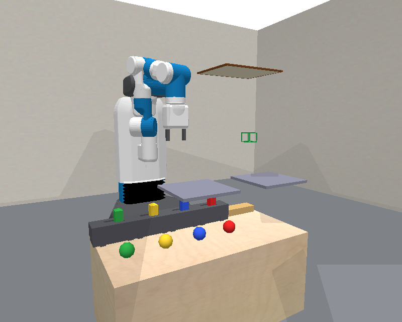
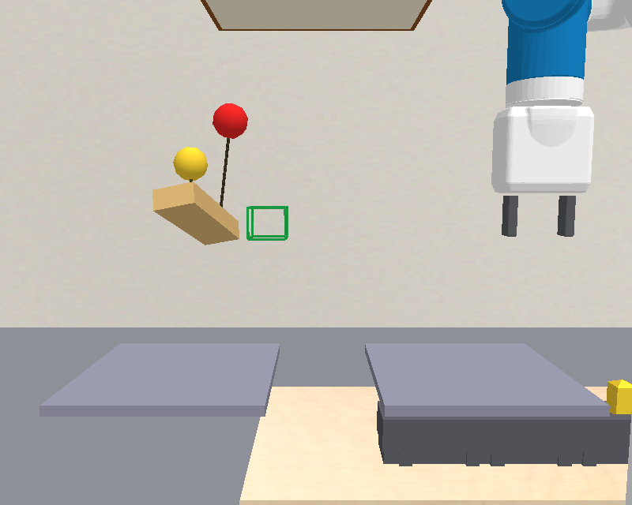
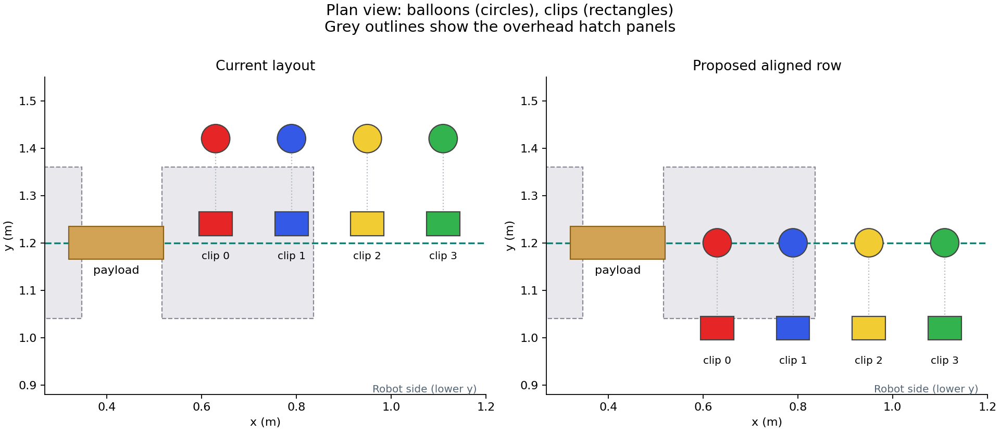
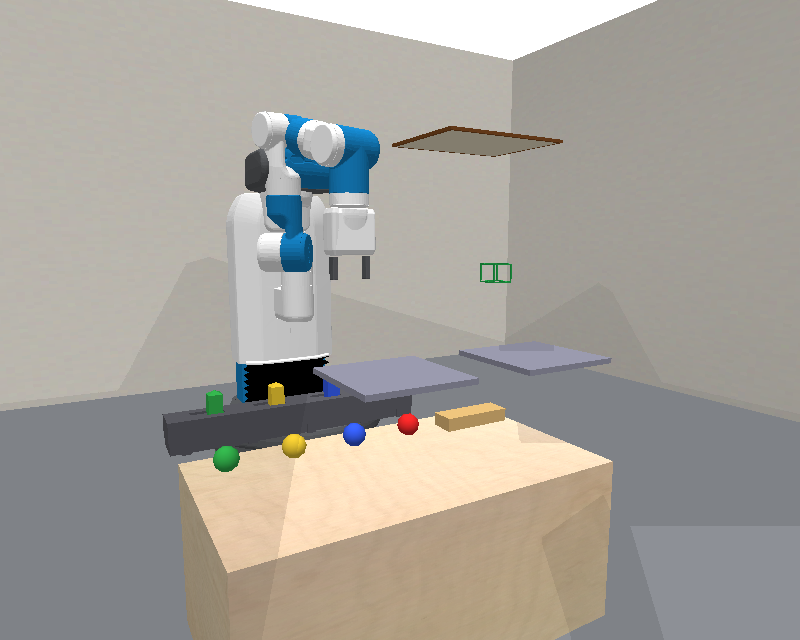

# Balloons visual refinement

The updated [overview slides](overview_slides.html) show the payload, attachments and obstacles more clearly.
Use the Hatch navigation button for the release videos.

| Visual | Change |
|---|---|
| Attachments | Dark ropes connect each released balloon to its point on the payload and follow the payload's rotation. |
| Clip switches | Each slider matches the colour of the balloon it releases. |
| Ceiling | A smaller outlined canopy marks the ceiling height over the payload column and clears the robot in the example views. |
| Target | An open green frame marks the allowed box-centre heights without looking like a solid object. |
| Overview | A side view separates the payload, rack and robot. |

Watch the [successful passage](visuals/hatch-pass.mp4) and the [contact failure](visuals/hatch-jam.mp4).
Both are mechanical demonstrations from the previously saved initial state, rather than new agent results.
The manifest records their source and replay outcomes.

The ropes illustrate the existing rigid attachments; this change does not introduce flexible-rope physics.
They appear after release, when the attachment exists in the simulator.
The canopy depicts the ceiling's height, while bursting still uses the existing height threshold.
The obstacle geometry, collision filters, release controller and evaluator are unchanged by this visual refinement.

The implementation is in the `balloons-visual-refinement` branch at `/home/ycliang/predicators-balloons-visuals-r1`.
The running MB/MF pilot keeps its frozen source and original rendering.
Documentation previews use the refined renderer.

The rendering implementation is commit `a698a7775`.
Compute job `22405964` passed the three rendering regressions, changed-file lint, formatting and full type checking across 887 files.
The regressions compare physical trajectories with and without rendering and check cleanup after a failed camera capture.
Replay job `22406226` used the exact previously saved primitive actions: contact failure at 65 actions and passage at 79 actions, with matching box heights and pitch to absolute tolerance `1e-7`.
The updated 17-slide HTML deck passed browser navigation, video playback and overflow checks in job `22406432`.

## Proposed common y coordinate

Aligning the payload and balloons makes the scene easier to read and removes the depth displacement when a balloon is released.
The clips retain their own row toward the robot.

| Object | Current y (m) | Preview y (m) |
|---|---:|---:|
| Payload | 1.20 | 1.20 |
| Balloons in the rack | 1.42 | 1.20 |
| Clip switches | 1.24 | 1.02 |

This is a layout preview, produced by [preview_aligned_layout.py](preview_aligned_layout.py) from the same saved initial state.
The grey footprints in the plan view show the hatch panels overhead, not objects colliding with the balloons.
Release reachability and full task acceptance must be checked before adopting the changed physical layout.
The aligned positions have not been applied to the domain implementation or the running experiments.
