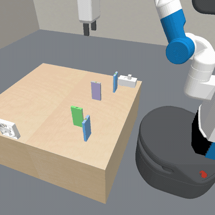
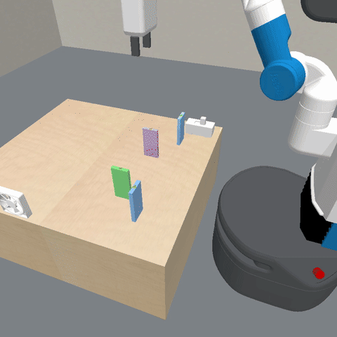
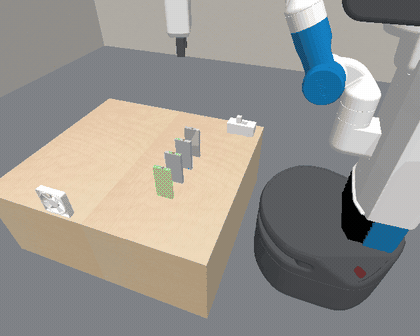

# domino-fan

The robot bridges a start block to a target with blue dominoes, presses
a switch, and the **wind** topples the chain. It never pushes a domino
itself — `Push` is withheld in this env, option and process both, so the
only way to start a cascade is the fan.

Run it:

```bash
PYTHONHASHSEED=0 .venv/bin/python scripts/local/launch_simp.py \
    -c predicatorv3/exp_domino_fan.yaml
```

`exp_domino_fan.yaml` carries the whole ladder; un-skip one arm at a time.

## oracle_solve.gif



Rung 1 — `oracle_process_planning`, ground-truth simulator and
predicates. **1/1 at reward 0.900**, ~2 minutes, no LLM. Plan:

```
PickDomino  → PlaceDomino  → PickDomino  → PlaceDomino
→ TurnFanOn → Wait
```

This is the ceiling the learning rungs are measured against, not a
result in itself.

## rung2_agent_planner.gif



Rung 2 — `agent_model_based_planning`, same ground-truth simulator and
predicates, but the **agent** writes the plan instead of the process
planner. **1/1 at reward 0.950**, early-stopped at cycle 1.

Higher than the oracle, and not by luck: the oracle's grid-based
planner bridges with TWO blues, while the agent found that ONE
suffices, since a domino topples further than one `pos_gap`. In the
video the second blue is still sitting untouched at its staging spot.

The agent also probed the limits and diagnosed them correctly - x=0.700
and x=0.570 both fail on **gripper clearance**, not physics ("the
opening fingers need ~0.044 m of side clearance"), symmetric about both
neighbours. Its notes are in the run's sandbox as `notes_domino_fan.md`.

## wind_cascade.gif



The mechanism in isolation: a chain laid by hand at `pos_gap`, fan
switched on, **no robot**. 4/4 dominoes topple (final rolls
`[82, 81, 83, 90]` degrees). Useful for showing that the wind physics
work independently of whether the manipulation does.

## Reading the reward

`reward = 1[goal reached via a certified wind cascade] − 0.05 × blues used`

The certificate ([`cascade_certificate.py`](../../../predicators/envs/pybullet_domino/cascade_certificate.py))
rejects an episode where the arm knocks the target over rather than the
wind — `TurnFanOn` is the sanctioned trigger here, in place of `Push`.

Ceilings differ between task sets, so do not read a drop as a
regression:

| task set | bridge  | blues (grid plan) | reward |
|----------|---------|-------------------|--------|
| train    | 0.196 m | 1                 | 0.95   |
| test     | 0.294 m | 2                 | 0.900  |

"Blues needed" is what the ORACLE's grid planner uses, not a floor: rung
2 solved the test task with one blue for 0.950. Treat 0.900 as the
oracle's score, not the task's ceiling.

## Results so far

| rung | arm | what it must supply | result |
|------|-----|---------------------|--------|
| 1 | `oracle` | nothing (GT everything) | **1/1, 0.900** |
| 2 | `agent_model_based_planning` | the plan + its continuous params | **1/1, 0.950** |
| 3 | `agent_param_learning` | the wind's parameters | not run |
| 4 | `agent_po_predicate_invention_al` | the wind's code, its params, and predicates | partial |
