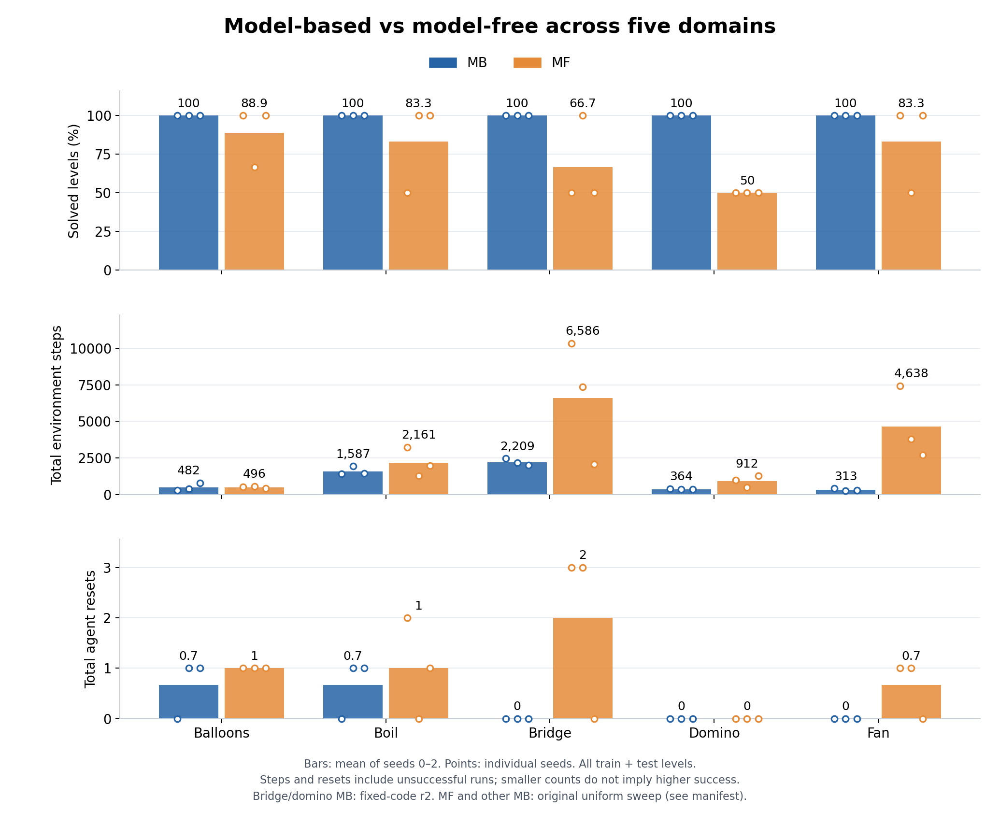

# Noiseless five-domain sweep

This is the frozen main result completed on 2026-09-08: model-based (MB) versus model-free (MF) continual agents across five domains and three seeds per arm.
The `noiseless-sweep-results-20260909` tag marks the merged integration milestone containing these artifacts.
It does not claim that every run used that exact code revision: bridge and domino MB were rerun from the fixed, then-uncommitted `predicators-place-fix` worktree, while MF and the other MB domains used the original uniform sweep.
The comparison is therefore not a matched-code ablation.



| Domain | MB solve | MF solve | MB steps | MF steps | MB resets | MF resets |
| --- | ---: | ---: | ---: | ---: | ---: | ---: |
| Balloons | 100% | 88.9% | 481.7 | 495.7 | 0.67 | 1.00 |
| Boil | 100% | 83.3% | 1587.3 | 2161.0 | 0.67 | 1.00 |
| Bridge | 100% | 66.7% | 2209.0 | 6586.3 | 0.00 | 2.00 |
| Domino | 100% | 50.0% | 364.0 | 911.7 | 0.00 | 0.00 |
| Fan | 100% | 83.3% | 312.7 | 4637.7 | 0.00 | 0.67 |

All entries are arithmetic means over seeds 0, 1, and 2.
Solve rate is computed within each seed over all training and test levels, then averaged across seeds.
Steps and agent resets are totals over all levels, including failed runs; they exclude sandbox simulation and harness recovery resets.
Low costs can reflect early failure and must be interpreted alongside solve rate.
The CSV includes sample standard deviations with denominator n-1.

## Frozen selection and provenance

- `manifest.json` records the exact 30 selected run paths and selection policy.
- `per_seed.csv` records each seed's metrics and the SHA-256 of its original scorecard bytes.
- `scorecard_snapshots.json` preserves the parsed scorecards, including available execution metadata.
- `summary.csv` records the aggregate statistics.
- `provenance.json` records the integration source revision and artifact hashes.
- `launch_bridge_domino_r2.yaml` is an unchanged historical copy of the r2 launch configuration, including its original comments and machine paths.
- `mb_vs_mf.pdf` and `mb_vs_mf.svg` are publication exports of the figure.

Cancelled r2 MF runs are excluded.
Boil MF seed 2 uses the later rerun selected by recency, not outcome; the earlier duplicate is excluded.
Absolute paths are historical provenance and are not needed to verify the archived results.
The archive retains the known balloons generator issue documented in [the failure analysis](../uncertainty-results/balloons-failure-analysis.md): a transient turning point can be mistaken for a jam.
No results were recomputed after changing the environment.

## Verify without experiment logs

```bash
python docs/noiseless-results/verify_results.py
```

This checks artifact hashes, complete seed coverage, noiseless observations, terminal run status, per-level totals, and all aggregate statistics against the frozen scorecards.
