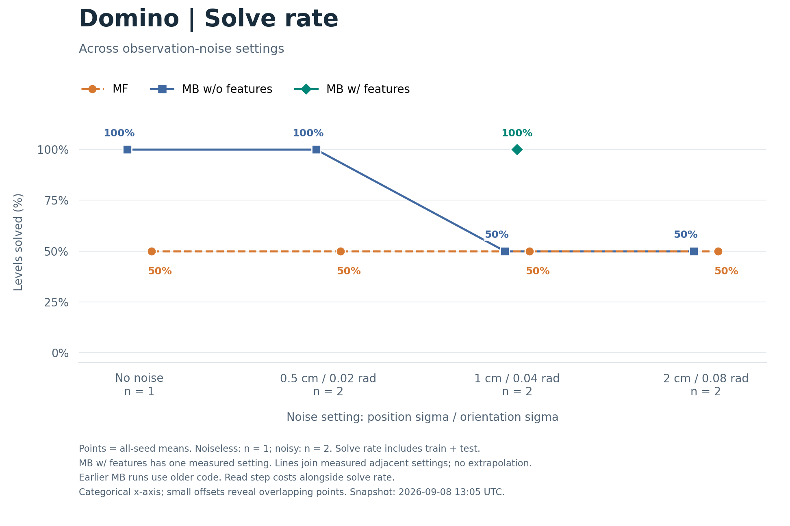
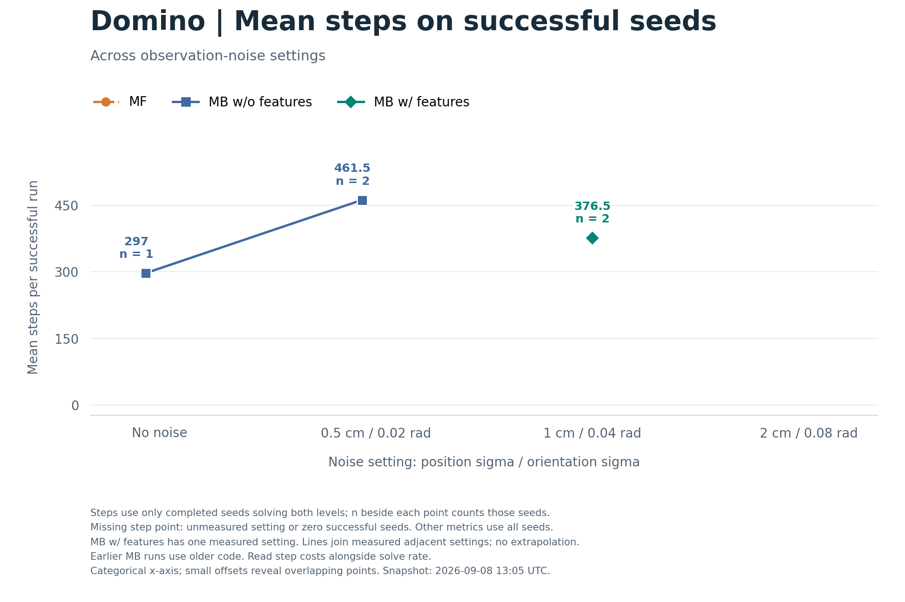
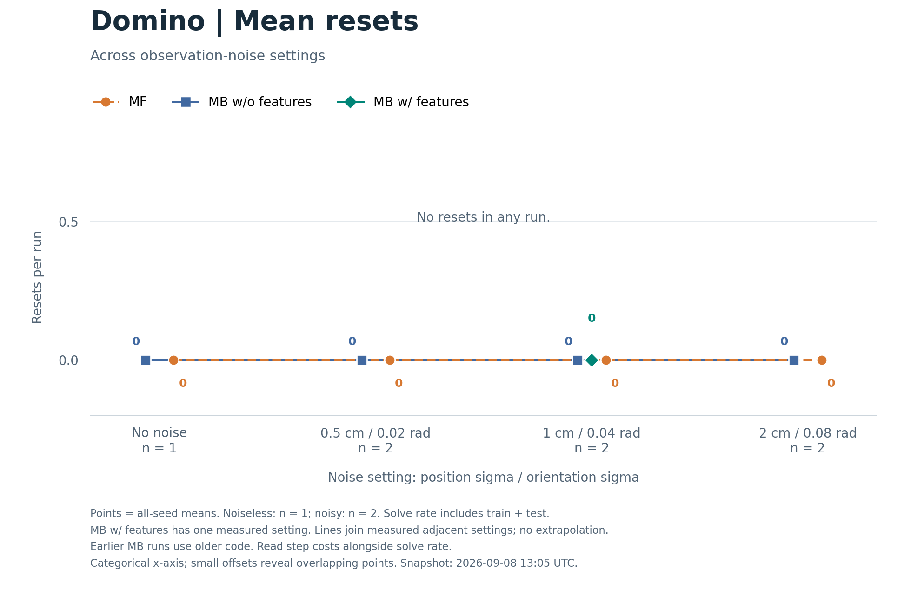
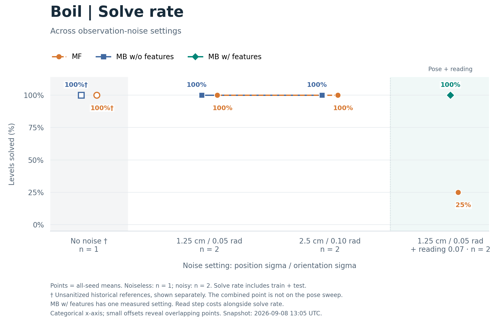
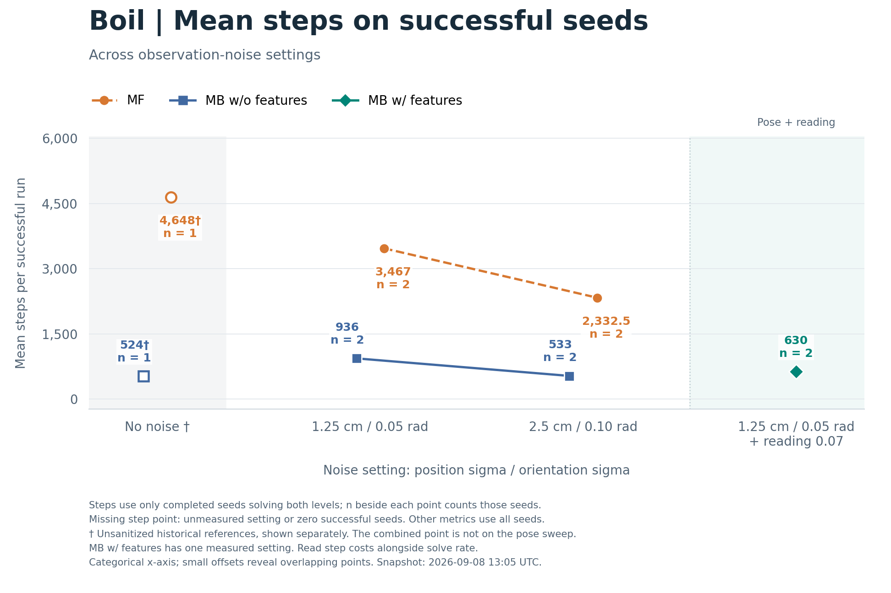
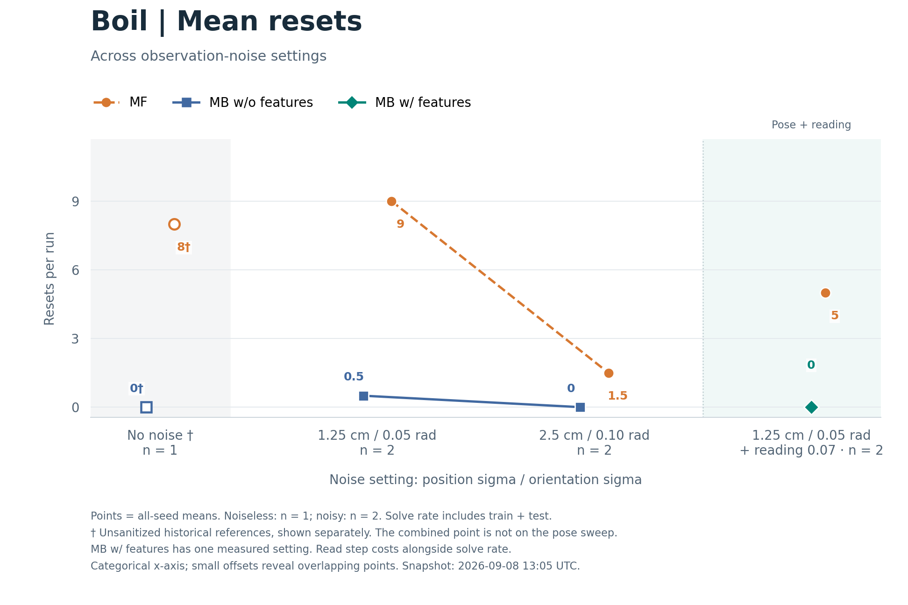

# Noiseless and noisy continual results

Generated by `make_figures.py` from `snapshot.json`; do not edit this report manually.
Scorecards captured at 2026-09-08T13:05:10.283352+00:00.

Solve rate is the fraction of the two levels solved in each run, averaged across the listed seeds.
It includes the training level and the test level, not just test performance.
Mean steps uses only successful seeds: completed runs that solved both the train and test levels.
For each successful seed, its whole-run step total includes all attempts and resets before completion.
The table reports the number of successful seeds contributing to that mean.
N/A means zero successful seeds; these step values are omitted from the curves, not plotted as zero.
Solve rate and mean resets continue to use all seeds, including unsuccessful runs.
The noiseless references have seed 0 only; noisy conditions have seeds 0 and 1.
`MB` means the earlier model-based configuration without the new uncertainty features; `MB + uncertainty` enables the new features.
MF remains the plain model-free code agent.

All selected scorecards are final.

| Domain | Noise | Arm | Seeds | Successful seeds | Solve rate | Mean steps (successful seeds) | Mean resets (all seeds) |
|---|---|---|---:|---:|---:|---:|---:|
| Domino | No noise | MB | 1 | 1 | 100% | 297 | 0 |
| Domino | No noise | MF | 1 | 0 | 50% | N/A | 0 |
| Domino | Pose 0.5 cm / 0.02 rad | MB | 2 | 2 | 100% | 461.5 | 0 |
| Domino | Pose 0.5 cm / 0.02 rad | MF | 2 | 0 | 50% | N/A | 0 |
| Domino | Pose 1 cm / 0.04 rad | MB | 2 | 0 | 50% | N/A | 0 |
| Domino | Pose 1 cm / 0.04 rad | MF | 2 | 0 | 50% | N/A | 0 |
| Domino | Pose 1 cm / 0.04 rad | MB + uncertainty | 2 | 2 | 100% | 376.5 | 0 |
| Domino | Pose 2 cm / 0.08 rad | MB | 2 | 0 | 50% | N/A | 0 |
| Domino | Pose 2 cm / 0.08 rad | MF | 2 | 0 | 50% | N/A | 0 |
| Boil | No noise | MB † | 1 | 1 | 100% | 524 | 0 |
| Boil | No noise | MF † | 1 | 1 | 100% | 4,648 | 8 |
| Boil | Pose 1.25 cm / 0.05 rad | MB | 2 | 2 | 100% | 936 | 0.5 |
| Boil | Pose 1.25 cm / 0.05 rad | MF | 2 | 2 | 100% | 3,467 | 9 |
| Boil | Pose 2.5 cm / 0.10 rad | MB | 2 | 2 | 100% | 533 | 0 |
| Boil | Pose 2.5 cm / 0.10 rad | MF | 2 | 2 | 100% | 2,332.5 | 1.5 |
| Boil | Pose 1.25 cm / 0.05 rad + reading 0.07 | MB + uncertainty | 2 | 2 | 100% | 630 | 0 |
| Boil | Pose 1.25 cm / 0.05 rad + reading 0.07 | MF | 2 | 0 | 25% | N/A | 5 |

The pose settings list position sigma in cm and orientation sigma in radians.
The combined boil point additionally has scalar-reading sigma 0.07.

† Both historical noiseless boil runs predate exact-observation sanitization and used a protocol that exposed privileged hidden heat in agent data.
They are historical references, not clean controls for the noisy runs.
Their presence in this table does not establish that noise has no cost.
Step costs are conditional on success and should be read alongside solve rate.
The older MB comparisons were run on earlier commits; this is not a controlled ablation on one code tree.
There is no MB-without-uncertainty result at the combined boil pose-plus-reading point.
The pose-only boil comparison cannot isolate the effect of the new features under reading noise.

Each curve figure shows one metric in one environment, with MF, MB without the new features and MB with the features as separate series.
Each marker uses the metric's seed subset defined above; a series with only one reported setting is an isolated point.
The x-axis is categorical: equal spacing does not imply equal noise increments.
Small horizontal offsets keep coincident series visible; the y-values are unchanged.
Lines connect only adjacent measured settings in the pose sweep, with no extrapolation or values inserted at unmeasured settings.
The combined boil point is separated from the pose sweep because it changes noise class and uses a smaller pose sigma than the 2.5 cm point.
Hollow markers with † denote historical unsanitized boil results and are not connected to the clean noisy results.
The cost axes are linear and include zero.
No confidence intervals are estimated from one or two seeds.



[Domino solve rate PDF](domino_solve_rate.pdf) · [SVG](domino_solve_rate.svg)



[Domino steps PDF](domino_steps.pdf) · [SVG](domino_steps.svg)



[Domino resets PDF](domino_resets.pdf) · [SVG](domino_resets.svg)



[Boil solve rate PDF](boil_solve_rate.pdf) · [SVG](boil_solve_rate.svg)



[Boil steps PDF](boil_steps.pdf) · [SVG](boil_steps.svg)



[Boil resets PDF](boil_resets.pdf) · [SVG](boil_resets.svg)


Data: [summary TSV](summary.tsv), [snapshot JSON with source paths and commit IDs](snapshot.json).

Presentation: [standalone HTML slides](../slides/uncertainty_results_slides.html), [PDF slides](../slides/uncertainty_results_slides.pdf).

Reproduce this snapshot's report and figures from the repository root:

```bash
OPENBLAS_NUM_THREADS=1 OMP_NUM_THREADS=1 python docs/uncertainty-results/make_figures.py
```

Use `--refresh --data-only` to explicitly replace the snapshot and table with current source scorecards, then run the command above to redraw the figures.
On Engaging, run figure rendering on a compute node.
This script does not launch, resume or cancel experiments.

Source scorecards:

- [Domino, No noise, MB, seed 0](../../logs/agent_continual/domino_high_friction_turn-agent_continual_m4/seed0/run_20260906_065659/scorecard.json)
- [Domino, No noise, MF, seed 0](../../logs/agent_continual_model_free/domino_high_friction_turn-agent_continual_model_free_m4/seed0/run_20260906_065647/scorecard.json)
- [Domino, Pose 0.5 cm / 0.02 rad, MB, seed 0](../../logs/agent_continual/domino_high_friction_turn-agent_continual_noise5mm/seed0/run_20260907_071102/scorecard.json)
- [Domino, Pose 0.5 cm / 0.02 rad, MB, seed 1](../../logs/agent_continual/domino_high_friction_turn-agent_continual_noise5mm/seed1/run_20260907_071102/scorecard.json)
- [Domino, Pose 0.5 cm / 0.02 rad, MF, seed 0](../../logs/agent_continual_model_free/domino_high_friction_turn-agent_continual_model_free_noise5mm/seed0/run_20260907_071623/scorecard.json)
- [Domino, Pose 0.5 cm / 0.02 rad, MF, seed 1](../../logs/agent_continual_model_free/domino_high_friction_turn-agent_continual_model_free_noise5mm/seed1/run_20260907_071059/scorecard.json)
- [Domino, Pose 1 cm / 0.04 rad, MB, seed 0](../../logs/agent_continual/domino_high_friction_turn-agent_continual_noise10mm/seed0/run_20260907_102757/scorecard.json)
- [Domino, Pose 1 cm / 0.04 rad, MB, seed 1](../../logs/agent_continual/domino_high_friction_turn-agent_continual_noise10mm/seed1/run_20260907_102752/scorecard.json)
- [Domino, Pose 1 cm / 0.04 rad, MF, seed 0](../../logs/agent_continual_model_free/domino_high_friction_turn-agent_continual_model_free_noise10mm/seed0/run_20260907_102801/scorecard.json)
- [Domino, Pose 1 cm / 0.04 rad, MF, seed 1](../../logs/agent_continual_model_free/domino_high_friction_turn-agent_continual_model_free_noise10mm/seed1/run_20260907_102757/scorecard.json)
- [Domino, Pose 1 cm / 0.04 rad, MB + uncertainty, seed 0](../../logs/agent_continual/domino_high_friction_turn-agent_continual_noise10mm_v2/seed0/run_20260908_063304/scorecard.json)
- [Domino, Pose 1 cm / 0.04 rad, MB + uncertainty, seed 1](../../logs/agent_continual/domino_high_friction_turn-agent_continual_noise10mm_v2/seed1/run_20260908_063304/scorecard.json)
- [Domino, Pose 2 cm / 0.08 rad, MB, seed 0](../../logs/agent_continual/domino_high_friction_turn-agent_continual_noise20mm/seed0/run_20260907_110211/scorecard.json)
- [Domino, Pose 2 cm / 0.08 rad, MB, seed 1](../../logs/agent_continual/domino_high_friction_turn-agent_continual_noise20mm/seed1/run_20260907_110211/scorecard.json)
- [Domino, Pose 2 cm / 0.08 rad, MF, seed 0](../../logs/agent_continual_model_free/domino_high_friction_turn-agent_continual_model_free_noise20mm/seed0/run_20260907_110209/scorecard.json)
- [Domino, Pose 2 cm / 0.08 rad, MF, seed 1](../../logs/agent_continual_model_free/domino_high_friction_turn-agent_continual_model_free_noise20mm/seed1/run_20260907_110218/scorecard.json)
- [Boil, No noise, MB, seed 0](../../logs/agent_continual/boil-agent_continual_m3/seed0/run_20260905_151521/scorecard.json)
- [Boil, No noise, MF, seed 0](../../logs/agent_continual_model_free/boil-agent_continual_model_free_m3/seed0/run_20260905_151453/scorecard.json)
- [Boil, Pose 1.25 cm / 0.05 rad, MB, seed 0](../../logs/agent_continual/boil-agent_continual_noise12mm_r2/seed0/run_20260907_152906/scorecard.json)
- [Boil, Pose 1.25 cm / 0.05 rad, MB, seed 1](../../logs/agent_continual/boil-agent_continual_noise12mm_r2/seed1/run_20260907_152905/scorecard.json)
- [Boil, Pose 1.25 cm / 0.05 rad, MF, seed 0](../../logs/agent_continual_model_free/boil-agent_continual_model_free_noise12mm/seed0/run_20260907_102802/scorecard.json)
- [Boil, Pose 1.25 cm / 0.05 rad, MF, seed 1](../../logs/agent_continual_model_free/boil-agent_continual_model_free_noise12mm/seed1/run_20260907_102905/scorecard.json)
- [Boil, Pose 2.5 cm / 0.10 rad, MB, seed 0](../../logs/agent_continual/boil-agent_continual_noise25mm/seed0/run_20260907_160038/scorecard.json)
- [Boil, Pose 2.5 cm / 0.10 rad, MB, seed 1](../../logs/agent_continual/boil-agent_continual_noise25mm/seed1/run_20260907_160047/scorecard.json)
- [Boil, Pose 2.5 cm / 0.10 rad, MF, seed 0](../../logs/agent_continual_model_free/boil-agent_continual_model_free_noise25mm/seed0/run_20260907_110211/scorecard.json)
- [Boil, Pose 2.5 cm / 0.10 rad, MF, seed 1](../../logs/agent_continual_model_free/boil-agent_continual_model_free_noise25mm/seed1/run_20260907_110212/scorecard.json)
- [Boil, Pose 1.25 cm / 0.05 rad + reading 0.07, MB + uncertainty, seed 0](../../logs/agent_continual/boil-agent_continual_noise_p12_r07/seed0/run_20260908_063739/scorecard.json)
- [Boil, Pose 1.25 cm / 0.05 rad + reading 0.07, MB + uncertainty, seed 1](../../logs/agent_continual/boil-agent_continual_noise_p12_r07/seed1/run_20260908_063739/scorecard.json)
- [Boil, Pose 1.25 cm / 0.05 rad + reading 0.07, MF, seed 0](../../logs/agent_continual_model_free/boil-agent_continual_model_free_noise_p12_r07/seed0/run_20260908_063739/scorecard.json)
- [Boil, Pose 1.25 cm / 0.05 rad + reading 0.07, MF, seed 1](../../logs/agent_continual_model_free/boil-agent_continual_model_free_noise_p12_r07/seed1/run_20260908_063818/scorecard.json)
