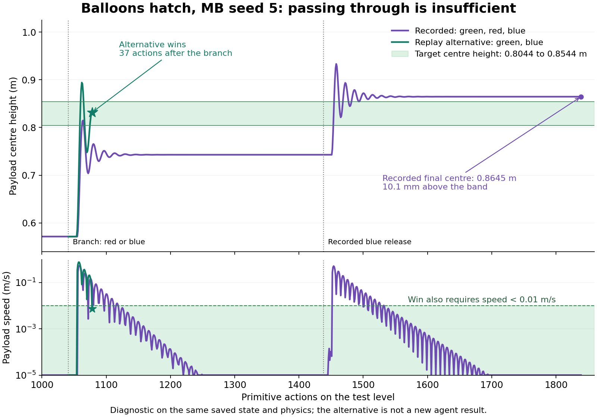

# Hatch MB seed 5: why the apparent goal was not a win

The recorded green -> red -> blue sequence never satisfied the evaluator on the test level.
Replaying all 1,839 saved primitive actions from the saved initial state reproduced every recorded payload x, y, z and pitch value exactly.
A valid alternative on that same task is **green (`clip3`) -> blue (`clip1`) -> wait**.
These are post-hoc mechanical diagnostics, not additional agent seeds or repaired-agent results.

## Goal and correct solution

The payload centre must lie in **[0.8044, 0.8544] m**, with payload speed **below 0.01 m/s**, and no burst balloon.
A tilted corner overlapping the green marker does not establish that the centre is inside the band.
The recorded trajectory has 14 true in-band frames, but its slowest in-band frame is still moving at 0.01848 m/s.
Its final centre height is 0.864516 m, **10.116 mm above the upper edge**.
The evaluator correctly never declares a win.

| Execution on the saved test task | Outcome | Test-level primitive actions | Height at outcome | Speed at outcome |
|---|---|---:|---:|---:|
| Recorded green -> long wait -> red -> wait -> blue -> wait | No win; agent eventually gave up | 1,839 | 0.864516 m | Approximately zero |
| Green -> blue, then hold | Win | 93 | 0.813171 m | 0.001745 m/s |
| Blue -> green, then hold | Win | 106 | 0.805289 m | 0.004215 m/s |
| Preserve recorded actions 1-1,041, then release blue instead of red and hold | Win | 1,078 total, 37 additional | 0.831549 m | 0.007567 m/s |
| Preserve all 1,839 recorded actions, then release gold | Gold balloon bursts | 1,853 total, 14 additional | 0.882389 m | 0.395590 m/s |

The alternative executions use the frozen task physics and public Release controller, with no reset inside each execution.
The two immediate orders start from the saved initial state; the 1,078-action alternative shares the agent's entire actual green-and-wait prefix.
Reported alternative heights are the first qualifying win, not estimates of the infinite-time equilibrium.
Other release timings or strategies have not been exhaustively searched.
The gold diagnostic supports the agent's decision that releasing the remaining balloon was a poor recovery, but it is not a proof that every conceivable robot action was futile.

## The decision that lost the level

The agent chose incremental release: start below the band, add the weakest remaining balloon, and measure again.
That strategy has no general guarantee when releases are irreversible and each height increment can exceed the entire target width.
It explicitly rejected the previous pine training level's green-plus-blue result because it appeared only about 3 mm inside the new band.
It preferred red as an unwedging action, then argued that adding blue could not overshoot.
Its predicted three-balloon height was below 0.824 m; the true settled result was 0.864516 m.

That bound assumed a payload near the hatch must be pushing upward against it, which would imply a lower bound on lift.
A contact or apparently stuck pose does not justify that force inequality without establishing the contact forces.
The agent later identified this flaw in its own journal.
Crucially, replacing red with blue after the exact same green-and-wait prefix does win, so the loss was avoidable at that decision.

## Why MB was no longer using a useful simulator

The scorecard records 182 simulator rollouts on training level 1 and zero planning rollouts on levels 2 and 3.
The agent stopped trusting simulation after observing a repeating rise-and-fall cycle during payload rotation.
It attributed that cycle to the harness restoring the state incorrectly.
The saved learned artifact contains a concrete cause within its own code: `_resolve_ids()` recognizes the payload by matching its **axis-aligned** bounding-box dimensions against the unrotated payload dimensions.
As the payload tilts, those dimensions change and the method returns no payload body.
`_domain_specific_step()` then returns before applying lift or torque.

A compute-node replay using the actual learned artifact and the agent's diagnostic values `mass_oak=0.1`, `lift_F=0.567` reproduced the logged failure.
At payload pitch 0.354281 radians, about 20.3 degrees, the identity check returned `None`.
At the next recorded action, the original model fell from z=0.451568 to 0.449219 m.
Changing only the diagnostic body's identification to stable IDs produced z=0.474916 m instead, with the same harness, actions and physical parameters.
This establishes a model-code cause for the apparent rotation failure; it does not establish that the otherwise unchanged model is physically accurate.
The stable-ID variant still has incorrect dynamics and is not a proposed trained-model replacement.

The learned model also remains specialized to the first three-balloon training scene: `ATTACH_SLOTS` lists only `balloon0`, `balloon1`, and `balloon2`, and its memory update ignores `balloon3`.
It gives every balloon the same lift law despite the observed color differences, and does not model bursting.
The final model file is unchanged across the snapshots after training level 1.
Consequently, the test-level hand calculations did not correspond to a validated simulator capable of predicting this four-balloon task.
The journal's claim that the failure was purely planning, with a solid model, is too strong.

The harness repeatedly ran its old `FIT FALLBACK` after the agent stopped acting, without fixing these structural errors.
Four late fits each used roughly 390 internal rollouts and 13 minutes, despite no additional real actions.
That explains part of the long apparent stall, while the irreversible release mistake already existed.
These fitter rollouts are distinct from the scorecard's planning-rollout count.
This pilot predates the separately developed removal of implicit fallback fits and the new timed-Wait interface.

## Implications

Prioritize reliable model construction and validation: stable object identity, object-count and color generalization, and replay checks covering rotation, attachment and free-flight settling.
Before irreversible actions, compare complete candidate release sequences and their predicted outcomes, including uncertainty, rather than assuming that adding lift gradually must preserve a route to the goal.
The subclass representation can express these mechanics; this particular learned program did not model them correctly.
No task-acceptance change is needed to explain or repair this demonstrated failure.
A viewer centre marker and explicit height/speed readout would make the existing goal easier to interpret visually.
No production agent, harness, task or viewer code was changed by this investigation.

## Sources and reproduction

Runtime: `/home/ycliang/predicators-balloons-hatch-fix-r1`, commit `86391e7ac12c9ae7bef2e5bd1678790f9b2f180c`.
The [final scorecard](../../logs/agent_continual/balloons-agent_continual_hatch_v4_mb/seed5/run_20260909_150111/scorecard.json) reports 2/3 levels, 4,234 steps, one reset, and `agent_ended`; Slurm job `22403398_5` completed with exit code 0.
The [test-level agent log](../../logs/agent_continual/balloons-agent_continual_hatch_v4_mb/seed5/run_20260909_150111/agent/003_play_20260909_173258.md) records the rejected green-blue alternative and overshoot calculation.
The [learned simulator](../../logs/agent_continual/balloons-agent_continual_hatch_v4_mb/seed5/run_20260909_150111/agent/sandbox/simulator.py) contains the identity and three-object assumptions.
The [diagnostic report](../../logs/balloons_hatch_seed5_diagnostic_20260910/report.json), [recorded trace](../../logs/balloons_hatch_seed5_diagnostic_20260910/recorded_trace.json), and [replay script](../../logs/balloons_hatch_seed5_diagnostic_20260910/replay.py) preserve the mechanical evidence.
Diagnostic job `22455539` completed all replays; the preceding job `22455489` reproduced the recorded failure and winning alternatives but hit a report-serialization error when the gold balloon burst, which was corrected before the complete diagnostic.
That reporting error is not an agent outcome.
The figure is generated by [plot_hatch_seed5_diagnostic.py](plot_hatch_seed5_diagnostic.py).
The [pilot results table](balloons-hatch-v4-pilot.md) keeps these diagnostics separate from the original non-hatch task and from all oracle scorecards.
