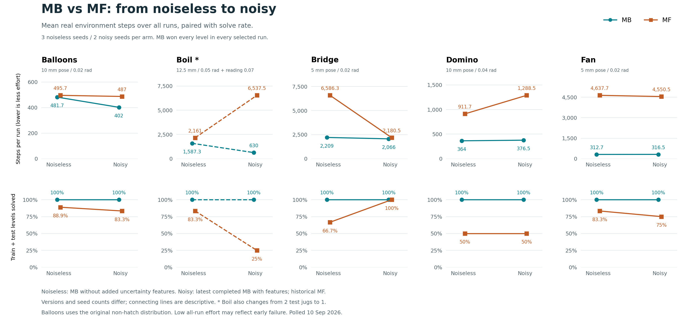

# Latest completed MB versus MF results across five domains

Generated by `make_plot.py`; do not edit manually.
Scorecards polled at 2026-09-10T08:33:46.548823+00:00.

All 50 selected runs are final: three noiseless seeds and two noisy seeds per domain and arm.
MB solved every level in all 25 selected runs, including both noisy seeds in each domain.
The noiseless MB references have the six added uncertainty features off; the noisy MB runs have all six on.
The selection includes all seeds in these cohorts, including MF failures, and uses the archived recency decision for the duplicate noiseless Boil MF seed 2.
No experiments were launched, resumed, cancelled, or changed by this collection.



[PDF](mb_vs_mf.pdf) | [SVG](mb_vs_mf.svg) | [Successful-run cost plot](successful_steps.png) | [TSV](summary.tsv)

The main step curves use whole-run real environment steps averaged over all seeds, matching the frozen noiseless table's convention.
Low effort can mean early failure, so every step panel is paired with the fraction of all train and test levels solved.
The companion plot averages steps only over runs that won every level and reports N/A when none succeeded.
Resets also average over all seeds, including unsuccessful runs.
Lines join two categorical settings; they do not interpolate a measured noise-response curve or isolate the effect of noise.
No confidence intervals are estimated from these two or three seeds.

## Results

| Domain | Setting | Arm | Successful runs | Levels solved | Steps, all runs | Steps, successful runs | Resets, all runs |
|---|---|---|---:|---:|---:|---:|---:|
| Balloons | Noiseless | MB | 3/3 | 100% | 481.7 | 481.7 | 0.7 |
| Balloons | Noiseless | MF | 2/3 | 88.9% | 495.7 | 464.5 | 1 |
| Balloons | Noisy | MB | 2/2 | 100% | 402 | 402 | 0.5 |
| Balloons | Noisy | MF | 1/2 | 83.3% | 487 | 461 | 0.5 |
| Boil | Noiseless | MB | 3/3 | 100% | 1,587.3 | 1,587.3 | 0.7 |
| Boil | Noiseless | MF | 2/3 | 83.3% | 2,161 | 1,627 | 1 |
| Boil | Noisy | MB | 2/2 | 100% | 630 | 630 | 0 |
| Boil | Noisy | MF | 0/2 | 25% | 6,537.5 | N/A | 5 |
| Bridge | Noiseless | MB | 3/3 | 100% | 2,209 | 2,209 | 0 |
| Bridge | Noiseless | MF | 1/3 | 66.7% | 6,586.3 | 7,352 | 2 |
| Bridge | Noisy | MB | 2/2 | 100% | 2,066 | 2,066 | 0 |
| Bridge | Noisy | MF | 2/2 | 100% | 2,180.5 | 2,180.5 | 0 |
| Domino | Noiseless | MB | 3/3 | 100% | 364 | 364 | 0 |
| Domino | Noiseless | MF | 0/3 | 50% | 911.7 | N/A | 0 |
| Domino | Noisy | MB | 2/2 | 100% | 376.5 | 376.5 | 0 |
| Domino | Noisy | MF | 0/2 | 50% | 1,288.5 | N/A | 0 |
| Fan | Noiseless | MB | 3/3 | 100% | 312.7 | 312.7 | 0 |
| Fan | Noiseless | MF | 2/3 | 83.3% | 4,637.7 | 5,064.5 | 0.7 |
| Fan | Noisy | MB | 2/2 | 100% | 316.5 | 316.5 | 0 |
| Fan | Noisy | MF | 1/2 | 75% | 4,550.5 | 654 | 1 |

## MB versus MF gaps

Step gap is MF minus MB mean effort over all runs; a positive value means MF spent more real steps, irrespective of success.
Solve gap is MB minus MF in percentage points over all levels.

| Domain | Step gap, noiseless | Step gap, noisy | Solve gap, noiseless | Solve gap, noisy |
|---|---:|---:|---:|---:|
| Balloons | 14 | 85 | 11.1 pp | 16.7 pp |
| Boil | 573.7 | 5,907.5 | 16.7 pp | 75 pp |
| Bridge | 4,377.3 | 114.5 | 33.3 pp | 0 pp |
| Domino | 547.7 | 912 | 50 pp | 50 pp |
| Fan | 4,325 | 4,234 | 16.7 pp | 25 pp |

## Versions and limits

This is a historical comparison of the latest completed cohorts, with different source versions across domains and settings.
Newly scheduled runs without final scorecards do not enter this snapshot.
Noiseless references follow the 30-run selection archived at tag `noiseless-sweep-results-20260909`: Bridge and Domino use MB `uniform_r2`; the other MB domains and all MF domains use `uniform`.
The archive's later Boil MF seed 2 rerun was selected by recency, irrespective of outcome; the earlier duplicate and cancelled MF r2 runs remain excluded.
Some scorecard SHAs identify a base commit with runtime patches; they are provenance labels, not guarantees of identical code.
**Boil changes task size:** the noiseless uniform runs test two jugs, while the latest noisy pose-plus-reading runs test one jug.
Its line is therefore a comparison of available experiments, not a matched task comparison, and the lower noisy MB cost cannot be attributed to noise handling alone.
The older one-jug noiseless m3 runs are excluded: they have only one seed per arm and predate exact-observation sanitization.
Bridge and Fan noisy runs include later manipulation and Wait fixes, respectively; these changes also affect step costs.
Balloons uses the original non-hatch task distribution; hatch and corrected-generator experiments are excluded.
Its latest MB uses the simulator subclass interface and the shared timed-Wait/proprioception update, while reused noisy MF predates that interface update.
The original Balloons task-generator caveat remains part of this historical dataset, and development used these seeds.
Seeds 0, 1, and 2 contribute to noiseless points; seeds 0 and 1 contribute to noisy points, so the means are not paired differences.

| Domain | Setting | Arm | Experiment | Scorecard source revisions |
|---|---|---|---|---|
| Balloons | Noiseless | MB | `balloons-agent_continual_uniform` | `ec09e55fcaac, fefee34c6206` |
| Balloons | Noiseless | MF | `balloons-agent_continual_model_free_uniform` | `ec09e55fcaac, fefee34c6206` |
| Balloons | Noisy | MB | `balloons-agent_continual_original_subclass_r1` | `41e4334270a2` |
| Balloons | Noisy | MF | `balloons-agent_continual_model_free_cross_noise` | `92d37ec9723b` |
| Boil | Noiseless | MB | `boil-agent_continual_uniform` | `fefee34c6206` |
| Boil | Noiseless | MF | `boil-agent_continual_model_free_uniform` | `fefee34c6206` |
| Boil | Noisy | MB | `boil-agent_continual_noise_p12_r07` | `b780c93d43d8` |
| Boil | Noisy | MF | `boil-agent_continual_model_free_noise_p12_r07` | `b780c93d43d8` |
| Bridge | Noiseless | MB | `bridge-agent_continual_uniform_r2` | `fefee34c6206` |
| Bridge | Noiseless | MF | `bridge-agent_continual_model_free_uniform` | `ec09e55fcaac, fefee34c6206` |
| Bridge | Noisy | MB | `bridge-agent_continual_cross_noise_on` | `92d37ec9723b` |
| Bridge | Noisy | MF | `bridge-agent_continual_model_free_cross_noise` | `92d37ec9723b` |
| Domino | Noiseless | MB | `domino_high_friction_turn-agent_continual_uniform_r2` | `fefee34c6206` |
| Domino | Noiseless | MF | `domino_high_friction_turn-agent_continual_model_free_uniform` | `ec09e55fcaac, fefee34c6206` |
| Domino | Noisy | MB | `domino_high_friction_turn-agent_continual_noise10mm_v2` | `88df0b68b38f` |
| Domino | Noisy | MF | `domino_high_friction_turn-agent_continual_model_free_noise10mm` | `ab100053b757` |
| Fan | Noiseless | MB | `fan-agent_continual_uniform` | `ec09e55fcaac, fefee34c6206` |
| Fan | Noiseless | MF | `fan-agent_continual_model_free_uniform` | `ec09e55fcaac, fefee34c6206` |
| Fan | Noisy | MB | `fan-agent_continual_cross_noise_on` | `92d37ec9723b` |
| Fan | Noisy | MF | `fan-agent_continual_model_free_cross_noise` | `92d37ec9723b` |

Noisy position, orientation and scalar standard deviations:

- Balloons: 10 mm pose / 0.02 rad.
- Boil: 12.5 mm / 0.05 rad + reading 0.07.
- Bridge: 5 mm pose / 0.02 rad.
- Domino: 10 mm pose / 0.04 rad.
- Fan: 5 mm pose / 0.02 rad.

## Source scorecards

Full parsed scorecards, SHA-256 digests, feature flags, and selection are frozen in [snapshot.json](snapshot.json).
The exact paths are also in [selection.json](selection.json).

- [Balloons Noiseless MB seed 0](../../../logs/agent_continual/balloons-agent_continual_uniform/seed0/run_20260907_102820/scorecard.json)
- [Balloons Noiseless MB seed 1](../../../logs/agent_continual/balloons-agent_continual_uniform/seed1/run_20260907_160923/scorecard.json)
- [Balloons Noiseless MB seed 2](../../../logs/agent_continual/balloons-agent_continual_uniform/seed2/run_20260907_160930/scorecard.json)
- [Balloons Noiseless MF seed 0](../../../logs/agent_continual_model_free/balloons-agent_continual_model_free_uniform/seed0/run_20260907_102819/scorecard.json)
- [Balloons Noiseless MF seed 1](../../../logs/agent_continual_model_free/balloons-agent_continual_model_free_uniform/seed1/run_20260907_160938/scorecard.json)
- [Balloons Noiseless MF seed 2](../../../logs/agent_continual_model_free/balloons-agent_continual_model_free_uniform/seed2/run_20260907_160921/scorecard.json)
- [Boil Noiseless MB seed 0](../../../logs/agent_continual/boil-agent_continual_uniform/seed0/run_20260907_144501/scorecard.json)
- [Boil Noiseless MB seed 1](../../../logs/agent_continual/boil-agent_continual_uniform/seed1/run_20260907_160923/scorecard.json)
- [Boil Noiseless MB seed 2](../../../logs/agent_continual/boil-agent_continual_uniform/seed2/run_20260907_160920/scorecard.json)
- [Boil Noiseless MF seed 0](../../../logs/agent_continual_model_free/boil-agent_continual_model_free_uniform/seed0/run_20260907_144511/scorecard.json)
- [Boil Noiseless MF seed 1](../../../logs/agent_continual_model_free/boil-agent_continual_model_free_uniform/seed1/run_20260907_160924/scorecard.json)
- [Boil Noiseless MF seed 2](../../../logs/agent_continual_model_free/boil-agent_continual_model_free_uniform/seed2/run_20260907_220406/scorecard.json)
- [Bridge Noiseless MB seed 0](../../../logs/agent_continual/bridge-agent_continual_uniform_r2/seed0/run_20260908_075640/scorecard.json)
- [Bridge Noiseless MB seed 1](../../../logs/agent_continual/bridge-agent_continual_uniform_r2/seed1/run_20260908_075639/scorecard.json)
- [Bridge Noiseless MB seed 2](../../../logs/agent_continual/bridge-agent_continual_uniform_r2/seed2/run_20260908_075645/scorecard.json)
- [Bridge Noiseless MF seed 0](../../../logs/agent_continual_model_free/bridge-agent_continual_model_free_uniform/seed0/run_20260907_102819/scorecard.json)
- [Bridge Noiseless MF seed 1](../../../logs/agent_continual_model_free/bridge-agent_continual_model_free_uniform/seed1/run_20260907_160928/scorecard.json)
- [Bridge Noiseless MF seed 2](../../../logs/agent_continual_model_free/bridge-agent_continual_model_free_uniform/seed2/run_20260907_160927/scorecard.json)
- [Domino Noiseless MB seed 0](../../../logs/agent_continual/domino_high_friction_turn-agent_continual_uniform_r2/seed0/run_20260908_075659/scorecard.json)
- [Domino Noiseless MB seed 1](../../../logs/agent_continual/domino_high_friction_turn-agent_continual_uniform_r2/seed1/run_20260908_075707/scorecard.json)
- [Domino Noiseless MB seed 2](../../../logs/agent_continual/domino_high_friction_turn-agent_continual_uniform_r2/seed2/run_20260908_075707/scorecard.json)
- [Domino Noiseless MF seed 0](../../../logs/agent_continual_model_free/domino_high_friction_turn-agent_continual_model_free_uniform/seed0/run_20260907_102820/scorecard.json)
- [Domino Noiseless MF seed 1](../../../logs/agent_continual_model_free/domino_high_friction_turn-agent_continual_model_free_uniform/seed1/run_20260907_160930/scorecard.json)
- [Domino Noiseless MF seed 2](../../../logs/agent_continual_model_free/domino_high_friction_turn-agent_continual_model_free_uniform/seed2/run_20260907_160924/scorecard.json)
- [Fan Noiseless MB seed 0](../../../logs/agent_continual/fan-agent_continual_uniform/seed0/run_20260907_102945/scorecard.json)
- [Fan Noiseless MB seed 1](../../../logs/agent_continual/fan-agent_continual_uniform/seed1/run_20260907_160921/scorecard.json)
- [Fan Noiseless MB seed 2](../../../logs/agent_continual/fan-agent_continual_uniform/seed2/run_20260907_160923/scorecard.json)
- [Fan Noiseless MF seed 0](../../../logs/agent_continual_model_free/fan-agent_continual_model_free_uniform/seed0/run_20260907_102819/scorecard.json)
- [Fan Noiseless MF seed 1](../../../logs/agent_continual_model_free/fan-agent_continual_model_free_uniform/seed1/run_20260907_160936/scorecard.json)
- [Fan Noiseless MF seed 2](../../../logs/agent_continual_model_free/fan-agent_continual_model_free_uniform/seed2/run_20260907_160928/scorecard.json)
- [Balloons Noisy MB seed 0](../../../logs/agent_continual/balloons-agent_continual_original_subclass_r1/seed0/run_20260909_171523/scorecard.json)
- [Balloons Noisy MB seed 1](../../../logs/agent_continual/balloons-agent_continual_original_subclass_r1/seed1/run_20260909_171520/scorecard.json)
- [Balloons Noisy MF seed 0](../../../logs/agent_continual_model_free/balloons-agent_continual_model_free_cross_noise/seed0/run_20260909_075624/scorecard.json)
- [Balloons Noisy MF seed 1](../../../logs/agent_continual_model_free/balloons-agent_continual_model_free_cross_noise/seed1/run_20260909_075654/scorecard.json)
- [Boil Noisy MB seed 0](../../../logs/agent_continual/boil-agent_continual_noise_p12_r07/seed0/run_20260908_063739/scorecard.json)
- [Boil Noisy MB seed 1](../../../logs/agent_continual/boil-agent_continual_noise_p12_r07/seed1/run_20260908_063739/scorecard.json)
- [Boil Noisy MF seed 0](../../../logs/agent_continual_model_free/boil-agent_continual_model_free_noise_p12_r07/seed0/run_20260908_063739/scorecard.json)
- [Boil Noisy MF seed 1](../../../logs/agent_continual_model_free/boil-agent_continual_model_free_noise_p12_r07/seed1/run_20260908_063818/scorecard.json)
- [Bridge Noisy MB seed 0](../../../logs/agent_continual/bridge-agent_continual_cross_noise_on/seed0/run_20260908_165814/scorecard.json)
- [Bridge Noisy MB seed 1](../../../logs/agent_continual/bridge-agent_continual_cross_noise_on/seed1/run_20260908_165814/scorecard.json)
- [Bridge Noisy MF seed 0](../../../logs/agent_continual_model_free/bridge-agent_continual_model_free_cross_noise/seed0/run_20260909_030602/scorecard.json)
- [Bridge Noisy MF seed 1](../../../logs/agent_continual_model_free/bridge-agent_continual_model_free_cross_noise/seed1/run_20260909_030544/scorecard.json)
- [Domino Noisy MB seed 0](../../../logs/agent_continual/domino_high_friction_turn-agent_continual_noise10mm_v2/seed0/run_20260908_063304/scorecard.json)
- [Domino Noisy MB seed 1](../../../logs/agent_continual/domino_high_friction_turn-agent_continual_noise10mm_v2/seed1/run_20260908_063304/scorecard.json)
- [Domino Noisy MF seed 0](../../../logs/agent_continual_model_free/domino_high_friction_turn-agent_continual_model_free_noise10mm/seed0/run_20260907_102801/scorecard.json)
- [Domino Noisy MF seed 1](../../../logs/agent_continual_model_free/domino_high_friction_turn-agent_continual_model_free_noise10mm/seed1/run_20260907_102757/scorecard.json)
- [Fan Noisy MB seed 0](../../../logs/agent_continual/fan-agent_continual_cross_noise_on/seed0/run_20260908_192755/scorecard.json)
- [Fan Noisy MB seed 1](../../../logs/agent_continual/fan-agent_continual_cross_noise_on/seed1/run_20260908_192723/scorecard.json)
- [Fan Noisy MF seed 0](../../../logs/agent_continual_model_free/fan-agent_continual_model_free_cross_noise/seed0/run_20260909_040222/scorecard.json)
- [Fan Noisy MF seed 1](../../../logs/agent_continual_model_free/fan-agent_continual_model_free_cross_noise/seed1/run_20260909_040219/scorecard.json)

Regenerate from the saved snapshot on a compute node:

```bash
python docs/uncertainty-results/five-domain-latest/make_plot.py
```

Add `--refresh` to poll the same selected scorecards again; selection does not change automatically.
Use `--data-only` to validate and export tables without rendering.
